# Java 8 → 25 Deep Evolution Guide 🚀

## Detailed Internals • Runtime Flows • JVM Changes • Concurrency • GC • Cloud Native • Real Production Examples

Enhanced from uploaded notes and Spring lifecycle content. 

---

# Evolution Story 🧠

Java evolved in **5 major eras**:

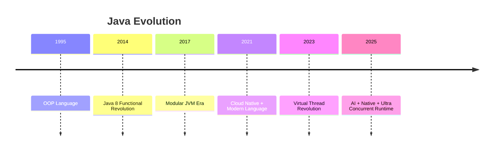

---

# BIG PICTURE

| Era        | Main Goal                   |
| ---------- | --------------------------- |
| Java 8     | Functional programming      |
| Java 9-11  | Modular + cloud-ready       |
| Java 12-17 | Language simplification     |
| Java 18-21 | Massive concurrency         |
| Java 22-25 | Native interop + AI runtime |

---

# Java 8 — Functional Revolution 🔥

---

# 1. Lambda Expressions

Before Java 8:

```java
Comparator<String> cmp = new Comparator<String>() {
    @Override
    public int compare(String a, String b) {
        return a.compareTo(b);
    }
};
```

After Java 8:

```java
Comparator<String> cmp =
    (a, b) -> a.compareTo(b);
```

---

# Internal JVM Flow

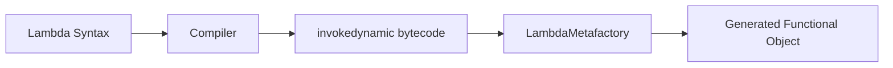

---

# Why Huge?

Anonymous classes:

```text
Generated separate .class files
Higher memory
More class loading
```

Lambdas:

```text
Dynamic runtime generation
Less memory
Faster startup
```

---

# Functional Interface

```java
@FunctionalInterface
interface PaymentProcessor {
    void pay();
}
```

Only ONE abstract method allowed.

---

# Real Production Example

```java
orders.stream()
    .filter(order -> order.amount() > 1000)
    .forEach(order -> kafkaProducer.send(order));
```

Used everywhere:

* Spring Boot
* Kafka Streams
* Reactive pipelines
* AWS SDK
* Stream processing

---

# Streams API 🌊

---

# Problem Before

Imperative looping everywhere.

```java
List<String> result = new ArrayList<>();

for (String user : users) {
    if(user.startsWith("A")) {
        result.add(user.toUpperCase());
    }
}
```

---

# Stream Pipeline

```java
List<String> result =
    users.stream()
         .filter(u -> u.startsWith("A"))
         .map(String::toUpperCase)
         .sorted()
         .toList();
```

---

# Internal Stream Architecture


---

# Intermediate Operations

Lazy.

```java
.filter()
.map()
.sorted()
.distinct()
.limit()
```

NO execution yet.

---

# Terminal Operations

Trigger execution.

```java
.collect()
.forEach()
.count()
.reduce()
```

---

# Lazy Evaluation Example

```java
Stream.of(1,2,3)
    .map(x -> {
        System.out.println(x);
        return x;
    });
```

Prints NOTHING.

Because:

```text
No terminal operation
```

---

# Parallel Streams ⚠️

```java
users.parallelStream()
```

Uses:

```text
ForkJoinPool.commonPool()
```

---

# Internal Parallel Flow

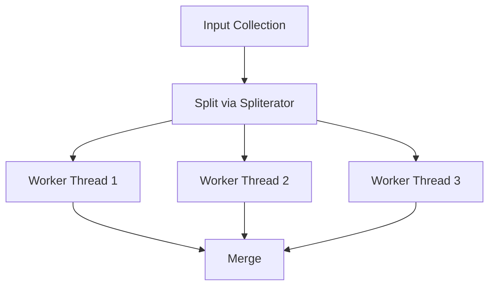

---

# Parallel Stream Problems ⚠️

BAD:

```java
parallelStream().forEach(list::add)
```

Race conditions.

---

# Good Usage

CPU-intensive independent tasks.

Examples:

* image processing
* ML transformations
* aggregations

---

# CompletableFuture 🔥

---

# Problem Before

```java
Future<User> future =
    executor.submit(task);

future.get(); // BLOCKING
```

---

# CompletableFuture Solution

```java
CompletableFuture
    .supplyAsync(() -> fetchUser())
    .thenApply(user -> enrich(user))
    .thenCompose(db::saveAsync)
    .thenAccept(saved -> notify(saved));
```

---

# Async Pipeline Flow

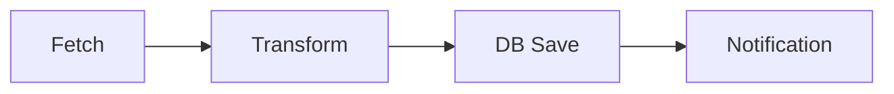

---

# thenApply vs thenCompose

---

# thenApply

```java
future.thenApply(user ->
    fetchOrders(user)
);
```

Returns:

```java
CompletableFuture<CompletableFuture<Order>>
```

BAD nested future.

---

# thenCompose

```java
future.thenCompose(user ->
    fetchOrdersAsync(user)
);
```

Flattened correctly.

---

# Real Production Example

Microservice aggregation:

```java
CompletableFuture<User> user =
    fetchUser();

CompletableFuture<Orders> orders =
    fetchOrders();

return user.thenCombine(orders,
    Dashboard::new);
```

---

# Optional 🔥

---

# Problem

```java
NullPointerException
```

Everywhere.

---

# Before

```java
if(user != null &&
   user.getAddress() != null)
```

---

# After

```java
Optional.ofNullable(user)
    .map(User::getAddress)
    .ifPresent(System.out::println);
```

---

# Optional Anti-Patterns ⚠️

BAD:

```java
Optional<User> field;
```

BAD:

```java
Optional<List<User>>
```

Use for:

```text
Method return types only
```

---

# New Date Time API 🕒

Old API issues:

| Problem             | Why Bad       |
| ------------------- | ------------- |
| Mutable             | thread unsafe |
| Timezone confusion  | bugs          |
| Calendar complexity | terrible API  |

---

# New API

```java
LocalDate
LocalDateTime
Instant
Duration
Period
ZonedDateTime
```

---

# Example

```java
Instant start = Instant.now();

Thread.sleep(1000);

Duration d =
    Duration.between(start, Instant.now());
```

---

# Java 9 — Module System 🧩

---

# Problem Before

```text
Everything on giant classpath
```

No encapsulation.

---

# JPMS

```java
module payment.service {
    requires java.sql;
    exports com.app.payment.api;
}
```

---

# Internal Architecture

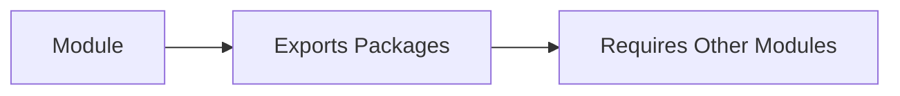

---

# Benefits

✅ smaller runtime
✅ strong encapsulation
✅ faster startup
✅ reduced attack surface

---

# JLink

Build custom runtime.

```bash
jlink --add-modules java.base
```

Huge for:

* Docker
* Kubernetes
* Lambda

---

# Java 10 — var 🔥

---

# Before

```java
Map<String, List<User>> users =
    new HashMap<>();
```

---

# After

```java
var users =
    new HashMap<String, List<User>>();
```

---

# Important

NOT dynamic typing.

Compiler still knows exact type.

---

# Java 11 — Modern HTTP + LTS 🚀

---

# New HTTP Client

Before:

```java
HttpURLConnection
```

Painful API.

---

# Modern Client

```java
HttpClient client =
    HttpClient.newHttpClient();
```

---

# Async HTTP Example

```java
client.sendAsync(request,
        BodyHandlers.ofString())
    .thenApply(HttpResponse::body)
    .thenAccept(System.out::println);
```

---

# Internal Flow

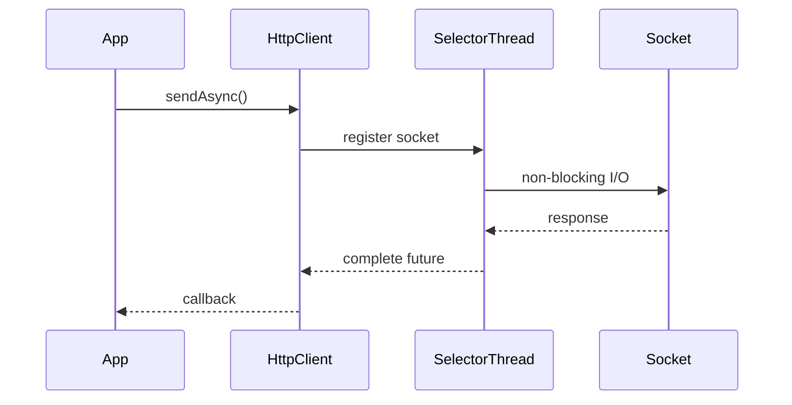

---

# String APIs

```java
" ".isBlank();
"abc".repeat(5);
"text".lines();
```

---

# Java 12–15 — Syntax Cleanup ✨

---

# Switch Expressions

Before:

```java
switch(day) {
    case MONDAY:
        return 1;
}
```

After:

```java
return switch(day) {
    case MONDAY -> 1;
    default -> 0;
};
```

---

# Text Blocks

```java
String sql = """
SELECT *
FROM users
WHERE id = ?
""";
```

Huge readability improvement.

---

# Java 14–16 — Records 📦

---

# Before

Boilerplate nightmare.

```java
class User {
    private final String name;

    getter
    constructor
    equals
    hashCode
}
```

---

# After

```java
record User(String name) {}
```

---

# Compiler Generates

```text
constructor
getter
equals
hashCode
toString
```

---

# Record Memory Model

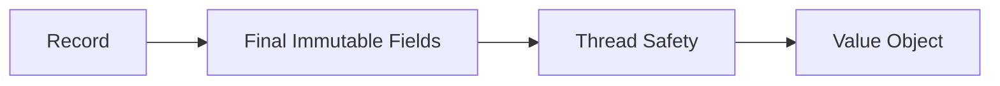

---

# Great For

✅ DTOs
✅ Kafka events
✅ REST payloads
✅ immutable data

---

# Java 17 — Enterprise Standard 🔥

---

# Sealed Classes

Control inheritance.

```java
public sealed interface Payment
    permits CardPayment, UpiPayment {}
```

---

# Pattern Matching

Before:

```java
if(obj instanceof String) {
    String s = (String)obj;
}
```

After:

```java
if(obj instanceof String s) {
    System.out.println(s);
}
```

---

# Java 17 Production Impact

Most enterprises moved:

```text
Java 8 → Java 17
```

Reasons:

* stability
* performance
* records
* better GC
* container awareness

---

# Garbage Collector Evolution 🗑️

---

# Java 8

```text
ParallelGC
CMS
G1
```

---

# Java 11+

```text
ZGC
```

Ultra low pause.

---

# ZGC Architecture

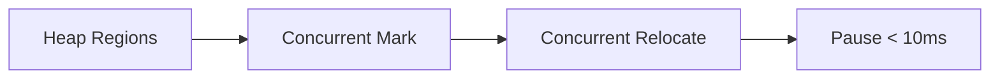

---

# Why Huge?

Old GC:

```text
STW pauses seconds
```

Modern GC:

```text
Pause times milliseconds
```

Huge for:

* trading systems
* gaming
* real-time APIs

---

# Java 19–21 — Virtual Threads 🚀🔥

BIGGEST change after Java 8.

---

# Old Model

```text
1 Java Thread = 1 OS Thread
```

Expensive.

---

# Virtual Thread Model

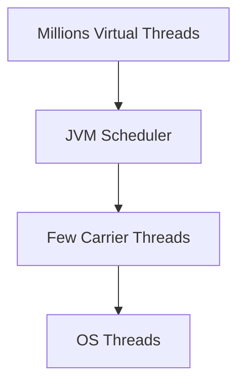

---

# Example

```java
try(var executor =
    Executors.newVirtualThreadPerTaskExecutor()) {

    IntStream.range(0, 1_000_000)
        .forEach(i -> executor.submit(() -> {
            Thread.sleep(1000);
            return i;
        }));
}
```

---

# Why Revolutionary?

Traditional threads:

```text
Memory per thread ≈ 1MB
```

1 million threads impossible.

---

# Virtual Threads

```text
Tiny stack chunks
Continuation-based scheduling
```

Millions possible.

---

# Real Production Example

High-scale HTTP server:

```java
@GetMapping("/orders")
public Order get() {
    return orderService.fetch();
}
```

Now blocking style code becomes scalable.

---

# Structured Concurrency 🔥

---

# Old Async Problem

```text
Orphan tasks
Leaked futures
Broken cancellation
```

---

# New Structured Flow

```java
try(var scope =
    new StructuredTaskScope.ShutdownOnFailure()) {

    Future<User> user =
        scope.fork(() -> fetchUser());

    Future<Order> order =
        scope.fork(() -> fetchOrder());

    scope.join();

    return combine(user.get(), order.get());
}
```

---

# Architecture

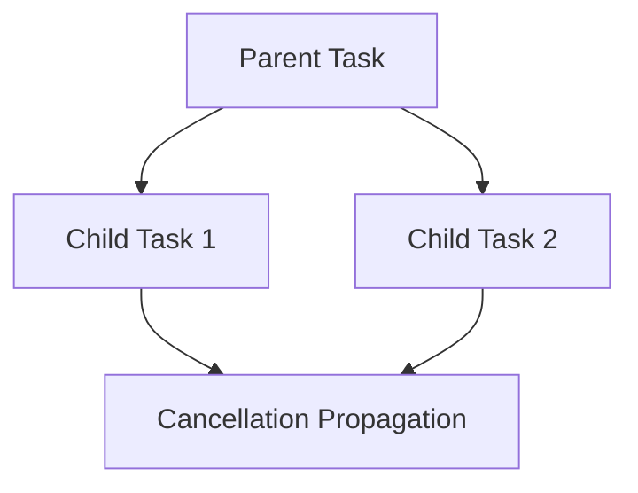

---

# Scoped Values

Alternative to ThreadLocal.

Better for virtual threads.

---

# Foreign Function & Memory API 🔥

---

# Before JNI Nightmare

```text
Java → JNI → Native C
```

Unsafe and complex.

---

# Modern API

```java
Linker linker =
    Linker.nativeLinker();
```

---

# Native Memory Example

```java
try (Arena arena = Arena.ofConfined()) {

    MemorySegment segment =
        arena.allocate(100);
}
```

---

# Used For

* AI libraries
* GPU integration
* C++ interop
* ML acceleration

---

# Container Awareness 🐳

Old JVM ignored Docker limits.

Problem:

```text
OOMKilled in Kubernetes
```

---

# Modern JVM

Reads:

```text
cgroup memory
container CPU
limits
```

---

# Kubernetes Example

```yaml
resources:
  limits:
    memory: 512Mi
```

Modern JVM respects it automatically.

---

# Spring Boot Impact 🚀

Modern Java massively improved Spring Boot.

---

# Java 8 Era

```text
Heavy thread pools
Complex async code
```

---

# Java 21 Era

```text
Simple blocking code
Massive scalability
```

---

# Example

Before:

```java
CompletableFuture<User>
```

Now:

```java
User user = repository.find();
```

using virtual threads.

---

# Real Architecture Evolution

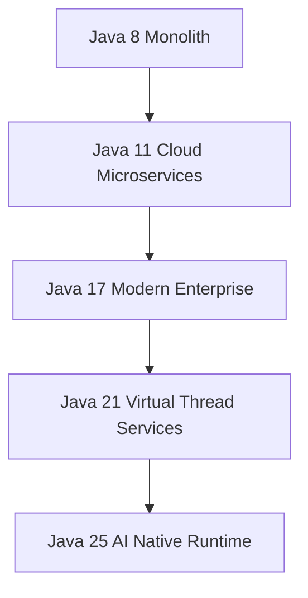

---

# Most Important Interview Topics 🎯

---

# Java 8

* Streams internals
* Spliterator
* Parallel streams
* CompletableFuture
* Functional interfaces

---

# Java 11

* HTTP Client
* var
* String APIs

---

# Java 17

* Records
* Sealed classes
* Pattern matching

---

# Java 21

* Virtual threads
* Carrier threads
* Pinning
* Structured concurrency

---

# Virtual Thread Pinning ⚠️

BAD:

```java
synchronized(lock) {
    Thread.sleep(1000);
}
```

Pins carrier thread.

Kills scalability.

---

# Better

```java
ReentrantLock
```

or non-blocking design.

---

# Final Mental Model 🧠

```text
Java evolved from:

Verbose OOP Enterprise Language
                ↓
Functional Programming Platform
                ↓
Cloud Native Runtime
                ↓
Massively Concurrent Runtime
                ↓
AI + Native + Ultra Scalable Platform
```

---

# One-Line Summary 🚀

```text
Java 8→25 transformed Java from a traditional enterprise language
into a modern cloud-native, AI-ready, massively concurrent runtime platform.
```
