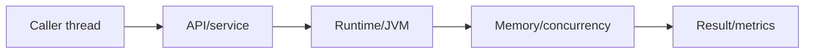
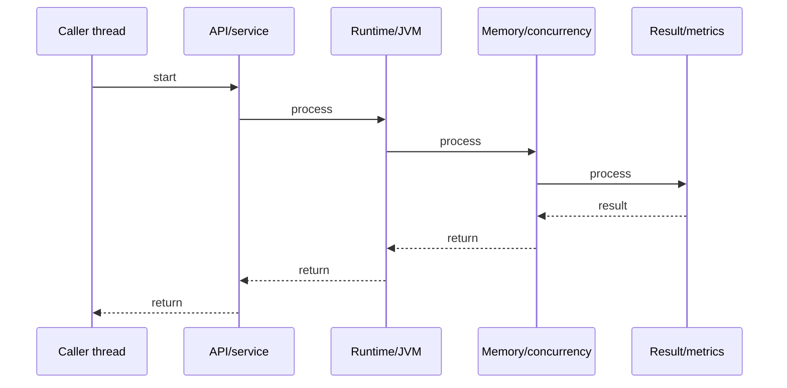

# Java Collection Types Deep Dive

## Quick Facts
- Area: Java
- Tag: Data Structures
- Source: `src/modules/topics/java/java-collection-types.js`
- Tags: `java`, `collections`, `list`, `set`, `map`, `queue`, `arraylist`, `linkedlist`, `treeset`, `hashmap`
- Visual coverage: live visual

## Concept
Java Collections Framework: Iterable -> Collection -> List/Set/Queue, plus Map (separate hierarchy). Each implementation trades time complexity, ordering, and memory differently. ArrayList = dynamic array O(1) get. LinkedList = doubly-linked O(1) head/tail. HashSet = HashMap-backed O(1) avg. TreeSet = red-black tree O(log n) sorted. ArrayDeque = ring buffer O(1) both ends (preferred over Stack/LinkedList). PriorityQueue = min-heap O(log n) poll.

## Why It Matters
Choosing wrong collection causes subtle bugs and perf regressions. ArrayList vs LinkedList matters for cache locality. HashSet vs TreeSet matters for sort requirements. PriorityQueue is NOT sorted - only guarantees minimum at peek. LinkedHashMap access-order mode = LRU cache. These distinctions come up in every FAANG interview.

## Architecture / Mental Model


## Runtime / Sequence


## Animation Plan
- Flow lab can use generated mental model steps above.
- UML sequence can use generated sequence diagram above.
- Architecture map can use generated area mental model above.
- Live visual exists in app: topic-specific canvas/ReactViz animation.

Flow steps:

1. Caller thread
2. API/service
3. Runtime/JVM
4. Memory/concurrency
5. Result/metrics

## Example
```java
// Choosing the right collection

// List - ordered, index access, duplicates OK
List<String> arr = new ArrayList<>();       // O(1) get, O(n) insert
List<String> ll  = new LinkedList<>();      // O(1) head/tail add, O(n) get

// Set - no duplicates
Set<String> hs  = new HashSet<>();          // O(1) avg, no order
Set<String> lhs = new LinkedHashSet<>();    // O(1), insertion order
Set<String> ts  = new TreeSet<>();          // O(log n), sorted

// Queue / Deque
Deque<String> dq  = new ArrayDeque<>();     // O(1) both ends, preferred
Queue<Integer> pq = new PriorityQueue<>();  // min-heap, O(log n) poll

// Map
Map<String, Integer> hm  = new HashMap<>();        // O(1) avg, null key ok
Map<String, Integer> lhm = new LinkedHashMap<>();  // O(1), insertion order
Map<String, Integer> tm  = new TreeMap<>();         // O(log n), sorted keys

// LRU cache with LinkedHashMap access-order
Map<K, V> lru = new LinkedHashMap<>(16, 0.75f, true) {
    protected boolean removeEldestEntry(Map.Entry<K,V> e) {
        return size() > MAX_SIZE;
    }
};

// PriorityQueue gotcha: NOT sorted, only heap-ordered
PriorityQueue<Integer> minHeap = new PriorityQueue<>();
minHeap.addAll(List.of(5, 1, 3, 2, 4));
System.out.println(minHeap); // [1, 2, 3, 5, 4] - NOT [1,2,3,4,5]
System.out.println(minHeap.poll()); // 1 - correct min
```

## Complexity And Performance
- O(1)
- O(log n)

## Interview Drills
1. ArrayList vs LinkedList - when would you choose each?

2. HashSet vs TreeSet vs LinkedHashSet tradeoffs?

3. How does LinkedHashMap implement LRU cache?

4. Why is ArrayDeque preferred over Stack and LinkedList for queue use?

5. PriorityQueue is NOT sorted - explain the heap property.

6. TreeMap vs HashMap for range queries?

## Trade-offs
Pros:
- ArrayList: O(1) random access, cache-friendly contiguous memory
- TreeSet/TreeMap: range queries (subSet, headMap, floorKey) - no sorting needed
- ArrayDeque: fast both ends, no null allowed but no synchronization overhead
- LinkedHashMap access-order: LRU in 3 lines of code

Cons:
- LinkedList: poor cache locality - each node is a separate heap object
- TreeSet/TreeMap: O(log n) for everything - overhead vs HashMap for simple lookups
- PriorityQueue: O(n) contains, no efficient remove-by-value
- HashSet: no ordering guarantee, iteration order changes on resize

## Gotchas
- LinkedList is rarely the right choice - ArrayList wins even with O(n) insert due to cache locality
- PriorityQueue.iterator() does NOT traverse in priority order - use repeated poll()
- TreeSet keys must be Comparable or provide Comparator - ClassCastException at runtime if not
- ArrayList.subList() returns a VIEW - modifying it modifies the original
- Arrays.asList() returns fixed-size List - add/remove throws UnsupportedOperationException
- Collections.sort() uses TimSort (stable) - Collections.shuffle() uses Fisher-Yates

