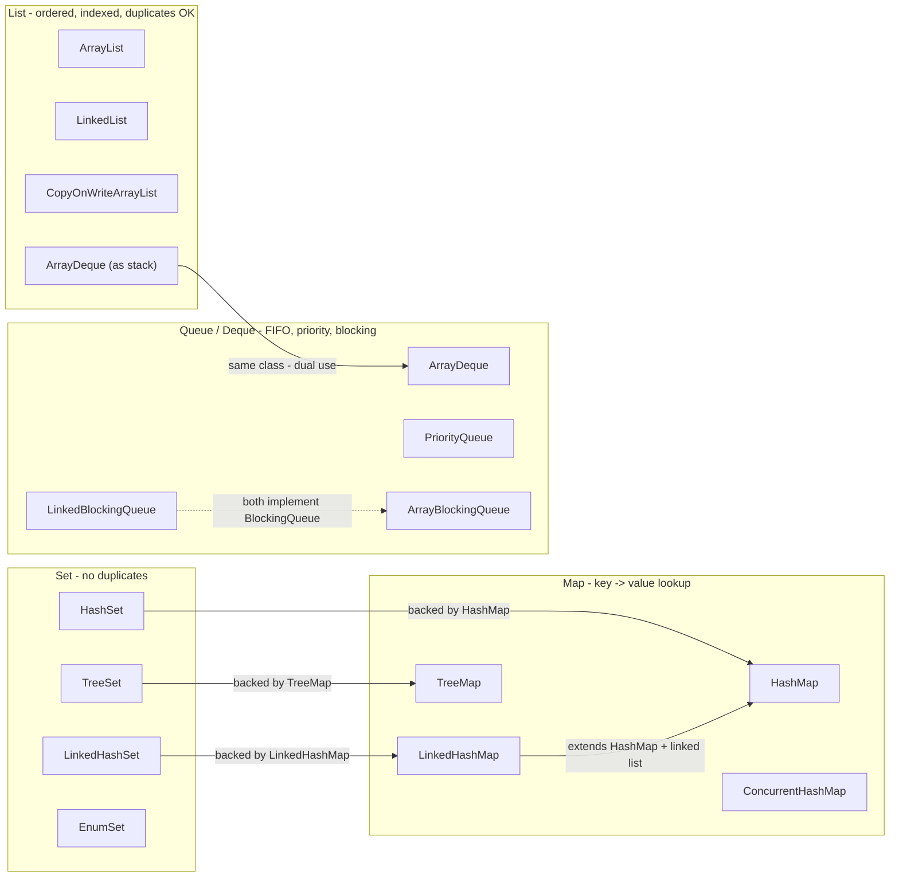
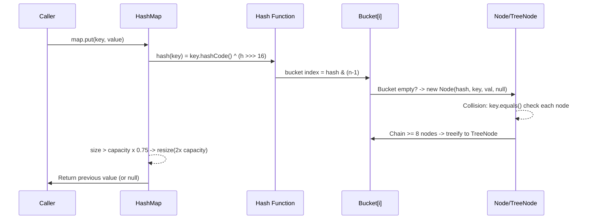

# Collections Framework: List, Map, Set, Queue

## Quick Facts
- Area: Java
- Tag: Collections
- Source: `src/modules/topics/java/java-collections.js`
- Tags: `collections`, `hashmap`, `arraylist`, `concurrenthashmap`, `treemap`, `list`, `set`, `queue`
- Visual coverage: live visual, flow lab, UML lab, architecture map

## Concept
**L1 (30s ELI5):** Collections are containers: List (ordered shelf), Set (no-duplicates jar), Map (labeled drawers). Pick by what you need: order, fast lookup, or key-value pairs.

**L2 (2min core):** ArrayList: dynamic array, O(1) random access, grows 1.5x on full. HashMap: array of buckets, `hash & (n-1)` index, linked-list per bucket, treeify >= 8 nodes. ConcurrentHashMap: per-bin CAS + synchronized, lock-free reads since Java 8. TreeMap/TreeSet: red-black tree, O(log n) all ops, sorted order. ArrayDeque: fastest queue/stack, never use Stack class.

**L3 (10min edge cases):** HashMap allows null key (bucket[0]); TreeMap throws NPE on null key. Override both `hashCode()` AND `equals()` for custom Map keys - same contract required. Pre-size HashMap: `new HashMap<>(expected * 4/3 + 1)` to avoid resize. ConcurrentModificationException on modification during iteration - use `removeIf()` or `iterator.remove()`. `CopyOnWriteArrayList.iterator()` is a snapshot - iterates stale data during concurrent writes.

**L4 (30min deep):** HashMap internals: load factor 0.75 -> resize at 75% fill, rehash all entries to new 2x array. Bucket index: `hash & (n-1)` works because n is always power-of-2 (fast modulo). Hash spreading: `h ^ (h >>> 16)` mixes high bits into low - reduces collision in small tables. Treeification: 8 nodes per bucket AND table capacity >= 64. ConcurrentHashMap: CAS on empty buckets, synchronized on first node for collision chains. EnumMap: array-backed with `enum.ordinal()` as index - fastest possible Map.

## Why It Matters
Choosing the wrong collection is a classic senior interview trap. `LinkedList` for a list (terrible cache locality), `HashMap` with wrong equals/hashCode (all O(n)), `ArrayList` without pre-sizing (repeated resizes), `HashMap` in concurrent code (data corruption). Know the internals.

## Architecture / Mental Model


## Runtime / Sequence


## Animation Plan
- Flow lab available: step-by-step path highlighting.
- UML sequence simulation available: actor messages animate in order.
- Architecture map available: clickable nodes and sync/async links.
- Live visual exists in app: topic-specific canvas/ReactViz animation.

Flow steps:

1. Do you need positional / ordered access? - If you need get(index), add(index), or iteration in insertion order - you want a List. If you want fast lookup by key or set membership test - keep going.
2. YES -> List - ArrayList: O(1) random access, O(n) insert/delete middle. Best for most cases. LinkedList: O(1) insert/delete at ends, O(n) random access - use as Deque, rarely as List. CopyOnWriteArrayList: thread-safe reads at cost of full array copy on...
3. NO -> Need unique elements? - If elements must be unique (no duplicates allowed), a Set is your friend. If you need to count frequencies or check membership, Set is O(1) for contains().
4. YES -> Set - HashSet: O(1) add/contains/remove, unordered - backed by HashMap. LinkedHashSet: insertion-order iteration, slightly slower. TreeSet: sorted by Comparable/Comparator, O(log n) ops - backed by TreeMap.
5. NO -> Need key->value lookup? - Maps store key-value pairs. O(1) average for get/put with HashMap. Use when you index data by a key (userId->user, word->count).
6. YES -> Map - HashMap: O(1) avg, unordered. LinkedHashMap: insertion or access order. TreeMap: sorted keys, O(log n). ConcurrentHashMap: thread-safe with segment locking (Java 8: per-bin lock). EnumMap: fastest for enum keys. WeakHashMap: GC can collect...
7. NO -> FIFO, LIFO, or priority processing? - Queues process elements in order. Task queues, BFS traversal, producer-consumer. Deque = double-ended queue (use as stack or queue). BlockingQueue for thread coordination.
8. YES -> Queue / Deque - ArrayDeque: fastest Deque/Stack, no null. PriorityQueue: min-heap, O(log n) poll. LinkedBlockingQueue: bounded producer-consumer. ArrayBlockingQueue: fixed capacity, blocks producer when full. DelayQueue: scheduled tasks.

## Example
```java
import java.util.*;
import java.util.concurrent.*;

// 1. LRU Cache using LinkedHashMap (5 lines!)
class LRUCache<K,V> extends LinkedHashMap<K,V> {
    private final int maxSize;
    LRUCache(int size) {
        super(size, 0.75f, true); // accessOrder = true
        this.maxSize = size;
    }
    @Override
    protected boolean removeEldestEntry(Map.Entry<K,V> e) {
        return size() > maxSize;
    }
}

// 2. Correct HashMap pre-sizing
// Avoid default new HashMap<>() if you know the size
int expected = 1000;
Map<String, Integer> freq = new HashMap<>(expected * 4 / 3 + 1);

// 3. ConcurrentHashMap atomic ops
ConcurrentHashMap<String, Integer> counts = new ConcurrentHashMap<>();
counts.merge("word", 1, Integer::sum);       // atomic increment
counts.compute("word", (k, v) -> v == null ? 1 : v + 1);
counts.computeIfAbsent("word", k -> new ArrayList<>()).add("item");

// 4. ArrayDeque as stack (faster than Stack class)
Deque<String> stack = new ArrayDeque<>();
stack.push("frame1"); stack.push("frame2");
String top = stack.pop();

// 5. PriorityQueue max-heap
PriorityQueue<Integer> maxHeap = new PriorityQueue<>(Comparator.reverseOrder());
maxHeap.addAll(List.of(3,1,4,1,5,9,2,6));
System.out.println(maxHeap.poll()); // 9
```

Notes:
Always override `hashCode()` AND `equals()` together for custom Map keys. Use `Objects.hash()` and `Objects.equals()` for multi-field implementations.

## Complexity And Performance
- O(1)
- O(log n)
- O(n)

## Interview Drills
1. HashMap vs ConcurrentHashMap - what breaks without CHM?
   Answer: In concurrent puts, HashMap can: (1) lose entries when two threads resize simultaneously, (2) create infinite linked-list loops (Java 6 bug - fixed in Java 8 but race still corrupts data), (3) return inconsistent results on reads. CHM uses per-bin CAS + synchronized - reads are fully lock-free since Java 8.
   Follow-ups: What is the difference between Hashtable and CHM?; When would you use Collections.synchronizedMap()?

2. When does HashMap become O(n) instead of O(1)?
   Answer: Two scenarios: (1) **Bad hashCode()** - all keys hash to the same bucket, creating a linked list of length n. O(n) per op. Java 8 fixes worst case to O(log n) by treeifying bins >= 8 nodes. (2) **Resize** - putting when size > threshold triggers O(n) rehash. Pre-size to avoid.
   Follow-ups: What is a hash flooding attack?; How does Java 8 treeify fix it?

3. LinkedList vs ArrayList - when is LinkedList actually better?
   Answer: Almost never, in practice. LinkedList is theoretically O(1) at ends but ArrayList is also O(1) amortized at end. LinkedList has terrible **cache locality** - each node is a separate heap object, causing cache misses. ArrayDeque beats LinkedList for queue/deque usage and ArrayList beats it for random access. LinkedList wins only for: concurrent modification during iteration with ListIterator, or when you need the Deque interface without ArrayDeque being available.
   Follow-ups: What is cache line size?; How does sequential memory access beat linked structures?

## Trade-offs
Pros:
- Generic, type-safe collections with consistent interfaces.
- Java 8+ factory methods: List.of(), Map.of() for immutable collections.
- Collectors API creates complex nested collections in one pipeline.

Cons:
- Boxing overhead: HashMap<Integer,Integer> vs int[]. Use primitive maps (Eclipse Collections, Trove) for hot paths.
- CopyOnWriteArrayList write cost is O(n) - don't use for write-heavy lists.
- PriorityQueue does NOT support O(1) decrease-key - use TreeMap for that.

When to use:
Default: **ArrayList + HashMap**. Thread-safe: **ConcurrentHashMap**. Sorted: **TreeMap/TreeSet**. Queue: **ArrayDeque**. LRU: **LinkedHashMap (accessOrder=true)**. Enum: **EnumMap/EnumSet**.

## Gotchas
- HashMap null key -> bucket[0] (allowed). TreeMap null key -> NullPointerException. Hashtable null key -> NPE. Know the difference.
- Override BOTH hashCode() AND equals() for Map keys. Missing either: entries lost or duplicated. Use Objects.hash() + Objects.equals().
- LinkedList as List is almost always wrong: terrible cache locality (each node separate heap object), O(n) random access. Use ArrayList.
- ConcurrentModificationException: modifying collection while iterating. Fix: use iterator.remove(), removeIf(), or collect-then-modify.
- CopyOnWriteArrayList iterator is a snapshot: sees data at time of iterator creation, not current state. Stale reads during concurrent writes.
- HashMap pre-size: new HashMap<>(expectedSize * 4/3 + 1) avoids resize. Forgetting causes O(n) rehash when load factor exceeded.

