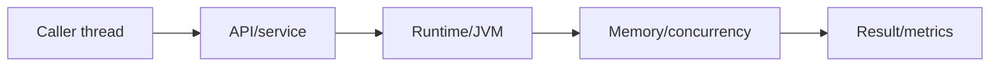
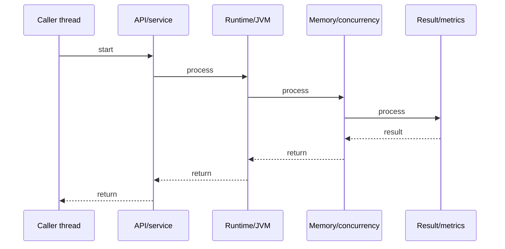
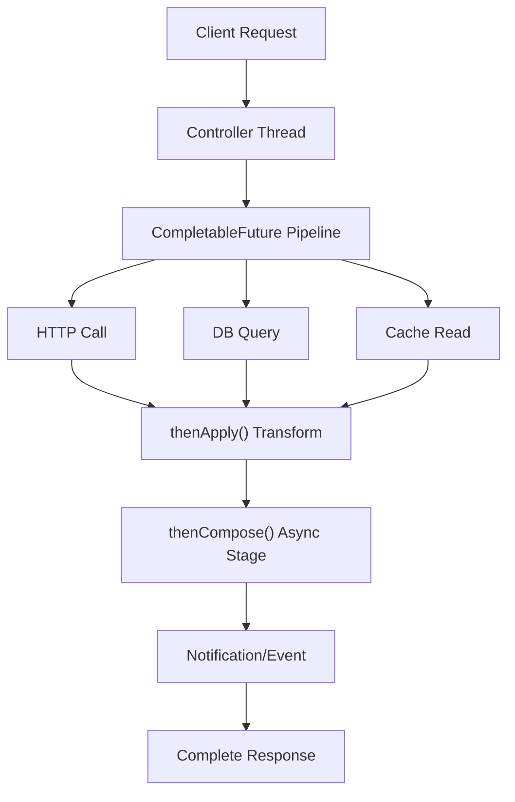
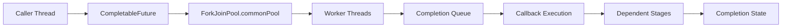
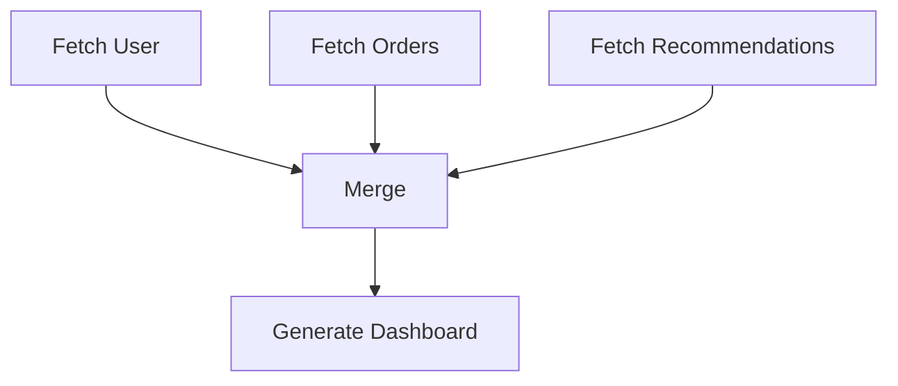
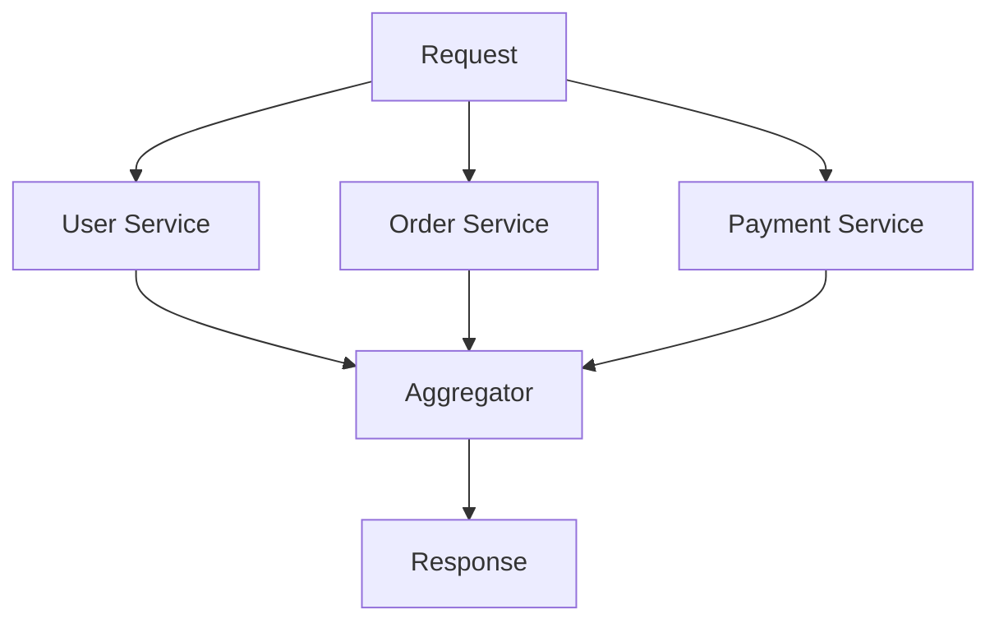
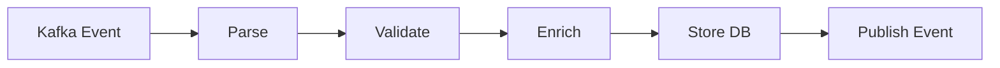
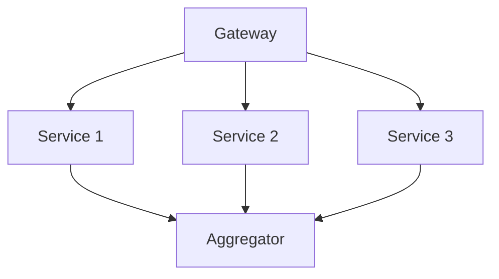
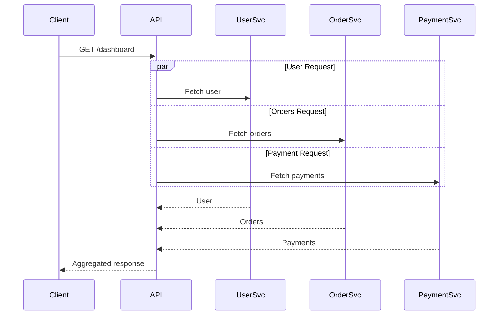

# CompletableFuture Pipeline

## Quick Facts

- Area: Java
- Tag: Async
- Source: `src/modules/topics/java/java-completablefuture.js`
- Tags: `java`, `completablefuture`, `async`, `pipeline`, `concurrency`, `non-blocking`
- Visual coverage: live visual

## Concept

CompletableFuture<T> is Java's promise/future for async composition. Unlike Future.get() (blocking), CompletableFuture chains non-blocking callbacks: thenApply (transform), thenCompose (flatMap), thenCombine (merge two futures), thenAccept (consume), exceptionally (error recovery). Stages run on ForkJoinPool.commonPool() by default or a custom Executor. allOf() fans out; anyOf() races.

## Why It Matters

Blocking threads on Future.get() wastes thread pool capacity under load. CompletableFuture enables async pipelines: HTTP call -> parse -> DB write - each stage hands off to ForkJoinPool without blocking. Essential for high-throughput services without reactive frameworks. Java 8+ standard library, no additional dependency.

## Architecture / Mental Model



## Runtime / Sequence



## Animation Plan

- Flow lab can use generated mental model steps above.
- UML sequence can use generated sequence diagram above.
- Architecture map can use generated area mental model above.
- Live visual exists in app: topic-specific canvas/ReactViz animation.

Flow steps:

1. Caller thread
2. API/service
3. Runtime/JVM
4. Memory/concurrency
5. Result/metrics

## Example

```java
// Sequential blocking (BAD for high throughput)
User user = userService.getUser(id);          // blocks
Orders orders = orderService.getOrders(id);   // blocks
return new Dashboard(user, orders);

// Async parallel with CompletableFuture
CompletableFuture<User> userFuture =
    CompletableFuture.supplyAsync(() -> userService.getUser(id), executor);

CompletableFuture<Orders> ordersFuture =
    CompletableFuture.supplyAsync(() -> orderService.getOrders(id), executor);

CompletableFuture<Dashboard> dashboard =
    userFuture.thenCombine(ordersFuture, Dashboard::new);

// Pipeline: fetch -> parse -> save -> notify
CompletableFuture.supplyAsync(() -> httpClient.fetch(url))     // async fetch
    .thenApply(response -> JsonParser.parse(response))          // sync transform
    .thenCompose(data -> dbService.saveAsync(data))             // async save (flatMap)
    .thenAccept(saved -> notificationService.send(saved.id()))  // consume result
    .exceptionally(ex -> { log.error("Failed", ex); return null; }); // error recovery
```

## Complexity And Performance

- Time/space complexity depends on input size, data volume, and implementation choices.
- Track latency, throughput, memory, saturation, error rate, and correctness invariants.

## Interview Drills

1. Difference between thenApply and thenCompose?

2. What thread executes thenApply callbacks?

3. How do you run two futures in parallel and combine results?

4. What happens when a CompletableFuture stage throws an exception?

5. Difference between exceptionally, handle, and whenComplete?

## Trade-offs

Pros:

- Non-blocking pipeline - thread freed while I/O waits
- allOf/anyOf for fan-out parallelism
- Built into Java 8+ stdlib - no extra dependency
- Composable: chain arbitrary async operations

Cons:

- Error handling verbose - exceptionally/handle on every stage
- Stack traces lose context across async boundaries
- Debugging hard - async callbacks across threads
- Replaced by virtual threads (Java 21) for simple I/O - only needed for fan-out

## Gotchas

- thenApply runs on completing thread (ForkJoinPool or caller) - use thenApplyAsync to specify executor
- thenCompose is flatMap - if fn returns CF<T>, thenApply wraps it: CF<CF<T>>
- allOf returns CF<Void> - call .get() on each individual future to extract results
- Unhandled exceptions silently complete exceptionally - always add exceptionally/handle


# CompletableFuture Pipeline — Deep Dive 🚀

## Quick Facts

* Area: Java Concurrency / Async Programming
* Tag: Async Pipeline
* Source: `src/modules/topics/java/java-completablefuture.js`
* Java Version: Java 8+
* Related Topics:

  * ExecutorService
  * ForkJoinPool
  * Virtual Threads
  * Reactive Streams
  * Structured Concurrency
  * Parallelism
  * Backpressure
  * Async HTTP Clients
* Tags:

  * `java`
  * `completablefuture`
  * `async`
  * `pipeline`
  * `concurrency`
  * `forkjoinpool`
  * `non-blocking`
  * `parallelism`
  * `fanout`
  * `fanin`
  * `distributed-systems`
* Visual Coverage:

  * live visual
  * async pipeline animation
  * thread transition animation
  * future graph visualization
  * executor saturation visualization

---

# What Is CompletableFuture?

`CompletableFuture<T>` is Java’s asynchronous computation graph engine.

Think of it as:

```text
Future + Callback + Pipeline + Composition + Error Handling
```

Unlike old `Future`:

```java
Future<User> future = executor.submit(task);
User user = future.get(); // BLOCKING
```

`CompletableFuture` enables:

```java
fetch()
  -> transform()
  -> validate()
  -> enrich()
  -> save()
  -> notify()
```

without blocking threads.

---

# Core Mental Model 🧠

## Traditional Blocking Model

```text
Thread starts request
    ↓
Thread waits for DB
    ↓
Thread waits for API
    ↓
Thread waits for cache
    ↓
Thread returns result
```

Problem:

```text
CPU mostly idle while thread blocked.
```

Under high traffic:

```text
1000 requests
→ 1000 blocked threads
→ thread pool exhaustion
→ latency spike
→ OOM risk
```

---

# CompletableFuture Model

```text
Start async work
    ↓
Thread released back to pool
    ↓
I/O happens elsewhere
    ↓
Callback triggered when complete
    ↓
Next stage runs
```

Key Idea:

```text
DO NOT BLOCK THREADS DURING I/O WAIT
```

---

# Real World Analogy 🌍

Food delivery app:

```text
Customer places order
    ↓
Restaurant prepares food
    ↓
Delivery partner assigned
    ↓
Payment processed
    ↓
Tracking updated
```

All happen independently and asynchronously.

CompletableFuture behaves similarly.

---

# Internal Architecture



---

# Internal JVM Architecture



---

# State Machine

A CompletableFuture internally behaves like a state machine.

```text
NEW
 ↓
RUNNING
 ↓
COMPLETED
 OR
FAILED
 OR
CANCELLED
```

---

# Internal Object Structure

Simplified:

```java
class CompletableFuture<T> {

    Object result;

    Completion stack;

    Executor executor;

}
```

It stores:

* result
* exception
* dependent callbacks
* completion actions

---

# Callback Graph Model

CompletableFuture is NOT linear internally.

It forms a DAG (Directed Acyclic Graph).



This is extremely important in system design.

---

# Core APIs Deep Dive

---

# 1. supplyAsync()

Creates async computation returning value.

```java
CompletableFuture<User> future =
    CompletableFuture.supplyAsync(() -> {
        return userService.getUser(id);
    });
```

Equivalent conceptually:

```text
Submit task to thread pool
```

---

# 2. runAsync()

Async task without return value.

```java
CompletableFuture.runAsync(() -> {
    emailService.send();
});
```

Equivalent:

```text
Fire and forget
```

---

# 3. thenApply()

Transforms result synchronously.

```java
future.thenApply(user -> user.getName());
```

Equivalent to:

```text
map()
```

Visualization:

```text
User -> String
```

---

# 4. thenCompose()

Flattens nested futures.

MOST IMPORTANT INTERVIEW QUESTION.

---

## Wrong

```java
CompletableFuture<CompletableFuture<Order>>
```

Generated by:

```java
future.thenApply(user ->
    fetchOrdersAsync(user.id())
);
```

Because function returns future.

---

## Correct

```java
future.thenCompose(user ->
    fetchOrdersAsync(user.id())
);
```

Produces:

```java
CompletableFuture<Order>
```

---

# Visual Difference

## thenApply

```text
A -> B
```

## thenCompose

```text
A -> Future<B>
Flattened to:
Future<B>
```

---

# 5. thenCombine()

Combine two parallel futures.

```java
userFuture.thenCombine(orderFuture,
    (user, orders) -> new Dashboard(user, orders)
);
```

---

# Parallel Fan-Out / Fan-In Pattern



This pattern is everywhere:

* API gateways
* GraphQL resolvers
* Microservice aggregators
* BFF layer
* recommendation engines

---

# 6. allOf()

Wait for all futures.

```java
CompletableFuture.allOf(f1, f2, f3)
```

BUT:

```java
Returns CompletableFuture<Void>
```

Need manual extraction.

---

## Pattern

```java
CompletableFuture<Void> all =
    CompletableFuture.allOf(f1, f2, f3);

all.join();

List<String> results = List.of(
    f1.join(),
    f2.join(),
    f3.join()
);
```

---

# 7. anyOf()

Race futures.

```java
CompletableFuture.anyOf(
    cacheFuture,
    dbFuture,
    replicaFuture
);
```

First completed wins.

Used in:

* geo-replication
* fastest replica reads
* CDN race strategies
* hedge requests

---

# Thread Execution Model ⚡

VERY IMPORTANT.

---

# Default Executor

By default:

```java
ForkJoinPool.commonPool()
```

Used.

---

# thenApply Thread Behavior

```java
future.thenApply(...)
```

Runs on:

```text
Thread that completed previous stage
```

NOT guaranteed async.

---

# thenApplyAsync

```java
future.thenApplyAsync(...)
```

Always schedules asynchronously.

---

# Visualization

```text
thenApply
-----------
Thread-1 -> callback

thenApplyAsync
--------------
Thread-1 -> enqueue
               ↓
        Thread-5 executes callback
```

---

# Custom Executor Best Practice

NEVER rely heavily on commonPool in production.

---

## Good

```java
ExecutorService ioPool =
    Executors.newFixedThreadPool(100);

CompletableFuture.supplyAsync(task, ioPool);
```

---

# Executor Segregation Pattern

```text
CPU Pool
    - parsing
    - encryption

I/O Pool
    - DB calls
    - HTTP calls

Scheduler Pool
    - retries
    - delayed tasks
```

Critical for large systems.

---

# Real Production Example — API Aggregator 🌐

```java
public CompletableFuture<Dashboard> getDashboard(String userId) {

    CompletableFuture<User> userFuture =
        CompletableFuture.supplyAsync(
            () -> userService.fetch(userId),
            ioPool
        );

    CompletableFuture<List<Order>> ordersFuture =
        CompletableFuture.supplyAsync(
            () -> orderService.fetch(userId),
            ioPool
        );

    CompletableFuture<Recommendations> recFuture =
        CompletableFuture.supplyAsync(
            () -> recommendationService.fetch(userId),
            ioPool
        );

    return userFuture.thenCombine(ordersFuture,
            DashboardData::new)
        .thenCombine(recFuture,
            (dashboard, recs) -> {
                dashboard.setRecommendations(recs);
                return dashboard;
            });
}
```

---

# Async ETL Pipeline Example



---

## Code

```java
CompletableFuture.supplyAsync(() -> kafkaEvent)
    .thenApply(parser::parse)
    .thenApply(validator::validate)
    .thenCompose(enricher::enrichAsync)
    .thenCompose(repository::saveAsync)
    .thenAccept(eventBus::publish);
```

---

# Retry Pattern 🔁

CompletableFuture has NO built-in retry.

Need manual implementation.

---

## Retry Utility

```java
public <T> CompletableFuture<T> retry(
        Supplier<T> supplier,
        int retries) {

    return CompletableFuture.supplyAsync(() -> {
        int attempts = 0;

        while (true) {
            try {
                return supplier.get();
            } catch (Exception e) {
                attempts++;

                if (attempts >= retries) {
                    throw e;
                }
            }
        }
    });
}
```

---

# Timeout Pattern ⏳

Java 9+:

```java
future.orTimeout(2, TimeUnit.SECONDS);
```

Fallback:

```java
future.completeOnTimeout(
    DEFAULT_VALUE,
    2,
    TimeUnit.SECONDS
);
```

---

# Circuit Breaker Integration

Common production stack:

```text
CompletableFuture
    +
Resilience4j
    +
Bulkhead
    +
Retry
    +
Timeout
```

---

# Error Handling Deep Dive 🔥

---

# exceptionally()

Recover from failure.

```java
future.exceptionally(ex -> {
    log.error("Failed", ex);
    return DEFAULT;
});
```

Only runs on failure.

---

# handle()

Runs always.

```java
future.handle((result, ex) -> {

    if (ex != null) {
        return DEFAULT;
    }

    return result;
});
```

---

# whenComplete()

Side effect only.

```java
future.whenComplete((res, ex) -> {
    metrics.record();
});
```

Cannot transform result.

---

# Comparison Table

| Method        | Runs On Success | Runs On Failure | Can Transform |
| ------------- | --------------- | --------------- | ------------- |
| exceptionally | ❌               | ✅               | ✅             |
| handle        | ✅               | ✅               | ✅             |
| whenComplete  | ✅               | ✅               | ❌             |

---

# Cancellation

```java
future.cancel(true);
```

BUT:

```text
Does NOT guarantee underlying task interruption.
```

Very tricky interview topic.

---

# Deadlock Scenario ⚠️

BAD:

```java
CompletableFuture.supplyAsync(() -> {
    return anotherFuture.join();
});
```

Can deadlock small thread pools.

---

# Thread Pool Exhaustion Scenario

```text
100 worker threads
    ↓
all blocked on join()
    ↓
no thread available
    ↓
system freeze
```

Classic async anti-pattern.

---

# Performance Characteristics 📊

## Good For

✅ I/O parallelism
✅ Fan-out aggregation
✅ HTTP orchestration
✅ DB concurrency
✅ Async workflows
✅ Event pipelines

---

## Bad For

❌ Heavy CPU tasks on commonPool
❌ Deep callback hell
❌ Complex transactional workflows
❌ Backpressure-sensitive streaming

---

# CompletableFuture vs Reactive Streams

| Feature           | CompletableFuture | Reactive  |
| ----------------- | ----------------- | --------- |
| Single Result     | Excellent         | Good      |
| Stream Processing | Weak              | Excellent |
| Backpressure      | No                | Yes       |
| Complexity        | Medium            | High      |
| Learning Curve    | Easier            | Harder    |
| Fan-out APIs      | Excellent         | Excellent |

---

# CompletableFuture vs Virtual Threads (Java 21)

VERY IMPORTANT MODERN INTERVIEW TOPIC.

---

# Old Recommendation

```text
Use CompletableFuture for scalable I/O
```

---

# Modern Recommendation

Virtual threads allow:

```java
User user = service.fetch();
```

without expensive blocking.

Simpler code.

---

# So Why CompletableFuture Still Exists?

Still valuable for:

✅ Parallel fan-out
✅ Combining async computations
✅ Racing requests
✅ Async DAG execution
✅ Scatter-gather
✅ Non-linear workflows

---

# Scatter-Gather Pattern



Classic microservice architecture pattern.

---

# Async Microservice Request Flow 🌐



---

# ForkJoinPool Internals 🧵

ForkJoinPool uses:

```text
Work-stealing algorithm
```

Each worker thread has deque.

Idle thread steals work from others.

Excellent for:

* recursive tasks
* parallel decomposition
* async callbacks

---

# Common Production Problems ⚠️

---

# 1. Callback Hell

```java
future.thenCompose(a ->
    future2.thenCompose(b ->
        future3.thenCompose(c ->
```

Solution:

* helper methods
* composition abstraction
* structured workflows

---

# 2. Lost MDC / Trace Context

Async thread switch loses:

```text
requestId
traceId
securityContext
```

Need:

* ThreadLocal propagation
* OpenTelemetry
* context wrappers

---

# 3. Silent Failure

```java
future.thenApply(...)
```

without terminal observation.

Failure disappears silently.

---

# 4. Memory Leak

Long future chains retain references.

Especially:

```text
large lambda captures
```

---

# 5. Blocking Inside Async

BAD:

```java
.thenApply(x -> jdbcCall())
```

JDBC blocks thread.

Need separate executor.

---

# Best Practices ✅

---

# DO

✅ Use custom executors
✅ Separate CPU/I/O pools
✅ Add timeouts
✅ Add retries
✅ Handle exceptions everywhere
✅ Monitor pool saturation
✅ Use allOf for fan-out
✅ Use thenCompose for async chaining
✅ Use structured logging

---

# DON'T

❌ Block using join/get everywhere
❌ Use commonPool heavily in production
❌ Mix CPU + blocking I/O pools
❌ Ignore cancellation
❌ Create infinite async chains
❌ Swallow exceptions silently

---

# Interview Deep Dive Questions 🎯

---

# Q1: thenApply vs thenCompose?

## thenApply

```text
map()
```

Transforms value.

## thenCompose

```text
flatMap()
```

Flattens nested futures.

---

# Q2: What thread runs callbacks?

Depends:

```text
thenApply
→ completing thread

thenApplyAsync
→ executor thread
```

---

# Q3: Why allOf returns Void?

Because futures may have different generic types.

---

# Q4: How does CompletableFuture avoid blocking?

By registering continuation callbacks instead of waiting synchronously.

---

# Q5: What is completion stack internally?

Dependent callbacks stored as linked completion nodes.

---

# Q6: Why can commonPool be dangerous?

Shared globally across JVM.

Heavy blocking tasks can starve unrelated workloads.

---

# Q7: Difference between get() and join()?

| Method | Checked Exception |
| ------ | ----------------- |
| get()  | Yes               |
| join() | No                |

`join()` wraps in `CompletionException`.

---

# Q8: How do you debug async chains?

* thread names
* distributed tracing
* MDC propagation
* structured logs
* OpenTelemetry spans

---

# Q9: How do retries interact with idempotency?

Critical distributed systems question.

Retries can create duplicates.

Need:

* idempotency keys
* deduplication
* transactional outbox

---

# Q10: When NOT to use CompletableFuture?

* simple CRUD APIs
* sequential workflows
* virtual-thread architectures
* streaming workloads requiring backpressure

---

# Advanced Pattern — Async Cache + DB Fallback

```java
cacheService.getAsync(key)
    .exceptionally(ex -> null)
    .thenCompose(cache -> {

        if (cache != null) {
            return CompletableFuture.completedFuture(cache);
        }

        return dbService.getAsync(key)
            .thenCompose(data ->
                cacheService.putAsync(key, data)
                    .thenApply(v -> data)
            );
    });
```

---

# Advanced Pattern — Hedged Requests

Reduce tail latency.

```java
CompletableFuture.anyOf(
    primaryReplica(),
    secondaryReplica()
);
```

Used in:

* Google
* Amazon
* Netflix

for latency optimization.

---

# Advanced Pattern — Bulkhead Isolation

```text
User API Pool
Payment API Pool
Analytics Pool
```

Failure isolation.

Prevents cascading collapse.

---

# Visualization Ideas 🎨

---

# Animation: Async Pipeline

```text
Request
  ↓
Async Fetch
  ↓
Thread released
  ↓
Completion event
  ↓
Callback resumes
```

---

# Animation: Fan-Out

```text
          /-> Service A
Request -+-> Service B
          \-> Service C
```

---

# Animation: Work Stealing

```text
Worker-1 overloaded
Worker-2 idle
    ↓
Worker-2 steals tasks
```

---

# Animation: Exception Propagation

```text
Stage1 OK
  ↓
Stage2 FAIL
  ↓
exceptionally()
  ↓
Fallback value
```

---

# Suggested Live Visuals

## Visual 1 — Thread Timeline

```text
Time →
Thread-1: submit task
Thread-1: free

Thread-8: HTTP callback
Thread-8: transform

Thread-3: DB save
```

---

# Visual 2 — Completion DAG

```text
Nodes = stages
Edges = dependencies
```

---

# Visual 3 — Pool Saturation

```text
Active threads
Queue depth
Rejected tasks
Blocked workers
```

---

# Metrics To Monitor 📈

* async latency
* queue depth
* executor saturation
* callback execution time
* timeout count
* retry count
* rejection count
* completion failure %
* fan-out amplification
* tail latency p99

---

# Production Monitoring Stack

```text
Micrometer
    +
Prometheus
    +
Grafana
    +
OpenTelemetry
```

---

# Final Mental Model 🧠

```text
CompletableFuture is:

A graph of dependent computations
executed asynchronously
using completion callbacks
without blocking waiting threads.
```

---

# One-Line Summary

```text
CompletableFuture transforms thread-blocking workflows
into composable asynchronous execution graphs.
```
