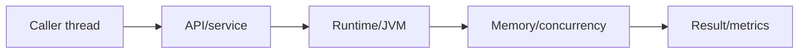
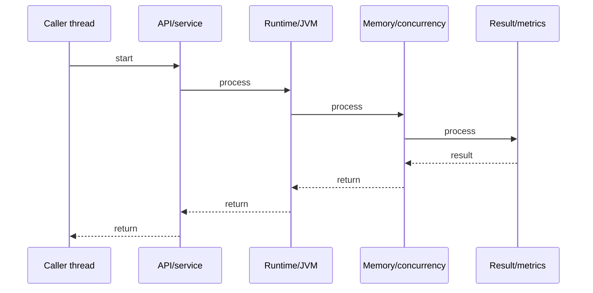

# CompletableFuture Pipeline

## Quick Facts
- Area: Java
- Tag: Async
- Source: `src/modules/topics/java/java-completablefuture.js`
- Tags: `java`, `completablefuture`, `async`, `pipeline`, `concurrency`, `non-blocking`
- Visual coverage: live visual

## Concept
CompletableFuture<T> is Java's promise/future for async composition. Unlike Future.get() (blocking), CompletableFuture chains non-blocking callbacks: thenApply (transform), thenCompose (flatMap), thenCombine (merge two futures), thenAccept (consume), exceptionally (error recovery). Stages run on ForkJoinPool.commonPool() by default or a custom Executor. allOf() fans out; anyOf() races.

## Why It Matters
Blocking threads on Future.get() wastes thread pool capacity under load. CompletableFuture enables async pipelines: HTTP call -> parse -> DB write - each stage hands off to ForkJoinPool without blocking. Essential for high-throughput services without reactive frameworks. Java 8+ standard library, no additional dependency.

## Architecture / Mental Model


## Runtime / Sequence


## Animation Plan
- Flow lab can use generated mental model steps above.
- UML sequence can use generated sequence diagram above.
- Architecture map can use generated area mental model above.
- Live visual exists in app: topic-specific canvas/ReactViz animation.

Flow steps:

1. Caller thread
2. API/service
3. Runtime/JVM
4. Memory/concurrency
5. Result/metrics

## Example
```java
// Sequential blocking (BAD for high throughput)
User user = userService.getUser(id);          // blocks
Orders orders = orderService.getOrders(id);   // blocks
return new Dashboard(user, orders);

// Async parallel with CompletableFuture
CompletableFuture<User> userFuture =
    CompletableFuture.supplyAsync(() -> userService.getUser(id), executor);

CompletableFuture<Orders> ordersFuture =
    CompletableFuture.supplyAsync(() -> orderService.getOrders(id), executor);

CompletableFuture<Dashboard> dashboard =
    userFuture.thenCombine(ordersFuture, Dashboard::new);

// Pipeline: fetch -> parse -> save -> notify
CompletableFuture.supplyAsync(() -> httpClient.fetch(url))     // async fetch
    .thenApply(response -> JsonParser.parse(response))          // sync transform
    .thenCompose(data -> dbService.saveAsync(data))             // async save (flatMap)
    .thenAccept(saved -> notificationService.send(saved.id()))  // consume result
    .exceptionally(ex -> { log.error("Failed", ex); return null; }); // error recovery
```

## Complexity And Performance
- Time/space complexity depends on input size, data volume, and implementation choices.
- Track latency, throughput, memory, saturation, error rate, and correctness invariants.

## Interview Drills
1. Difference between thenApply and thenCompose?

2. What thread executes thenApply callbacks?

3. How do you run two futures in parallel and combine results?

4. What happens when a CompletableFuture stage throws an exception?

5. Difference between exceptionally, handle, and whenComplete?

## Trade-offs
Pros:
- Non-blocking pipeline - thread freed while I/O waits
- allOf/anyOf for fan-out parallelism
- Built into Java 8+ stdlib - no extra dependency
- Composable: chain arbitrary async operations

Cons:
- Error handling verbose - exceptionally/handle on every stage
- Stack traces lose context across async boundaries
- Debugging hard - async callbacks across threads
- Replaced by virtual threads (Java 21) for simple I/O - only needed for fan-out

## Gotchas
- thenApply runs on completing thread (ForkJoinPool or caller) - use thenApplyAsync to specify executor
- thenCompose is flatMap - if fn returns CF<T>, thenApply wraps it: CF<CF<T>>
- allOf returns CF<Void> - call .get() on each individual future to extract results
- Unhandled exceptions silently complete exceptionally - always add exceptionally/handle

