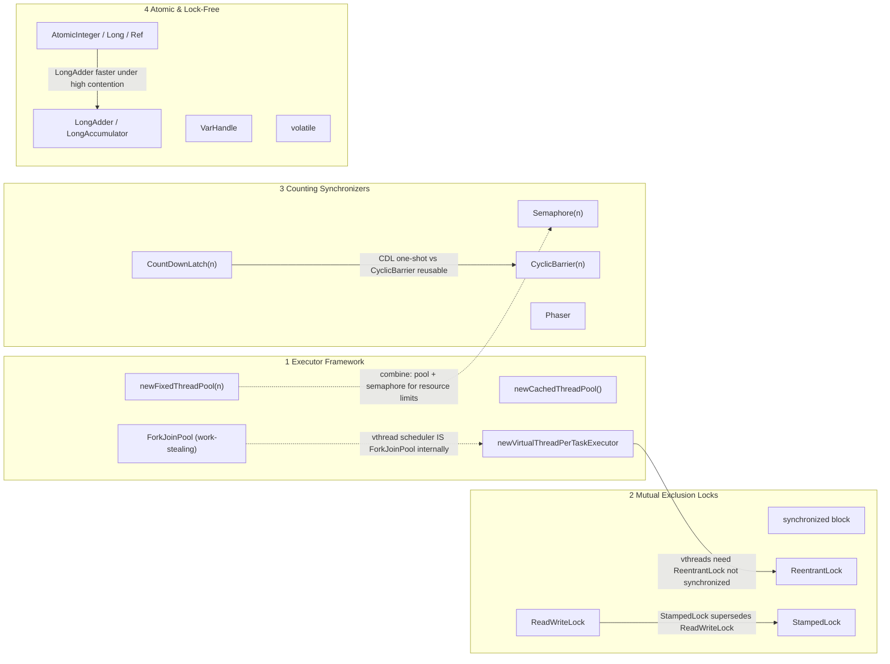
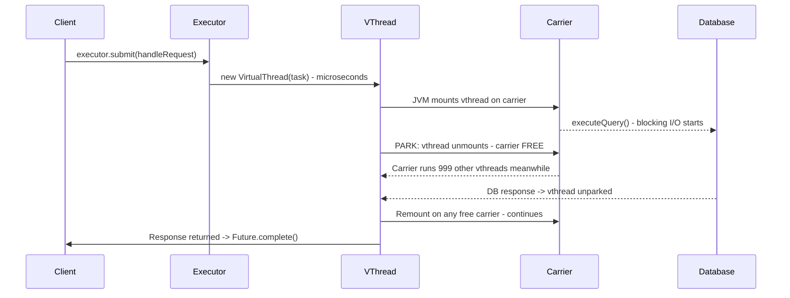

# Concurrency: Threads, Executors, Locks & Synchronizers

## Quick Facts
- Area: Java
- Tag: Concurrency
- Source: `src/modules/topics/java/java-concurrency.js`
- Tags: `threads`, `executor`, `loom`, `virtual threads`, `reentrantlock`, `semaphore`, `countdownlatch`, `cyclic barrier`, `concurrency`
- Visual coverage: live visual, flow lab, UML lab, architecture map

## Concept
**L1 (30s ELI5):** Threads are mini-programs running simultaneously. Like workers sharing a factory - need locks so they don't break things. Java 21 virtual threads: 10 million lightweight threads instead of 10,000 real ones.

**L2 (2min core):** Platform threads = 1:1 OS threads (~1MB stack). Virtual threads (Java 21): heap-stack, mounts on carrier OS thread. Blocking I/O parks vthread -> unmounts from carrier -> carrier FREE for others. Lock ladder: `synchronized` -> `ReentrantLock` -> `ReadWriteLock` -> `StampedLock` (optimistic reads). Synchronizers: Semaphore (permits), CountDownLatch (one-shot gate), CyclicBarrier (reusable rendezvous).

**L3 (10min edge cases):** `synchronized` PINS virtual thread to carrier (blocks carrier OS thread - defeats purpose). StampedLock NOT reentrant: calling `lock()` inside `lock()` = deadlock. CyclicBarrier: one thread dies = all waiters get BrokenBarrierException. ThreadLocal leaks in pooled threads - always `remove()` in finally. volatile does NOT provide atomicity for compound ops (check-then-act).

**L4 (30min deep):** JMM happens-before: lock release -> lock acquire, volatile write -> volatile read, Thread.start() -> first action in started thread. Without happens-before: stale cached values, reordered writes visible. VarHandle: acquire/release/opaque memory order semantics for lock-free structures. ForkJoinPool work-stealing: each worker has a deque; idle workers steal from tail of others. Virtual thread continuation: stack stored as heap object, mounted/unmounted via JVM internal `Continuation.yield()/run()`.

## Why It Matters
Virtual threads collapse the **thread-per-request vs reactive** debate. You write straight-line blocking code; the JVM gives you reactive-grade scalability. Lock choice determines virtual thread friendliness and contention patterns.

## Architecture / Mental Model


## Runtime / Sequence


## Animation Plan
- Flow lab available: step-by-step path highlighting.
- UML sequence simulation available: actor messages animate in order.
- Architecture map available: clickable nodes and sync/async links.
- Live visual exists in app: topic-specific canvas/ReactViz animation.

Flow steps:

1. new Thread(task) - object in heap, no OS thread - Platform thread: JVM creates a Thread object but NO OS thread yet. Virtual thread: same - just a cheap JVM object. 10,000 virtual thread objects cost ~1MB total. Same as 1 platform thread stack.
2. thread.start() - enters run queue - Platform: OS allocates ~1MB stack, adds to OS scheduler queue. Virtual: JVM adds to ForkJoinPool work-stealing queue. No OS thread allocated until it actually runs.
3. CPU time slice granted - RUNNING - Platform thread: OS picks it, context-switch happens. Virtual thread: JVM "mounts" it onto a carrier OS thread. Your code runs. Both look identical from inside run().
4. Blocking I/O or lock wait - KEY DIFFERENCE! - Platform thread: OS BLOCKS the entire OS thread. 200 blocked platform threads = 200 wasted OS threads. Virtual thread: JVM detects blocking, PARKS the vthread, UNMOUNTS from carrier. Carrier INSTANTLY FREE to run other vthreads!
5. I/O complete / lock acquired - back to RUNNABLE - Platform: OS wakes the blocked OS thread. Virtual: JVM marks the parked vthread runnable again, remounts on any available carrier. Transparent to your code.
6. run() returns -> TERMINATED - Task complete. ExecutorService wraps result in Future/CompletableFuture. Platform thread destroyed or returned to pool. Virtual thread: JVM object collected. Cost: near zero.

## Example
```java
import java.util.concurrent.*;
import java.util.concurrent.locks.*;

// 1. ReentrantLock - virtual thread safe, timed try
ReentrantLock lock = new ReentrantLock();
if (lock.tryLock(100, TimeUnit.MILLISECONDS)) {
    try { /* critical section */ }
    finally { lock.unlock(); }  // ALWAYS unlock in finally
}

// 2. ReadWriteLock - concurrent reads
ReadWriteLock rwl = new ReentrantReadWriteLock();
// reads: concurrent
rwl.readLock().lock(); try { return cache.get(key); } finally { rwl.readLock().unlock(); }
// writes: exclusive
rwl.writeLock().lock(); try { cache.put(key, val); } finally { rwl.writeLock().unlock(); }

// 3. StampedLock - optimistic read (no lock!)
StampedLock sl = new StampedLock();
long stamp = sl.tryOptimisticRead();
double x = this.x, y = this.y;  // read without lock
if (!sl.validate(stamp)) {       // check: did a write happen?
    stamp = sl.readLock();       // fall back to real read lock
    try { x = this.x; y = this.y; } finally { sl.unlockRead(stamp); }
}

// 4. Semaphore - connection pool limit
Semaphore pool = new Semaphore(10);  // max 10 concurrent DB connections
pool.acquire();
try { useDatabase(); } finally { pool.release(); }

// 5. CountDownLatch - wait for N workers
CountDownLatch ready = new CountDownLatch(3);
for (int i = 0; i < 3; i++) {
    executor.submit(() -> { doWork(); ready.countDown(); });
}
ready.await();  // main thread blocks until all 3 finish

// 6. CyclicBarrier - parallel phases
CyclicBarrier barrier = new CyclicBarrier(4, () -> System.out.println("Phase done!"));
// Each of 4 threads does:
doPhaseWork();
barrier.await();  // all 4 must arrive before any proceeds
```

Notes:
Never call `lock()` without a matching `unlock()` in `finally`. `synchronized` blocks pin virtual threads during I/O - prefer `ReentrantLock` in virtual-thread-heavy code.

## Complexity And Performance
- Time/space complexity depends on deployment, data size, and chosen implementation.
- Track p50/p95/p99 latency, throughput, memory, saturation, and error rate for production topics.

## Interview Drills
1. Difference between virtual threads and reactive (WebFlux)?
   Answer: Both achieve high concurrency with few OS threads. **Virtual threads** keep the **imperative blocking** programming model - easier debugging, linear stack traces, `ThreadLocal` works. **Reactive** uses async non-blocking APIs; backpressure is first-class but cognitive load is high. For most apps in 2025, **virtual threads** are the better default.
   Follow-ups: What is thread pinning?; Can I use ThreadLocal with virtual threads?

2. When to use Semaphore vs ReadWriteLock vs StampedLock?
   Answer: **Semaphore**: limit concurrency (N permits for N connections). Not about mutual exclusion of a resource - about throughput control. **ReadWriteLock**: shared resource with concurrent reads, exclusive writes. Writer starvation risk under high read load. **StampedLock**: same as RWL but adds optimistic reads with no lock acquisition - 3-10x faster for read-dominant loads. Not reentrant.
   Follow-ups: What is writer starvation?; Why is StampedLock not reentrant?

3. CountDownLatch vs CyclicBarrier - which one?
   Answer: **CountDownLatch**: one-way, one-shot. Either many threads wait for 1 signal, or 1 thread waits for N completions. Cannot reuse. **CyclicBarrier**: N threads all wait for each other at a rendezvous point. Resets automatically after all arrive. Optional barrierAction fires when all arrive. Use CyclicBarrier for iterative parallel algorithms (game loops, parallel matrix ops, phases).
   Follow-ups: Can CountDownLatch deadlock?; Phaser vs CyclicBarrier?

## Trade-offs
Pros:
- Virtual threads remove the need for reactive complexity.
- StampedLock gives near-zero overhead optimistic reads.
- Structured concurrency (Java 21) prevents thread leaks in fork-join patterns.

Cons:
- synchronized blocks pin virtual threads - subtle performance cliff.
- StampedLock is NOT reentrant - easy to deadlock.
- CyclicBarrier deadlocks if any thread dies before arriving.

When to use:
**I/O-bound**: virtual threads + ReentrantLock. **CPU-bound parallel**: ForkJoinPool. **Shared cache**: StampedLock. **Connection pool**: Semaphore. **Phase sync**: CyclicBarrier.

## Gotchas
- synchronized pins virtual threads: carrier OS thread blocks during I/O - same as platform thread. Use ReentrantLock for virtual-thread code.
- StampedLock is NOT reentrant: calling lock() inside the same thread that holds a stamp = deadlock (no exception, just hangs).
- CyclicBarrier: if one thread throws exception before barrier.await(), all other waiters get BrokenBarrierException. Must handle.
- volatile gives VISIBILITY not ATOMICITY: volatile int x; x++ is still a race (read-increment-write = 3 ops). Use AtomicInteger.
- ReentrantLock: forgetting unlock() in finally = permanent deadlock for all threads waiting on that lock.
- ThreadLocal leak in virtual threads: child virtual threads inherit parent's ThreadLocal values - surprising shared state.

