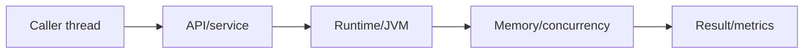
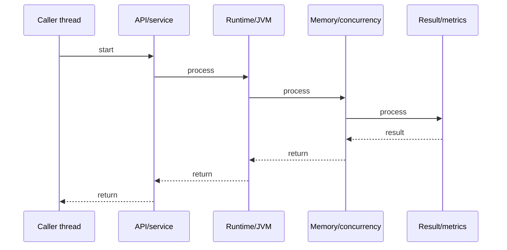
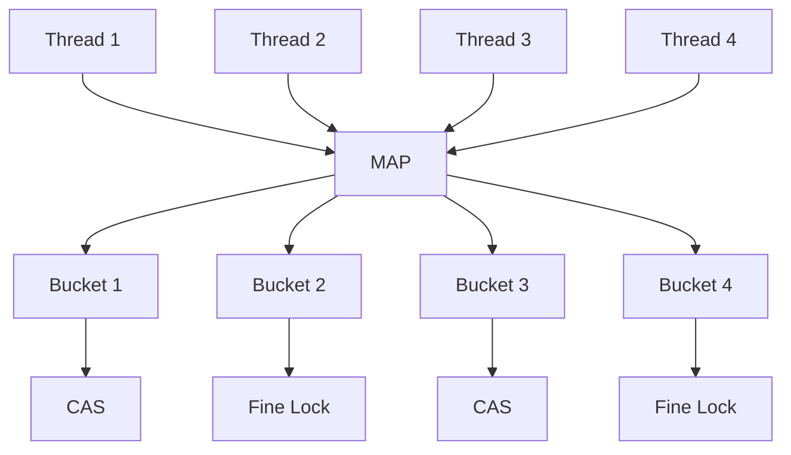
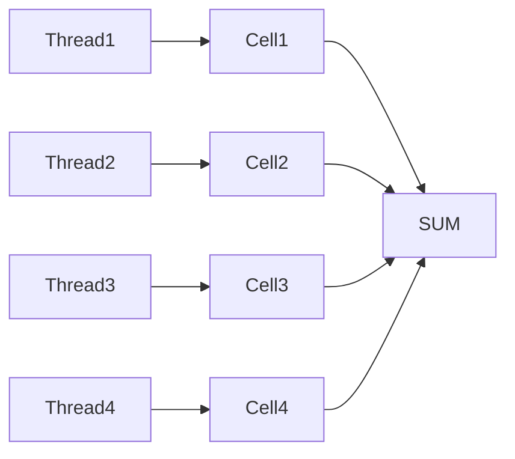
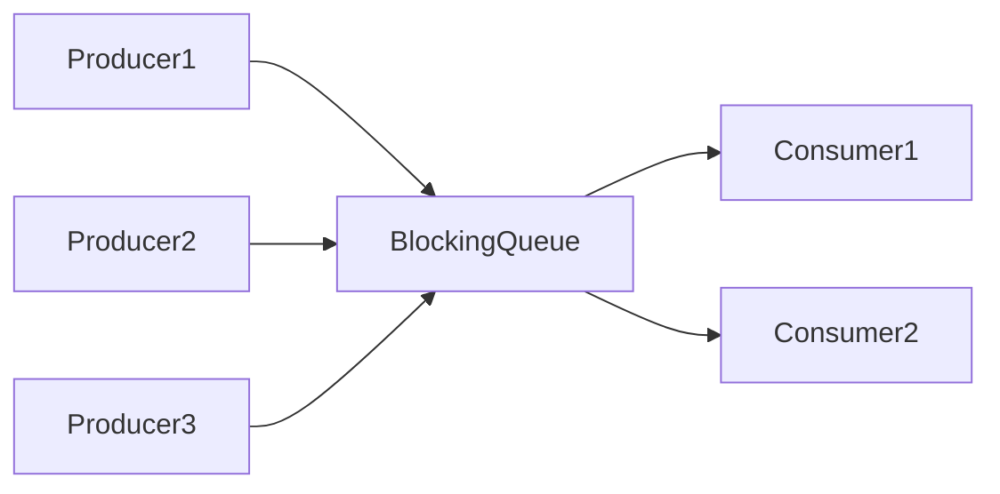
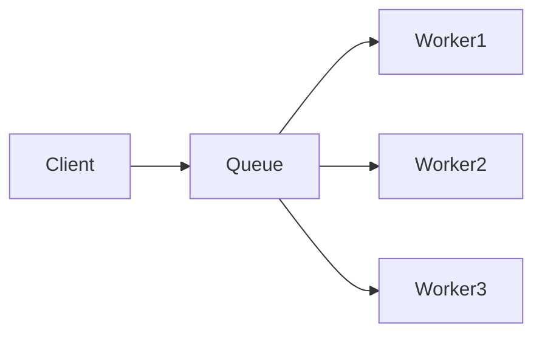

# Concurrent Collections

## Quick Facts

- Area: Java
- Tag: Concurrency
- Source: `src/modules/topics/java/java-concurrent-collections.js`
- Tags: `java`, `concurrent`, `concurrenthashmap`, `copyonwrite`, `blockingqueue`, `thread-safe`, `lock-free`
- Visual coverage: live visual

## Concept

java.util.concurrent collections provide thread safety without global locking. ConcurrentHashMap (Java 8+): CAS on empty buckets + synchronized on bucket head - only same-bucket writes contend. CopyOnWriteArrayList: writes copy the entire array (snapshot semantics, no lock for readers). BlockingQueue: put/take block via Condition await - decouples producers from consumers. ConcurrentLinkedQueue: lock-free FIFO via CAS on tail pointer.

## Why It Matters

Collections.synchronizedMap() wraps every operation in a single mutex - kills concurrency. ConcurrentHashMap gives ~16-128x better throughput under contention. CopyOnWriteArrayList eliminates reader locks for rarely-written lists (event listeners, plugin registries). BlockingQueue is the backbone of every thread pool (ThreadPoolExecutor uses LinkedBlockingQueue internally).

## Architecture / Mental Model



## Runtime / Sequence



## Animation Plan

- Flow lab can use generated mental model steps above.
- UML sequence can use generated sequence diagram above.
- Architecture map can use generated area mental model above.
- Live visual exists in app: topic-specific canvas/ReactViz animation.

Flow steps:

1. Caller thread
2. API/service
3. Runtime/JVM
4. Memory/concurrency
5. Result/metrics

## Example

```java
import java.util.concurrent.*;

// ConcurrentHashMap - fine-grained locking
ConcurrentHashMap<String, AtomicLong> counts = new ConcurrentHashMap<>();

// computeIfAbsent - atomic, only one thread computes per key
counts.computeIfAbsent("page_views", k -> new AtomicLong(0))
      .incrementAndGet();

// merge - atomic read-modify-write
counts.merge("errors", new AtomicLong(1),
    (existing, val) -> { existing.addAndGet(val.get()); return existing; });

// CopyOnWriteArrayList - zero-lock reads
List<EventListener> listeners = new CopyOnWriteArrayList<>();
listeners.add(new MyListener());  // copies array, slow write

// Safe concurrent iteration (snapshot of array at iterator creation)
for (EventListener l : listeners) {  // no ConcurrentModificationException
    l.onEvent(event);
}

// BlockingQueue - producer/consumer
BlockingQueue<Task> queue = new LinkedBlockingQueue<>(100); // bounded

// Producer thread
queue.put(new Task());      // blocks if full
queue.offer(task, 1, SECONDS); // timeout

// Consumer thread
Task t = queue.take();      // blocks if empty
Task t2 = queue.poll(1, SECONDS); // timeout, returns null

// Atomic counter - lock-free
LongAdder counter = new LongAdder();  // better than AtomicLong under contention
counter.increment();
long total = counter.sum();
```

## Complexity And Performance

- Time/space complexity depends on input size, data volume, and implementation choices.
- Track latency, throughput, memory, saturation, error rate, and correctness invariants.

## Interview Drills

1. How does ConcurrentHashMap avoid a global lock?

2. Why does ConcurrentHashMap forbid null keys/values?

3. When would you use CopyOnWriteArrayList vs ConcurrentHashMap?

4. Difference between offer() and put() on BlockingQueue?

5. How is LongAdder better than AtomicLong under high contention?

6. What is weakly consistent iteration in concurrent collections?

## Trade-offs

Pros:

- ConcurrentHashMap: high throughput - only same-bucket ops contend
- CopyOnWriteArrayList: zero-overhead reads, never throws ConcurrentModificationException
- BlockingQueue: clean producer-consumer decoupling, backpressure via bounded capacity
- LongAdder: stripe counters across cells - no CAS spinning under contention

Cons:

- ConcurrentHashMap: size() is approximate, compute() can block entire bucket
- CopyOnWriteArrayList: O(n) write cost - unsuitable for frequent writes or large arrays
- BlockingQueue: blocking threads on put/take - virtual threads reduce this cost
- ConcurrentLinkedQueue: size() is O(n) - avoid calling it in a loop

## Gotchas

- ConcurrentHashMap: null key/value throws NullPointerException - cannot distinguish "absent" from "null value"
- CopyOnWriteArrayList iterator sees SNAPSHOT - concurrent adds NOT visible to ongoing iteration
- BlockingQueue.offer() returns false silently on full - use put() when blocking guarantee needed
- computeIfAbsent holds bucket lock during computation - never do I/O or slow ops inside
- ConcurrentHashMap.size() is NOT atomic across put() calls - use mappingCount() for long precision
- Iterating ConcurrentHashMap is weakly consistent - may or may not reflect concurrent puts


# Concurrent Collections

## Quick Facts

* Area: Java
* Tag: Concurrency
* Source: `src/modules/topics/java/java-concurrent-collections.js`
* Tags: `java`, `concurrent`, `concurrenthashmap`, `copyonwrite`, `blockingqueue`, `thread-safe`, `lock-free`
* Visual coverage: live visual
* Advanced Coverage Added:

  * CAS internals
  * Memory barriers
  * False sharing
  * CPU cache coherence
  * ABA problem
  * Lock striping
  * Weakly consistent iterators
  * BlockingQueue internals
  * ForkJoinPool work stealing
  * LongAdder striped cells
  * Virtual thread interactions
  * Backpressure flows
  * Ring buffer comparisons
  * Lock-free linked queue internals
  * ConcurrentSkipListMap deep dive
  * SynchronousQueue handoff architecture
  * Phaser/CyclicBarrier coordination visuals

---

# Concept

java.util.concurrent collections provide thread safety without global locking. ConcurrentHashMap (Java 8+): CAS on empty buckets + synchronized on bucket head - only same-bucket writes contend. CopyOnWriteArrayList: writes copy the entire array (snapshot semantics, no lock for readers). BlockingQueue: put/take block via Condition await - decouples producers from consumers. ConcurrentLinkedQueue: lock-free FIFO via CAS on tail pointer.

---

# Why It Matters

Collections.synchronizedMap() wraps every operation in a single mutex - kills concurrency. ConcurrentHashMap gives ~16-128x better throughput under contention. CopyOnWriteArrayList eliminates reader locks for rarely-written lists (event listeners, plugin registries). BlockingQueue is the backbone of every thread pool (ThreadPoolExecutor uses LinkedBlockingQueue internally).

---

# Concurrency Mental Model

```text
Traditional Collections
↓
Single shared mutable structure
↓
Threads collide
↓
Locks everywhere
↓
Contention + slowdown
```

Modern concurrent collections:

```text
Reduce shared locking
↓
Partition contention
↓
Use CAS where possible
↓
Allow parallel reads/writes
```

---

# Core Concurrency Architecture



---

# synchronizedMap vs ConcurrentHashMap

# synchronizedMap

```text
Thread1 -> LOCK ENTIRE MAP
Thread2 -> BLOCKED
Thread3 -> BLOCKED
Thread4 -> BLOCKED
```

Single bottleneck.

---

# ConcurrentHashMap

```text
Thread1 -> Bucket1
Thread2 -> Bucket2
Thread3 -> Bucket3
Thread4 -> Bucket4
```

Parallelism.

---

# ConcurrentHashMap Deep Dive

# Java 7 Architecture

```text
Segment[]
```

Each segment had lock.

---

# Java 8 Architecture

Removed segments.

Now:

```text
Node[] table
```

Per bucket synchronization.

---

# Internal Structure

```text
ConcurrentHashMap
    ↓
Node[] table
    ↓
Bucket
    ↓
Linked List / TreeBin
```

---

# Concurrent Put Flow

```text
put(key,val)
    ↓
hash spread
    ↓
find bucket
    ↓
empty?
    ↓
CAS insert
```

Collision:

```text
synchronized(firstNode)
```

Only bucket locked.

---

# CAS Visual Animation

```text
Expected value = null
Actual value = null
↓
CAS success
↓
Insert node
```

Failure:

```text
Expected value = null
Actual value = Node
↓
CAS fail
↓
Retry
```

---

# Why Reads Mostly Lock-Free

```text
volatile Node[] table
volatile next
volatile value
```

Memory visibility guaranteed.

Readers avoid locking.

---

# Concurrent Resize Flow

```text
Threshold exceeded
↓
Create new table 2x size
↓
Multiple threads help resize
↓
transfer buckets in parallel
```

---

# Resize Visual

```text
Old Table
[1][2][3][4]

↓ resize

New Table
[ ][1][ ][2][ ][3][ ][4]
```

---

# TreeBin Internals

Collision chain >= 8.

```text
Linked List
↓
Red Black Tree
```

Reduces:

```text
O(n)
↓
O(log n)
```

---

# computeIfAbsent Danger

BAD:

```java
map.computeIfAbsent("key", k -> {
    callExternalService();
    return expensive();
});
```

Problem:

```text
Bucket lock held during slow operation
```

Can stall threads.

---

# Correct Pattern

```java
Value temp = expensive();
map.putIfAbsent(key, temp);
```

---

# Weakly Consistent Iteration

ConcurrentHashMap iterator:

```text
May see updates
May miss updates
Never throws CME
```

---

# Iteration Animation

```text
Iterator starts
↓
Thread adds item
↓
Iterator MAY see it
```

No deterministic guarantee.

---

# Null Restriction

ConcurrentHashMap forbids:

```text
null keys
null values
```

Why?

```text
map.get(key) == null
```

Cannot distinguish:

```text
absent
vs
stored null
```

Critical in concurrency.

---

# LongAdder Deep Dive

# AtomicLong Problem

```text
All threads CAS same memory location
↓
Heavy contention
↓
CAS retries spin
```

---

# LongAdder Solution

```text
Thread1 -> Cell1
Thread2 -> Cell2
Thread3 -> Cell3
Thread4 -> Cell4
```

Final value:

```text
sum(cells)
```

---

# LongAdder Architecture



---

# LongAdder Example

```java
ConcurrentHashMap<String, LongAdder> metrics =
    new ConcurrentHashMap<>();

metrics.computeIfAbsent("requests",
    k -> new LongAdder())
    .increment();
```

---

# False Sharing Problem

```text
CPU cache line = 64 bytes
```

Two counters in same line:

```text
Thread1 modifies Counter1
Thread2 modifies Counter2
```

Cache invalidation storm.

---

# False Sharing Visual

```text
CPU1 cache -> invalidated
CPU2 cache -> invalidated
CPU1 cache -> invalidated
```

Huge slowdown.

---

# LongAdder Avoids False Sharing

Uses padded cells.

```text
[padding][value][padding]
```

---

# CopyOnWriteArrayList Deep Dive

# Write Flow

```text
Old Array
[1][2][3]

Add 4
↓
Copy entire array
↓
[1][2][3][4]
↓
Atomic reference swap
```

---

# Snapshot Iterator

```text
Iterator gets immutable snapshot
```

Concurrent writes invisible.

---

# Visual Snapshot Flow

```text
Iterator -> [1][2][3]

Thread adds 4
↓
New array
[1][2][3][4]

Iterator still sees
[1][2][3]
```

---

# Best Use Cases

✅ Listener registry
✅ Config snapshots
✅ Routing table snapshots
✅ Security policy snapshots

---

# Worst Use Cases

❌ Chat applications
❌ High-frequency writes
❌ Real-time feeds
❌ Trading systems

---

# Memory Disaster Scenario

```java
CopyOnWriteArrayList<byte[]> list =
    new CopyOnWriteArrayList<>();
```

Large writes:

```text
copy 100MB array repeatedly
↓
GC pressure explosion
```

---

# BlockingQueue Deep Dive

# Producer Consumer Architecture



---

# Core Concept

Queue acts as:

```text
Buffer
Throttle
Backpressure mechanism
Decoupling layer
```

---

# put() vs offer()

# put()

```text
Queue full
↓
Thread BLOCKS
```

---

# offer()

```text
Queue full
↓
returns false
```

---

# offer(timeout)

```text
Wait some time
↓
Timeout
↓
return false
```

---

# Blocking Animation

```text
Producer faster than consumer
↓
Queue fills
↓
Producer blocks
↓
Backpressure applied
```

---

# LinkedBlockingQueue

Uses:

```text
putLock
+
takeLock
```

Better parallelism.

---

# ArrayBlockingQueue

Uses:

```text
Single lock
Fixed array
```

Lower memory overhead.

---

# Queue Comparison

| Queue                 | Strength           | Weakness               |
| --------------------- | ------------------ | ---------------------- |
| LinkedBlockingQueue   | High throughput    | More memory            |
| ArrayBlockingQueue    | Predictable memory | Single lock contention |
| SynchronousQueue      | Zero buffering     | Direct handoff only    |
| DelayQueue            | Scheduling         | Unbounded              |
| PriorityBlockingQueue | Priority ordering  | Unbounded              |
|                       |                    |                        |

---

# SynchronousQueue

No internal capacity.

```text
Producer hands directly to consumer
```

---

# Handoff Animation

```text
Producer waiting
↓
Consumer arrives
↓
Direct transfer
```

Used heavily in:

```text
Executors.newCachedThreadPool()
```

---

# DelayQueue Internals

Elements implement:

```java
Delayed
```

Only available after expiration.

---

# DelayQueue Visual

```text
Task1 -> ready in 5s
Task2 -> ready in 10s
Task3 -> ready in 1s
```

Priority based on delay.

---

# ConcurrentLinkedQueue Deep Dive

Lock-free queue.

---

# Internal Structure

```text
Head -> Node -> Node -> Tail
```

CAS updates head/tail.

---

# Enqueue Flow

```text
Read tail
↓
CAS tail.next
↓
Move tail forward
```

---

# Lock-Free Benefit

No thread suspension.

Threads retry instead of blocking.

---

# ABA Problem

Thread reads:

```text
A
```

Another thread:

```text
A -> B -> A
```

CAS sees:

```text
still A
```

But state changed.

---

# ABA Solution

```text
Stamped references
Version numbers
```

---

# ConcurrentSkipListMap

Sorted concurrent map.

---

# SkipList Structure

```text
Level3 -------->
Level2 ----->----->
Level1 ->->->->->->
```

Probabilistic balancing.

---

# Why Useful

Concurrent alternative to TreeMap.

Supports:

```text
sorted iteration
range queries
ceiling/floor
```

---

# Performance Comparison

| Collection            | Read           | Write           | Locking      |
| --------------------- | -------------- | --------------- | ------------ |
| Hashtable             | Slow           | Slow            | Global       |
| synchronizedMap       | Slow           | Slow            | Global       |
| ConcurrentHashMap     | Fast           | Fast            | Fine-grained |
| CopyOnWriteArrayList  | Very Fast Read | Very Slow Write | Copy         |
| ConcurrentLinkedQueue | Fast           | Fast            | Lock-free    |
| LinkedBlockingQueue   | Moderate       | Moderate        | Dual locks   |
| LongAdder             | Extremely Fast | Extremely Fast  | Striped      |

---

# Memory Visibility Deep Dive

# Problem

CPU cores cache memory independently.

```text
Thread1 updates value
Thread2 may not see immediately
```

---

# volatile Fix

```text
Write flushed to main memory
Read refreshed from main memory
```

---

# Happens-Before Relationship

Concurrent collections establish:

```text
producer write
↓
happens-before
↓
consumer read
```

Critical correctness guarantee.

---

# BlockingQueue Happens-Before

```text
Producer put(task)
↓
Consumer take()
↓
Consumer guaranteed latest task state
```

---

# ThreadPoolExecutor Internals

Uses:

```text
BlockingQueue
+
Worker threads
```

---

# Thread Pool Flow



---

# RejectedExecution Scenarios

```text
Queue full
Threads maxed
↓
Reject task
```

Policies:

```text
AbortPolicy
CallerRunsPolicy
DiscardPolicy
DiscardOldestPolicy
```

---

# Virtual Threads Impact

Java virtual threads reduce blocking cost.

Traditional:

```text
Blocked thread = expensive OS thread
```

Virtual:

```text
Blocked thread = lightweight continuation
```

BlockingQueue becomes cheaper.

---

# ForkJoinPool Work Stealing

Each worker:

```text
Own deque
```

Idle thread:

```text
steals tasks from others
```

---

# Work Stealing Animation

```text
Worker1 overloaded
Worker2 idle
↓
Worker2 steals tasks
```

---

# Parallel Stream Internals

Uses:

```text
ForkJoinPool.commonPool()
```

---

# Parallel Stream Danger

BAD:

```java
List<Integer> list = new ArrayList<>();

IntStream.range(0,1000)
    .parallel()
    .forEach(list::add);
```

Race condition.

---

# Correct

```java
List<Integer> result =
    IntStream.range(0,1000)
        .parallel()
        .boxed()
        .collect(Collectors.toList());
```

---

# ConcurrentModificationException

Concurrent collections usually avoid:

```text
fail-fast iteration
```

Instead use:

```text
weakly consistent iteration
```

---

# Fail Fast Visual

```text
Iterator stores modCount
Collection changes
↓
throw CME
```

---

# Weakly Consistent Visual

```text
Collection changes
↓
Iterator continues safely
```

---

# Real World Usage Patterns

| System                 | Concurrent Collection |
| ---------------------- | --------------------- |
| Metrics engine         | LongAdder + CHM       |
| Web server sessions    | ConcurrentHashMap     |
| Kafka producer buffers | BlockingQueue         |
| Event listeners        | CopyOnWriteArrayList  |
| Task scheduler         | DelayQueue            |
| Chat queues            | ConcurrentLinkedQueue |
| Routing registry       | ConcurrentSkipListMap |
| Thread pool            | LinkedBlockingQueue   |

---

# Production Gotchas

❌ computeIfAbsent with DB call
❌ size() in hot loops
❌ CopyOnWrite for large datasets
❌ BlockingQueue without bounds
❌ synchronizedMap under contention
❌ AtomicLong high-contention counters
❌ Assuming iterator sees latest updates
❌ Ignoring backpressure
❌ Using unbounded queues in microservices

---

# Best Practices

✅ Prefer ConcurrentHashMap over synchronizedMap
✅ Use LongAdder for hot counters
✅ Bound queues for backpressure
✅ Use CopyOnWrite only for read-heavy systems
✅ Keep compute() operations tiny
✅ Understand weak consistency
✅ Monitor queue saturation
✅ Pre-size concurrent maps
✅ Use immutable snapshots where possible

---

# Interview Drills

1. How does ConcurrentHashMap avoid a global lock?

Answer:

```text
Uses CAS for empty buckets and synchronized only on individual bucket heads.
Threads operating on different buckets proceed independently.
```

---

2. Why does ConcurrentHashMap forbid null keys/values?

Answer:

```text
Cannot distinguish absent mapping from stored null under concurrency.
```

---

3. When would you use CopyOnWriteArrayList?

Answer:

```text
Read-heavy, write-rare collections.
Listener registries.
Config snapshots.
```

---

4. Difference between offer() and put()?

Answer:

```text
put blocks forever.
offer returns immediately.
offer(timeout) waits limited duration.
```

---

5. Why LongAdder better than AtomicLong?

Answer:

```text
Stripes updates across cells reducing CAS contention.
```

---

6. What is weakly consistent iteration?

Answer:

```text
Iterator tolerates concurrent modification.
May/may not see updates.
Never throws CME.
```

---

# Advanced Interview Traps

```text
- CHM reads mostly lock-free.
- compute() locks bucket.
- LongAdder sum() not atomic snapshot.
- ConcurrentLinkedQueue size() O(n).
- BlockingQueue establishes happens-before.
- CopyOnWrite iteration stale by design.
- ConcurrentSkipListMap sorted and concurrent.
- SynchronousQueue has zero capacity.
- Parallel streams use ForkJoinPool.
- Weak consistency != eventual consistency.
```

---

# Golden Rules

```text
1. Reduce contention, not just locks.
2. Blocking is scalability enemy.
3. CAS avoids context switching.
4. Concurrent != lock-free.
5. Reads dominate most systems.
6. Backpressure prevents collapse.
7. Memory visibility matters as much as locking.
8. Queue choice changes system behavior.
9. Snapshot iteration trades freshness for safety.
10. Benchmark under contention, not single thread.
```
