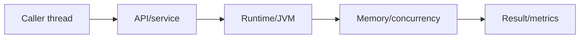
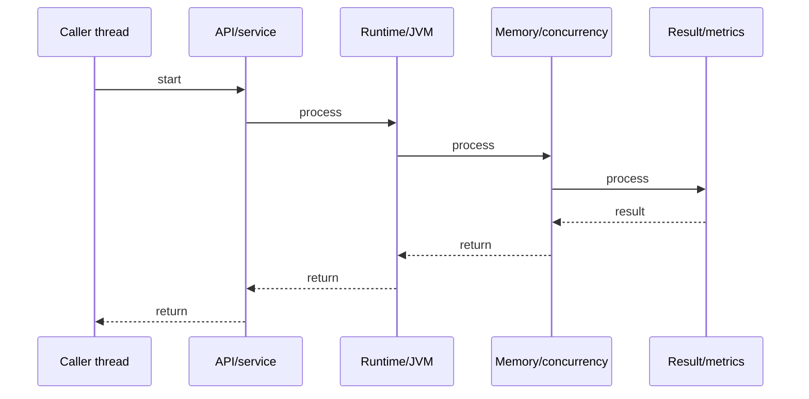

# Concurrent Collections

## Quick Facts
- Area: Java
- Tag: Concurrency
- Source: `src/modules/topics/java/java-concurrent-collections.js`
- Tags: `java`, `concurrent`, `concurrenthashmap`, `copyonwrite`, `blockingqueue`, `thread-safe`, `lock-free`
- Visual coverage: live visual

## Concept
java.util.concurrent collections provide thread safety without global locking. ConcurrentHashMap (Java 8+): CAS on empty buckets + synchronized on bucket head - only same-bucket writes contend. CopyOnWriteArrayList: writes copy the entire array (snapshot semantics, no lock for readers). BlockingQueue: put/take block via Condition await - decouples producers from consumers. ConcurrentLinkedQueue: lock-free FIFO via CAS on tail pointer.

## Why It Matters
Collections.synchronizedMap() wraps every operation in a single mutex - kills concurrency. ConcurrentHashMap gives ~16-128x better throughput under contention. CopyOnWriteArrayList eliminates reader locks for rarely-written lists (event listeners, plugin registries). BlockingQueue is the backbone of every thread pool (ThreadPoolExecutor uses LinkedBlockingQueue internally).

## Architecture / Mental Model


## Runtime / Sequence


## Animation Plan
- Flow lab can use generated mental model steps above.
- UML sequence can use generated sequence diagram above.
- Architecture map can use generated area mental model above.
- Live visual exists in app: topic-specific canvas/ReactViz animation.

Flow steps:

1. Caller thread
2. API/service
3. Runtime/JVM
4. Memory/concurrency
5. Result/metrics

## Example
```java
import java.util.concurrent.*;

// ConcurrentHashMap - fine-grained locking
ConcurrentHashMap<String, AtomicLong> counts = new ConcurrentHashMap<>();

// computeIfAbsent - atomic, only one thread computes per key
counts.computeIfAbsent("page_views", k -> new AtomicLong(0))
      .incrementAndGet();

// merge - atomic read-modify-write
counts.merge("errors", new AtomicLong(1),
    (existing, val) -> { existing.addAndGet(val.get()); return existing; });

// CopyOnWriteArrayList - zero-lock reads
List<EventListener> listeners = new CopyOnWriteArrayList<>();
listeners.add(new MyListener());  // copies array, slow write

// Safe concurrent iteration (snapshot of array at iterator creation)
for (EventListener l : listeners) {  // no ConcurrentModificationException
    l.onEvent(event);
}

// BlockingQueue - producer/consumer
BlockingQueue<Task> queue = new LinkedBlockingQueue<>(100); // bounded

// Producer thread
queue.put(new Task());      // blocks if full
queue.offer(task, 1, SECONDS); // timeout

// Consumer thread
Task t = queue.take();      // blocks if empty
Task t2 = queue.poll(1, SECONDS); // timeout, returns null

// Atomic counter - lock-free
LongAdder counter = new LongAdder();  // better than AtomicLong under contention
counter.increment();
long total = counter.sum();
```

## Complexity And Performance
- Time/space complexity depends on input size, data volume, and implementation choices.
- Track latency, throughput, memory, saturation, error rate, and correctness invariants.

## Interview Drills
1. How does ConcurrentHashMap avoid a global lock?

2. Why does ConcurrentHashMap forbid null keys/values?

3. When would you use CopyOnWriteArrayList vs ConcurrentHashMap?

4. Difference between offer() and put() on BlockingQueue?

5. How is LongAdder better than AtomicLong under high contention?

6. What is weakly consistent iteration in concurrent collections?

## Trade-offs
Pros:
- ConcurrentHashMap: high throughput - only same-bucket ops contend
- CopyOnWriteArrayList: zero-overhead reads, never throws ConcurrentModificationException
- BlockingQueue: clean producer-consumer decoupling, backpressure via bounded capacity
- LongAdder: stripe counters across cells - no CAS spinning under contention

Cons:
- ConcurrentHashMap: size() is approximate, compute() can block entire bucket
- CopyOnWriteArrayList: O(n) write cost - unsuitable for frequent writes or large arrays
- BlockingQueue: blocking threads on put/take - virtual threads reduce this cost
- ConcurrentLinkedQueue: size() is O(n) - avoid calling it in a loop

## Gotchas
- ConcurrentHashMap: null key/value throws NullPointerException - cannot distinguish "absent" from "null value"
- CopyOnWriteArrayList iterator sees SNAPSHOT - concurrent adds NOT visible to ongoing iteration
- BlockingQueue.offer() returns false silently on full - use put() when blocking guarantee needed
- computeIfAbsent holds bucket lock during computation - never do I/O or slow ops inside
- ConcurrentHashMap.size() is NOT atomic across put() calls - use mappingCount() for long precision
- Iterating ConcurrentHashMap is weakly consistent - may or may not reflect concurrent puts

