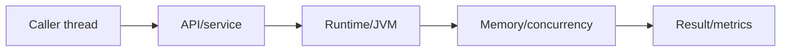
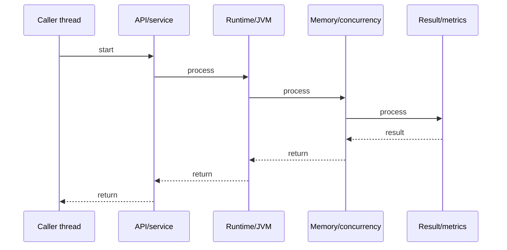

# GC Collectors: G1, ZGC, Shenandoah

## Quick Facts
- Area: Java
- Tag: Performance
- Source: `src/modules/topics/java/java-gc-collectors.js`
- Tags: `java`, `gc`, `g1`, `zgc`, `shenandoah`, `garbage-collection`, `pauses`
- Visual coverage: live visual

## Concept
Modern JVM GCs differ in how they trade throughput vs pause time. G1GC (Java 9 default): divides heap into equal-size regions (~1-32MB), collects highest-garbage regions first. ZGC (Java 15 GA): concurrent mark + relocate with colored pointers, sub-millisecond pauses, scales to TB heaps. Shenandoah: concurrent evacuation via forwarding pointers, similar pause goals to ZGC but different mechanism. All run most work concurrently with application threads.

## Why It Matters
GC pauses directly cause latency spikes in production. A 200ms G1 full GC pause = 200ms service timeout to clients. ZGC/Shenandoah target <1ms pauses at the cost of higher CPU. Choosing the wrong GC for your workload (throughput vs latency) is a common production performance mistake.

## Architecture / Mental Model


## Runtime / Sequence


## Animation Plan
- Flow lab can use generated mental model steps above.
- UML sequence can use generated sequence diagram above.
- Architecture map can use generated area mental model above.
- Live visual exists in app: topic-specific canvas/ReactViz animation.

Flow steps:

1. Caller thread
2. API/service
3. Runtime/JVM
4. Memory/concurrency
5. Result/metrics

## Example
```java
// JVM GC flags - choose one

// G1GC (default Java 9+) - balanced throughput + latency
-XX:+UseG1GC
-XX:MaxGCPauseMillis=200       // soft pause target
-XX:G1HeapRegionSize=16m       // region size (1-32MB)
-XX:G1NewSizePercent=20        // young gen floor
-XX:G1MaxNewSizePercent=40     // young gen ceiling
-XX:G1MixedGCLiveThresholdPercent=85  // skip almost-full regions

// ZGC (Java 17+ production-ready) - ultra-low latency
-XX:+UseZGC
-XX:SoftMaxHeapSize=30g        // soft limit (ZGC expands beyond on pressure)
-XX:ZUncommitDelay=300         // return memory to OS after 5 min

// Shenandoah (Java 15+) - concurrent evacuation
-XX:+UseShenandoahGC
-XX:ShenandoahGCMode=iu        // incremental-update (default)

// GC logging (all collectors)
-Xlog:gc*:file=/var/log/app-gc.log:time,uptime,tags

// Monitor: JVM GC metrics
// jcmd <pid> GC.run        - trigger GC
// jstat -gcutil <pid> 1000 - GC stats every 1s
```

## Complexity And Performance
- Time/space complexity depends on input size, data volume, and implementation choices.
- Track latency, throughput, memory, saturation, error rate, and correctness invariants.

## Interview Drills
1. How does G1GC select which regions to collect?

2. What makes ZGC achieve sub-millisecond pauses?

3. What are colored pointers (load barriers) in ZGC?

4. When would you choose ZGC over G1?

5. What is the difference between concurrent and stop-the-world phases?

## Trade-offs
Pros:
- G1: best throughput of modern GCs, predictable pause target, default for most apps
- ZGC: <1ms pauses, scales to TB heap, ideal for latency-sensitive services
- Shenandoah: concurrent evacuation, good for medium heaps with strict latency

Cons:
- G1: pauses can spike to 200ms+ at high allocation rates, region fragmentation
- ZGC: higher CPU overhead (colored pointers = load barrier on every ref read)
- Shenandoah: higher memory overhead (forwarding pointers), less tuning knobs
- All: concurrent GC needs more heap headroom than stop-the-world collectors

## Gotchas
- MaxGCPauseMillis is a SOFT target - G1 will exceed it under pressure
- ZGC needs extra heap headroom: run 25-30% more heap than live data set
- G1 full GC is single-threaded stop-the-world - avoid humongous objects
- Humongous objects (>50% region size) in G1 bypass young gen - cause full GC
- jstat -gcutil shows: S0/S1=survivor, E=eden, O=old, M=metaspace, GCT=GC time total

