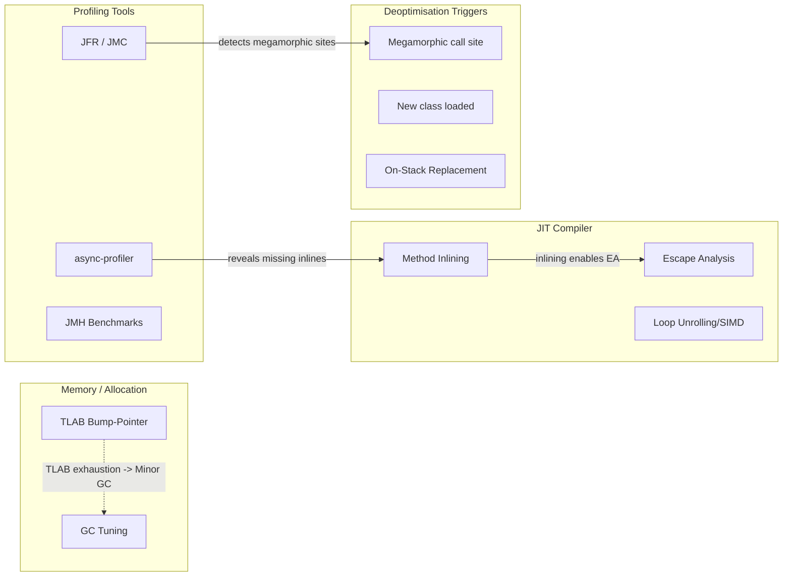
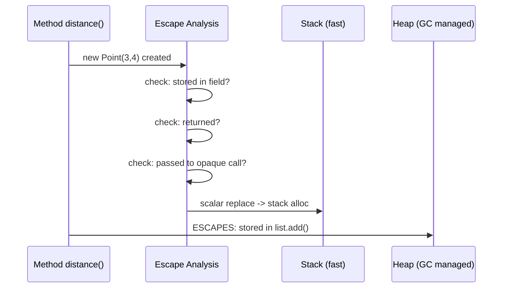

# JIT, Escape Analysis & Java Performance

## Quick Facts
- Area: Java
- Tag: Perf
- Source: `src/modules/topics/java/java-jit-performance.js`
- Tags: `jit`, `c1`, `c2`, `escape-analysis`, `jmh`, `profiling`
- Visual coverage: live visual, flow lab, UML lab, architecture map

## Concept
**L1 (30s):** JVM starts slow, gets faster as JIT compiles hot code. Escape analysis eliminates heap allocations for short-lived objects.
**L2 (2min):** Tiered compilation: T0 (interpreter) -> T1/T2 (C1 light) -> T3 (C1 full profile) -> T4 (C2 optimised). C2 does heavy optimisations: method inlining, loop unrolling, vectorisation. JVM deoptimises when assumptions break (megamorphic call sites).
**L3 (10min):** Escape analysis: if an object never escapes a method/thread, JIT allocates it on stack (scalar replacement). Eliminates GC pressure. Breaks: objects stored in fields, returned, passed to unresolved callees. Inline caches: monomorphic (fast) -> bimorphic -> megamorphic (slow - IC fails, virtual dispatch).
**L4 (30min):** C2 IR = sea-of-nodes graph. TLAB (Thread-Local Allocation Buffer) - object allocation is a pointer bump, ~5ns. Major GC pause = stop-the-world. JFR + async-profiler = production profiling without overhead. VarHandle replaces Unsafe for memory fence operations. Graal JIT (EE/CE) = alternative C2 written in Java - supports AOT for native-image.

## Why It Matters
**Production win:** Checkout service's hot path allocating ~50 BigDecimal objects per request. 10K RPS = 500K objects/sec = constant Minor GC pressure, 5ms pauses every 200ms. Profiled with async-profiler: BigDecimal.multiply allocates heavily. Refactored to long arithmetic (scaled integers). GC pressure drops 80%, p99 latency 5ms -> 0.8ms.

## Architecture / Mental Model


## Runtime / Sequence


## Animation Plan
- Flow lab available: step-by-step path highlighting.
- UML sequence simulation available: actor messages animate in order.
- Architecture map available: clickable nodes and sync/async links.
- Live visual exists in app: topic-specific canvas/ReactViz animation.

Flow steps:

1. Interpreter starts - First run: bytecode interpreted, invocation counters incremented
2. Quick C1 compile - 2000 invocations -> C1 compiles with minimal profiling
3. Profile accumulation - C1 instruments: which types hit this call site, which branches taken
4. C2 optimisation - 10K invocations + rich profile -> C2 inlines, scalar replaces, vectorises
5. Deoptimisation - Assumption broken (new class loaded, megamorphic) -> fall back to interpreter, re-profile

## Example
```java
// JMH benchmark - the ONLY correct way to microbenchmark Java
@BenchmarkMode(Mode.AverageTime) @OutputTimeUnit(TimeUnit.NANOSECONDS)
@State(Scope.Thread) @Fork(2) @Warmup(iterations=5) @Measurement(iterations=10)
public class StringConcatBench {
    String a="hello"; String b="world"; int n=42;

    @Benchmark public String plus()    { return a + " " + b + " " + n; }
    @Benchmark public String builder() {
        return new StringBuilder().append(a).append(' ').append(b).append(' ').append(n).toString();
    }
    @Benchmark public String fmt() { return String.format("%s %s %d", a, b, n); }
    // Result on JDK 21: plus  builder (~12ns). fmt = 120ns - 10x slower.
}

// Escape Analysis: this allocation is FREE - scalar replaced
double distance(int x1,int y1,int x2,int y2){
    // JIT: no Point object created on heap, x/y are stack ints
    return Math.sqrt((x2-x1)*(x2-x1) + (y2-y1)*(y2-y1));
}
```

## Complexity And Performance
- Time/space complexity depends on deployment, data size, and chosen implementation.
- Track p50/p95/p99 latency, throughput, memory, saturation, and error rate for production topics.

## Interview Drills
1. What is escape analysis and how do you verify it?
   Answer: C2 proves object doesn't escape method/thread -> scalar replacement (stack allocation). Zero GC pressure. Verify: -XX:+PrintEliminateAllocations. Measure: async-profiler --alloc event before/after.
   Follow-ups: Why do anonymous classes break EA?; Lambda capture and EA?

2. Why are microbenchmarks usually wrong?
   Answer: (1) No warmup = measuring interpreter, (2) Dead-code elimination = JIT removes unused results, (3) Constant folding = inputs become compile-time constants. Use JMH: @Warmup, Blackhole.consume(), @State, multiple @Fork.
   Follow-ups: What is OSR (on-stack replacement)?; Bimodal distributions in benchmarks?

3. Megamorphic call site - what is it and how to fix?
   Answer: Inline cache supports 2 types (bimorphic). With 3+ the IC becomes megamorphic - JIT can't inline -> virtual dispatch -> 3-5x slower. Fix: fewer concrete types at hot call sites, use final classes in hot paths, split polymorphic collections.
   Follow-ups: What is the inline cache and how does it work?; Profile with JFR to detect?

## Trade-offs
Pros:
- JIT specialises to actual call sites - often beats AOT
- TLAB allocation ~5ns - cheapest of any runtime
- JFR + async-profiler are best-in-class profiling tools

Cons:
- Warmup cost matters for short-lived processes (CLIs, lambdas)
- Deoptimisation cliffs from megamorphic sites
- C2 bugs rare but real - pin JDK versions in prod

When to use:
**HotSpot** for long-running services where warmup time is acceptable. **GraalVM native-image** for CLIs, lambdas, sidecars where startup time dominates.

## Gotchas
- Microbenchmarks without JMH lie - dead-code elimination, constant folding, no warmup
- String + concat is NOT slow in JDK 9+ (invokedynamic). String.format() IS 8-10x slower
- Escape analysis breaks if object passed to non-inlined method - inline cache miss disables EA
- GC overhead from SURVIVING objects, not allocations. Allocation itself is ~5ns (TLAB bump)
- Megamorphic call sites (3+ concrete types) disable inlining -> 3-5x slowdown in hot paths
- Deoptimisation is silent - JVM falls back to interpreter, you need JFR to detect it

