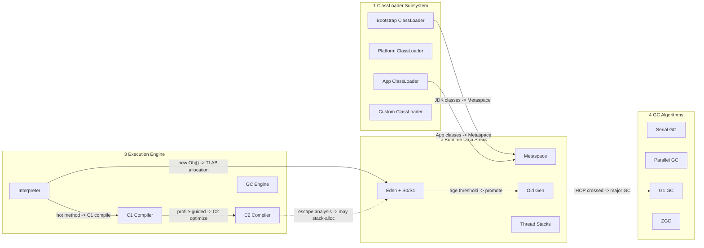
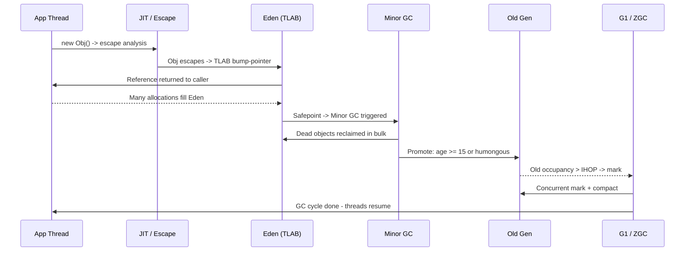

# JVM Memory Model & Garbage Collection

## Quick Facts

- Area: Java
- Tag: JVM
- Source: `src/modules/topics/java/java-jvm-memory-gc.js`
- Tags: `jvm`, `gc`, `g1`, `zgc`, `memory`, `classloader`, `jit`
- Visual coverage: live visual, flow lab, UML lab, architecture map

## Concept

**L1 (30s ELI5):** JVM is a fake computer inside your computer. Objects live in "heap." Old objects get their own room. GC throws away objects nobody needs anymore.

**L2 (2min core):** Heap = Young Gen (Eden + S0/S1) + Old Gen. New objects -> Eden via TLAB (bump-pointer, 5 ns). Minor GC copies survivors; age >= 15 -> promote Old. Metaspace (off-heap): class metadata. Collectors: **G1** (region-based, 200ms pause goal, Java 9 default), **ZGC** (<1ms pause, colored pointers, Java 15+), **Shenandoah** (concurrent compact, Red Hat).

**L3 (10min edge cases):** Humongous allocs (> G1 region) skip Eden -> fragment Old Gen -> Full GC. Metaspace OOM on redeployment: ClassLoader not GC'd if stale static/thread ref held. `-Xms  -Xmx` in containers: heap resize under load -> GC pause. ZGC reserves 2.5x virtual address space - inflates docker memory stats.

**L4 (30min deep):** TLAB = per-thread bump-pointer in Eden; refilled via CAS on exhaustion. GC roots: thread stacks, static fields, JNI globals. G1 RSets: card table tracks cross-region dirty refs. ZGC colored pointers: 42-bit address + 4 metadata bits (marked0/1, remapped, finalizable); load barriers fix stale refs on access. Escape analysis at C2: stack-allocates non-escaping objects -> zero GC pressure.

## Why It Matters

Heap layout and GC choice directly drive **p99 latency** and **throughput**. Misconfigured heaps cause stop-the-world pauses that break SLOs in trading, ads, and chat systems. At scale (`> 32 GB heap`), CompressedOops boundary and GC algorithm choice change throughput by 20-40%.

## Architecture / Mental Model



## Runtime / Sequence



## Animation Plan

- Flow lab available: step-by-step path highlighting.
- UML sequence simulation available: actor messages animate in order.
- Architecture map available: clickable nodes and sync/async links.
- Live visual exists in app: topic-specific canvas/ReactViz animation.

Flow steps:

1. 1 \* javac compiles to .class - javac parses, type-checks, and emits .class bytecode. No native code - targets a portable stack-machine ISA. Inspect with javap -c.
2. 2 \* .class emitted - .class contains: constant pool, method bytecodes, attribute tables. One .class per top-level class. Inner classes get separate .class files.
3. 3 \* ClassLoader delegation chain - Bootstrap -> Platform (ext) -> Application. Parent asked first - prevents shadowing java.lang.String. Custom loaders add hot-reload, isolation (OSGi, WAR isolation).
4. 4 \* Link + Init -> Metaspace - Verify (type safety) -> Prepare (static fields) -> Resolve (symbolic refs -> direct ptrs) -> Initialize (run static {}). Class metadata goes to native Metaspace - not on heap. Grows until MaxMetaspaceSize.
5. 5 \* Interpret (Tier 0) - cold start - Methods start interpreted. JVM counts invocations + back-edges. Cheap startup; throughput ~10-50x slower than C2 compiled. Most methods never leave this tier (dead code).
6. 6 \* JIT: C1 (T1) -> C2 (T4) - >=200 calls -> C1 (profiled, fast compile). >=15000 calls -> C2 full optimize: method inlining (main win!), loop unrolling, escape analysis, lock elision, SIMD auto-vectorization.
7. 7 \* Allocate in Eden TLAB (5 ns) - new Obj() bumps a thread-local pointer - no CAS, no lock. Each thread owns a TLAB. Object header = mark word (hash/lock/age bits) + klass pointer. Cost 5 ns vs malloc 50 ns.
8. 8 \* Minor GC - copy survivors - Eden full -> safepoint (all threads stop). GC roots traced (stacks, statics, JNI). Live objects COPIED to Survivor (S0<->S1 swap each GC). Dead Eden abandoned, reset in bulk. Pause 1-10 ms.
9. 9 \* Promote to Old Gen - Age threshold (default 15) -> promote. Humongous objects (> half region) skip Young entirely, go direct to Old. Card table updated for cross-gen references.
10. 10 \* Major GC - G1 or ZGC - G1: concurrent mark when Old > 45% -> mixed collection of high-garbage regions. ZGC: fully concurrent, pause < 1ms at any heap size, using colored pointers + load barriers. Both compact without full STW.
11. 11 \* Heap reclaimed - cycle repeats - Freed Eden ready for new TLABs. Metaspace freed only on ClassLoader unload (common leak: WAR redeployments). Application continues. Cycle never ends for long-lived services.

## Example

```java
// JVM flags worth memorising for an interview
// java -Xms4g -Xmx4g -XX:+UseG1GC -XX:MaxGCPauseMillis=200 \
//      -XX:+UnlockExperimentalVMOptions -XX:+UseZGC \
//      -Xlog:gc*,gc+heap=debug:file=gc.log:time,uptime,level,tags

import java.lang.management.*;
import java.util.*;

public class HeapInspector {
    public static void main(String[] args) {
        MemoryMXBean mem = ManagementFactory.getMemoryMXBean();
        System.out.println("Heap     : " + mem.getHeapMemoryUsage());
        System.out.println("NonHeap  : " + mem.getNonHeapMemoryUsage());

        for (MemoryPoolMXBean p : ManagementFactory.getMemoryPoolMXBeans()) {
            System.out.printf("%-24s %-10s %s%n", p.getName(), p.getType(), p.getUsage());
        }
        // Force allocation to watch Eden fill
        List<byte[]> hold = new ArrayList<>();
        for (int i = 0; i < 50; i++) hold.add(new byte[1 << 20]); // 1 MB blocks
    }
}
```

Notes:
Edge cases: humongous allocations (> 50% of G1 region) skip Eden and go straight to Old; large arrays cause fragmentation. Always pin `-Xms = -Xmx` in containers to avoid resize stalls.

## Complexity And Performance

- Time/space complexity depends on input size, data volume, and implementation choices.
- Track latency, throughput, memory, saturation, error rate, and correctness invariants.

## Interview Drills

1. When would you pick ZGC over G1?
   Answer: Pick **ZGC** when p99/p999 latency matters more than peak throughput and the heap is large (> 16 GB). ZGC keeps pause times sub-ms even at 16 TB. **G1** is the safer default for typical 4-32 GB services where 100-200 ms pauses are acceptable and throughput matters.
   Follow-ups: What are colored pointers?; Cost of ZGC's load barriers?; Why is generational ZGC faster?

2. How do you debug a memory leak in production?
   Answer: 1. Capture a heap dump with `jcmd <pid> GC.heap_dump` or `-XX:+HeapDumpOnOutOfMemoryError`. 2. Open in **Eclipse MAT** or **VisualVM**; look at dominator tree. 3. Inspect retained-size sorted by class. 4. Common culprits: unbounded caches, `ThreadLocal` leaks in pooled threads, JDBC `PreparedStatement` not closed, listeners not unregistered.
   Follow-ups: What is a leak suspect in MAT?; Why do ThreadLocals leak in Tomcat?

3. What is a 'humongous' allocation?
   Answer: In G1, any object larger than half of a region (regions are 1-32 MB) is allocated directly in contiguous old-gen regions. Many humongous allocations fragment the heap and force full GC. Detect with `-Xlog:gc+heap=debug`.
   Follow-ups: How to tune region size?; G1 vs Parallel for batch jobs?

## Trade-offs

Pros:

- GC tuning is observable - every collector emits structured logs.
- ZGC/Shenandoah remove pause as a tuning lever for low-latency systems.
- JIT + escape analysis often outperform hand-written C for hot paths.

Cons:

- Each collector adds CPU/throughput overhead (~10-15% for ZGC).
- Memory overhead: G1 keeps remembered sets; ZGC reserves 2.5x virtual address space.
- Tuning is heap-shape specific - copy-paste flags rarely transfer.

When to use:
**G1** for general services. **ZGC** for low-latency, large-heap workloads. **Parallel GC** for short batch jobs where throughput trumps pause. **Serial GC** only for tiny CLI tools.

## Gotchas

- Humongous allocation (> G1 region): skips Eden -> goes direct to Old Gen -> fragments heap -> Full GC. Detect with -Xlog:gc+heap=debug.
- -Xms -Xmx in containers: JVM resizes heap under load -> GC pause during resize. Always set equal in prod.
- Metaspace OOM after WAR redeployment: old ClassLoader held alive by stale static field, thread, or JDBC driver classref.
- ZGC reserves 2.5x virtual address space: docker stats shows inflated 'memory'. It's mostly uncommitted pages - use RSS not VSZ.
- synchronized block PINS virtual thread to carrier OS thread. Carrier blocks too - defeats virtual thread benefit. Use ReentrantLock instead.
- ThreadLocal in Tomcat pooled thread: request ends, next request gets stale value. Always ThreadLocal.remove() in finally block.
