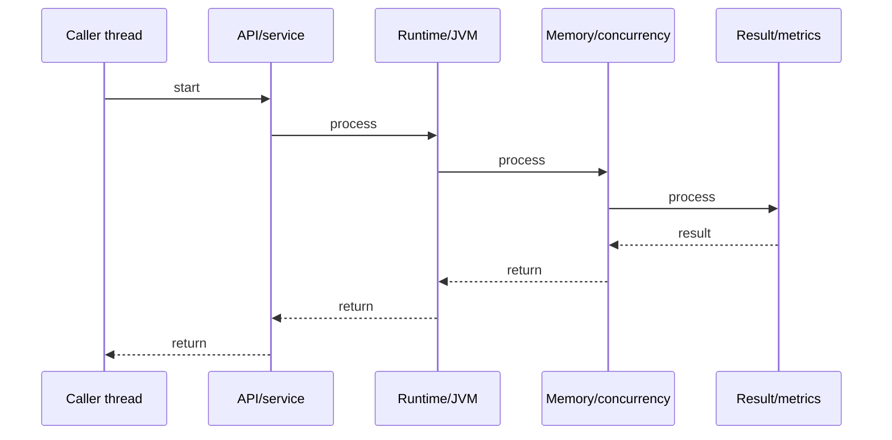

# synchronized vs ReentrantLock

## Quick Facts
- Area: Java
- Tag: Concurrency
- Source: `src/modules/topics/java/java-locks.js`
- Tags: `java`, `synchronized`, `reentrantlock`, `monitor`, `deadlock`, `concurrency`
- Visual coverage: live visual

## Concept
synchronized is a JVM-level intrinsic lock on any object's monitor. Simple and automatic - acquired on block entry, released on exit (even on exception). ReentrantLock (java.util.concurrent.locks) is explicit: lock()/unlock() in try/finally. ReentrantLock adds tryLock(), lockInterruptibly(), timed lock, multiple Condition objects, and fairness mode. Both are reentrant - same thread can re-acquire without deadlock.

## Why It Matters
synchronized works for simple mutual exclusion. ReentrantLock is needed when you require: timeout on lock attempt, interruptible waiting, multiple condition queues (producer-consumer), fair scheduling, or when synchronized would pin a virtual thread (Loom). Understanding monitor internals explains spurious wakeups and wait/notify semantics.

## Architecture / Mental Model


## Runtime / Sequence


## Animation Plan
- Flow lab can use generated mental model steps above.
- UML sequence can use generated sequence diagram above.
- Architecture map can use generated area mental model above.
- Live visual exists in app: topic-specific canvas/ReactViz animation.

Flow steps:

1. Caller thread
2. API/service
3. Runtime/JVM
4. Memory/concurrency
5. Result/metrics

## Example
```java
// synchronized - simple
class Counter {
    private int count = 0;
    synchronized void increment() { count++; }
    synchronized int get() { return count; }
}

// ReentrantLock - explicit
class BoundedQueue<T> {
    private final ReentrantLock lock = new ReentrantLock();
    private final Condition notFull  = lock.newCondition();
    private final Condition notEmpty = lock.newCondition();
    private final Queue<T> queue = new ArrayDeque<>();
    private final int capacity;

    void put(T item) throws InterruptedException {
        lock.lock();
        try {
            while (queue.size() == capacity) notFull.await();
            queue.offer(item);
            notEmpty.signal();
        } finally {
            lock.unlock();  // ALWAYS in finally
        }
    }

    T take() throws InterruptedException {
        lock.lock();
        try {
            while (queue.isEmpty()) notEmpty.await();
            T item = queue.poll();
            notFull.signal();
            return item;
        } finally {
            lock.unlock();
        }
    }
}

// tryLock - non-blocking acquisition attempt
if (lock.tryLock(100, TimeUnit.MILLISECONDS)) {
    try { /* critical section */ }
    finally { lock.unlock(); }
} else {
    // failed to acquire - handle gracefully
}
```

## Complexity And Performance
- Time/space complexity depends on deployment, data size, and chosen implementation.
- Track p50/p95/p99 latency, throughput, memory, saturation, and error rate for production topics.

## Interview Drills
1. What is the difference between synchronized and ReentrantLock?

2. What is a monitor and how does wait/notify work?

3. Why must lock.unlock() always be in a finally block?

4. What is a spurious wakeup and how do you handle it?

5. How does tryLock() help avoid deadlock?

## Trade-offs
Pros:
- synchronized: automatic release, no forget-unlock bug, simpler code
- ReentrantLock: tryLock/timed/interruptible - prevents indefinite blocking
- ReentrantLock: multiple Condition objects - finer-grained wait/notify
- ReentrantLock(true): fair mode - FIFO thread ordering (avoids starvation)

Cons:
- synchronized: no timeout, no interruption, one condition queue (wait/notify)
- synchronized: pins virtual threads in Loom scenarios
- ReentrantLock: must call unlock() in finally - easy to forget -> deadlock
- ReentrantLock: verbose code vs clean synchronized block syntax

## Gotchas
- Always use while loop (not if) for condition check - spurious wakeups occur
- ReentrantLock.unlock() in finally is mandatory - exception without unlock = permanent deadlock
- notifyAll() vs notify(): notify() wakes one random thread - use notifyAll() for safety with multiple conditions
- synchronized on different objects = no mutual exclusion - must lock SAME object
- Deadlock: T1 holds lockA wants lockB; T2 holds lockB wants lockA - detect with jstack

