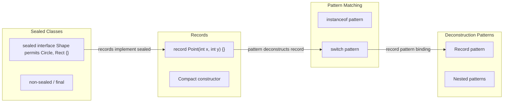
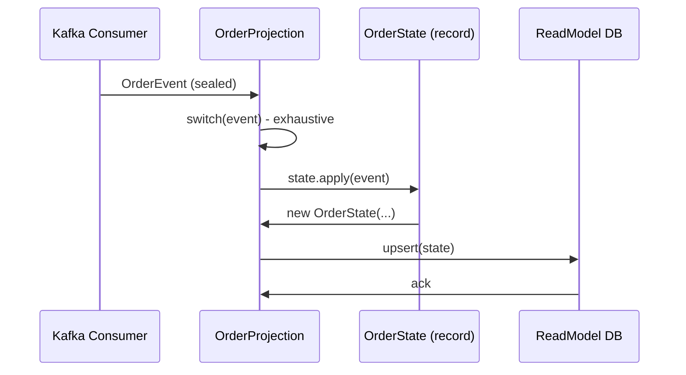

# Records, Sealed Classes & Pattern Matching

## Quick Facts

- Area: Java
- Tag: Modern Java
- Source: `src/modules/topics/java/java-records-sealed-patterns.js`
- Tags: `records`, `sealed`, `pattern matching`, `switch`, `ADT`
- Visual coverage: live visual, flow lab, UML lab, architecture map

## Concept

**L1 (30s):** Records = immutable data. Sealed = closed type hierarchy. Pattern matching = smart instanceof. Together = algebraic data types in Java.
**L2 (2min):** Records auto-generate constructor, equals, hashCode, toString, accessors. Sealed classes declare permitted subtypes - compiler enforces exhaustive switch. Pattern matching: `if (obj instanceof Point(int x, int y))` deconstructs in one step.
**L3 (10min):** Records can't extend classes (only interfaces). Compact constructors for validation. Sealed + switch = compile-time exhaustiveness - add a new subtype, every switch breaks. Guard patterns: `case Failed f when f.retryCount() >= 3`. Works with generics.
**L4 (30min):** Records compile to final classes with private fields + public accessors. JIT scalar-replaces short-lived records (escape analysis). Pattern matching switch desugars to tableswitch/lookupswitch with type checks. JEP 445 (unnamed patterns) and JEP 456 (unnamed variables) continue evolving the feature.

## Why It Matters

**Production case:** Payment processing event store. 12 event types, each handled differently. Before: big `if/else instanceof` ladder, easy to miss a case silently. After: sealed PaymentEvent + exhaustive switch - compiler enforces every new event type is handled. Zero runtime ClassCastExceptions.

## Architecture / Mental Model



## Runtime / Sequence



## Animation Plan

- Flow lab available: step-by-step path highlighting.
- UML sequence simulation available: actor messages animate in order.
- Architecture map available: clickable nodes and sync/async links.
- Live visual exists in app: topic-specific canvas/ReactViz animation.

Flow steps:

1. Declare closed hierarchy - sealed interface PaymentEvent permits Initiated, Failed
2. Define record subtypes - record Initiated(String id, BigDecimal amt) implements PaymentEvent {}
3. Switch on the sealed type - switch(event) - compiler knows all subtypes
4. Apply guard conditions - case Failed f when f.retryCount() >= 3 -> markDead()
5. Execute correct branch - No ClassCastException possible - type proven at compile time

## Example

```java
sealed interface PaymentEvent permits Initiated, Authorized, Captured, Failed {}

record Initiated(String id, BigDecimal amount, String currency) implements PaymentEvent {}
record Authorized(String id, String authCode) implements PaymentEvent {}
record Captured(String id, Instant at) implements PaymentEvent {}
record Failed(String id, String reason, int retryCount) implements PaymentEvent {}

// Exhaustive - compiler enforces coverage of all 4 types
State apply(State s, PaymentEvent event) {
    return switch (event) {
        case Initiated(var id, var amt, var ccy) -> s.withAmount(amt, ccy);
        case Authorized(var id, var code)        -> s.withAuth(code);
        case Captured(var id, var at)            -> s.captured(at);
        case Failed f when f.retryCount() >= 3   -> s.markDead();
        case Failed f                            -> s.scheduleRetry();
    };
}
```

## Complexity And Performance

- Time/space complexity depends on input size, data volume, and implementation choices.
- Track latency, throughput, memory, saturation, error rate, and correctness invariants.

## Interview Drills

1. Why are records better than Lombok @Data?
   Answer: Records are a language feature - no annotation processor, IDE plugin, or @Builder collisions. Immutable by default, work with pattern matching, JIT-optimised via scalar replacement. Lombok remains useful for mutable JPA entities.
   Follow-ups: Can a record extend a class?; Compact constructor for validation?; Records and serialization?

2. What does sealed buy you over abstract class?
   Answer: Exhaustiveness checks. Compiler knows the closed set of permitted subtypes - switch without default is verified. Add a new event type and every consumer breaks at compile time. That's a feature.
   Follow-ups: non-sealed vs sealed vs final?; Module visibility constraints?

3. Guards in pattern switch - what's the execution order?
   Answer: Type check first, then guard evaluation. `case Failed f when f.retryCount() >= 3` - first checks `instanceof Failed`, then evaluates the when clause. Guards short-circuit - if type doesn't match, guard is never evaluated.
   Follow-ups: What is the dominance rule?; Can two cases match the same value?

## Trade-offs

Pros:

- Compile-time exhaustiveness for sealed types
- Immutability by default for records
- Cleaner DSLs and event sourcing code
- No annotation processors

Cons:

- Records can't extend classes
- Pattern switch preview until Java 21
- JPA entities incompatible with records
- Migration from Lombok-heavy codebases non-trivial

When to use:
**Domain events, value objects, state machines, DTOs.** Use classes when you need inheritance or mutable state.

## Gotchas

- Records CANNOT extend classes (final + extends Record). Only implement interfaces.
- JPA entities cannot be records - JPA needs no-arg constructor + mutable fields + proxy subclass
- Exhaustive switch only enforces at compile time for sealed types - not for open hierarchies
- Compact constructor runs before field assignment - you can validate but not rebind the same names
- Non-sealed reopens the hierarchy - switch on it is no longer exhaustive without default
- Pattern matching switch is null-hostile - null hits NullPointerException unless you add `case null` arm
