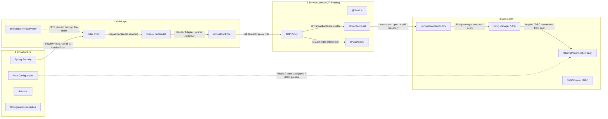
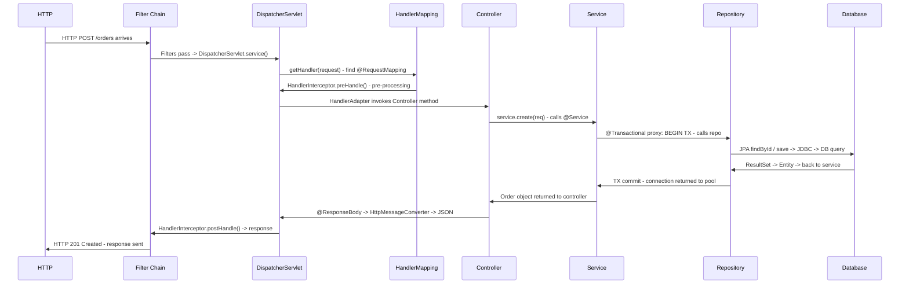

# Spring Boot: Startup, DI, Request Lifecycle & AOP

## Quick Facts
- Area: Java
- Tag: Spring
- Source: `src/modules/topics/java/java-spring-boot.js`
- Tags: `spring`, `boot`, `di`, `ioc`, `autoconfig`, `aop`, `transactions`, `request lifecycle`
- Visual coverage: live visual, flow lab, UML lab, architecture map

## Concept
**L1 (30s ELI5):** Spring Boot is a machine that builds your app automatically. You add JARs, it figures out what you need (database? auto-adds HikariCP). You write business code; Spring wires everything together.

**L2 (2min core):** IoC container (ApplicationContext) manages bean lifecycle. Auto-config: reads `META-INF/spring/AutoConfiguration.imports` from every JAR, evaluates `@ConditionalOnClass`/`@ConditionalOnMissingBean`. DI: constructor injection (preferred, immutable, testable) > setter > field. AOP: CGLIB subclass proxy wraps `@Transactional`/`@Cacheable`/`@Async` beans - proxy intercepts external method calls.

**L3 (10min edge cases):** `@Transactional` on private methods: CGLIB proxy can't override private -> no transaction (silently ignored). Self-invocation `this.method()`: bypasses proxy -> `@Cacheable`/`@Async` silently ignored. Prototype into singleton: same instance forever - use `ObjectProvider<T>`. `@Async void`: exceptions silently swallowed unless `AsyncUncaughtExceptionHandler` configured. `@Transactional`: only unchecked `RuntimeException` triggers rollback - checked exceptions don't by default.

**L4 (30min deep):** Bean lifecycle: instantiate -> populateProperties -> Aware callbacks (BeanNameAware, ApplicationContextAware) -> `@PostConstruct` (InitializingBean.afterPropertiesSet) -> in-service -> `@PreDestroy` (DisposableBean.destroy). BeanPostProcessor intercepts all beans before/after init - AOP proxy creation happens here (AbstractAutoProxyCreator). BeanFactoryPostProcessor: modifies bean definitions before instantiation (PropertySourcesPlaceholderConfigurer resolves `${}`). DispatcherServlet strategy pattern: each of HandlerMapping, HandlerAdapter, ViewResolver, HandlerExceptionResolver is a Spring bean - fully replaceable.

## Why It Matters
Auto-config is **decision compression** - sensible defaults that work in 80% of cases. But it hides what's running. In senior interviews, you must be able to trace a `/actuator/conditions` report, explain AOP proxy limitations (@Transactional on private methods), and describe the full HTTP request lifecycle through DispatcherServlet.

## Architecture / Mental Model


## Runtime / Sequence


## Animation Plan
- Flow lab available: step-by-step path highlighting.
- UML sequence simulation available: actor messages animate in order.
- Architecture map available: clickable nodes and sync/async links.
- Live visual exists in app: topic-specific canvas/ReactViz animation.

Flow steps:

1. SpringApplication.run() - bootstrap starts - SpringApplication constructed. Detects application type (SERVLET/REACTIVE/NONE). SpringApplicationRunListeners notified. ApplicationStartingEvent published. Logging initialized.
2. Environment prepared - StandardEnvironment created. Properties loaded in order: command-line args > OS env vars > application.yml > application.properties > @PropertySource. Spring profiles activated (spring.profiles.active). ApplicationEnvironmentPreparedEvent...
3. ApplicationContext created - For web: AnnotationConfigServletWebServerApplicationContext. For reactive: AnnotationConfigReactiveWebServerApplicationContext. Empty container - no beans yet. BeanFactory initialized.
4. BeanFactory PostProcessors - @ComponentScan - ConfigurationClassPostProcessor runs. Processes @Configuration, @ComponentScan, @Bean, @Import. Finds all @Component/@Service/@Repository/@Controller/@RestController. Registers BeanDefinitions (metadata, not instances yet).
5. Auto-configuration evaluated - @EnableAutoConfiguration reads META-INF/spring/AutoConfiguration.imports from ALL JARs. Each @AutoConfiguration evaluated: @ConditionalOnClass (classpath?), @ConditionalOnMissingBean (user override?), @ConditionalOnProperty (flag set?)....
6. Singleton beans instantiated - All singleton BeanDefinitions instantiated in dependency order. Constructor injection: Spring resolves dependency graph, detects cycles. @PostConstruct called after DI. ApplicationContextAware, InitializingBean callbacks. @EventListener...
7. Embedded server starts - WebServerFactory bean creates Tomcat/Netty/Undertow. DispatcherServlet registered. Filter chain configured (Security, CORS, compression). Port bound. ApplicationStartedEvent fired. CommandLineRunner / ApplicationRunner beans called.
8. ApplicationReadyEvent - serving traffic - First HTTP request can now be handled. Actuator health shows UP. /actuator/beans shows all registered beans. /actuator/conditions shows auto-config decisions. Startup complete - may take 1-10s depending on classpath size.

## Example
```java
// Constructor injection - preferred, immutable, testable
@RestController
@RequestMapping("/orders")
class OrderController {
    private final OrderService service;
    OrderController(OrderService service) { this.service = service; }

    @PostMapping
    @ResponseStatus(HttpStatus.CREATED)
    Order create(@Valid @RequestBody CreateOrder req) { return service.create(req); }
}

@Service
@Transactional
class OrderService {
    private final OrderRepository repo;
    private final MeterRegistry metrics;

    OrderService(OrderRepository repo, MeterRegistry metrics) {
        this.repo = repo; this.metrics = metrics;
    }

    Order create(CreateOrder req) {
        var saved = repo.save(new Order(req));
        metrics.counter("orders.created", "tenant", req.tenant()).increment();
        return saved;
    }
}

// Custom auto-configuration
@AutoConfiguration
@ConditionalOnClass(KafkaTemplate.class)
@ConditionalOnMissingBean(EventPublisher.class)
class KafkaEventAutoConfiguration {
    @Bean
    EventPublisher kafkaEventPublisher(KafkaTemplate<String, Object> kafka) {
        return new KafkaEventPublisher(kafka);
    }
}

// Type-safe config properties
@ConfigurationProperties(prefix = "app.order")
record OrderProperties(int maxRetries, Duration timeout, String topic) {}
```

Notes:
`@Transactional` only works on public methods via the AOP proxy. Private or package-private methods bypass the proxy - transaction never starts. Self-invocation (calling `this.method()`) also bypasses the proxy.

## Complexity And Performance
- Time/space complexity depends on input size, data volume, and implementation choices.
- Track latency, throughput, memory, saturation, error rate, and correctness invariants.

## Interview Drills
1. Why doesn't @Transactional work on private methods?
   Answer: Spring wraps beans in a **CGLIB subclass proxy**. The proxy intercepts method calls from OUTSIDE the bean. When you call a private method (or call `this.someMethod()` from within the class), the call goes directly to the original bean - the proxy is bypassed. No proxy = no transaction. Fix: extract to a separate bean, or use `@Transactional` via AspectJ compile-time weaving.
   Follow-ups: What is self-invocation?; JDK proxy vs CGLIB proxy?; How does Spring detect circular @Transactional?

2. How does auto-configuration know what to load?
   Answer: At startup, Spring reads `META-INF/spring/org.springframework.boot.autoconfigure.AutoConfiguration.imports` from every JAR. Each entry is a `@AutoConfiguration` class evaluated with `@Conditional` annotations: `@ConditionalOnClass` (is a class on classpath?), `@ConditionalOnMissingBean` (user already defined one?), `@ConditionalOnProperty` (feature flag). `/actuator/conditions` shows what matched and why.
   Follow-ups: How do you write a custom starter?; What replaced spring.factories?

3. What happens if you inject a prototype bean into a singleton?
   Answer: The prototype bean is injected ONCE at singleton creation and held forever - defeating the prototype scope. The singleton holds the same prototype instance for its entire lifetime. Fix: inject `ObjectProvider<T>` and call `getObject()` each time you need a fresh instance, or use scoped proxies (`@Scope(proxyMode = TARGET_CLASS)`) which create a new prototype on each method call through the proxy.
   Follow-ups: What is a scoped proxy?; ObjectProvider vs ApplicationContext.getBean()?

## Trade-offs
Pros:
- Boilerplate gone - a working web app in 10 lines.
- Strong ecosystem (Data, Security, Cloud, Actuator, Testcontainers).
- Production-ready: metrics, health, tracing out of the box.

Cons:
- Magic by default - debugging hidden bean wiring is hard.
- Startup time grows with classpath - investigate with --debug flag.
- @Transactional proxy limitations cause subtle bugs in self-invocation.

When to use:
**Default for enterprise Java services.** For startup-sensitive workloads (lambdas, edge), evaluate **Quarkus** or **Micronaut** with build-time DI + GraalVM native image.

## Gotchas
- @Transactional on private method: CGLIB proxy can't override private -> no transaction started, no exception, silent failure.
- Self-invocation this.method(): bypasses the AOP proxy entirely -> @Cacheable, @Async, @Transactional all silently ignored.
- Prototype bean injected into singleton: injected once at singleton creation time. Same instance forever - prototype scope defeated.
- @Async void method: exceptions are swallowed silently. Configure AsyncUncaughtExceptionHandler or return Future<T>.
- @Transactional checked exceptions: only RuntimeException (unchecked) rolls back by default. SQLException won't roll back unless rollbackFor=Exception.class.
- Lazy-loaded JPA entity outside @Transactional: LazyInitializationException. Session closed before collection accessed.

