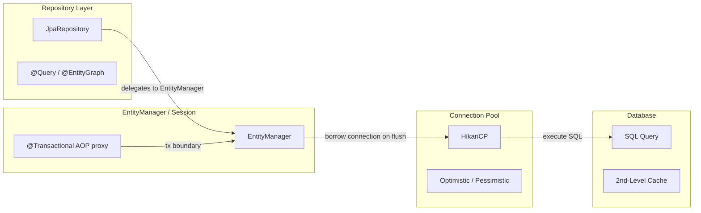
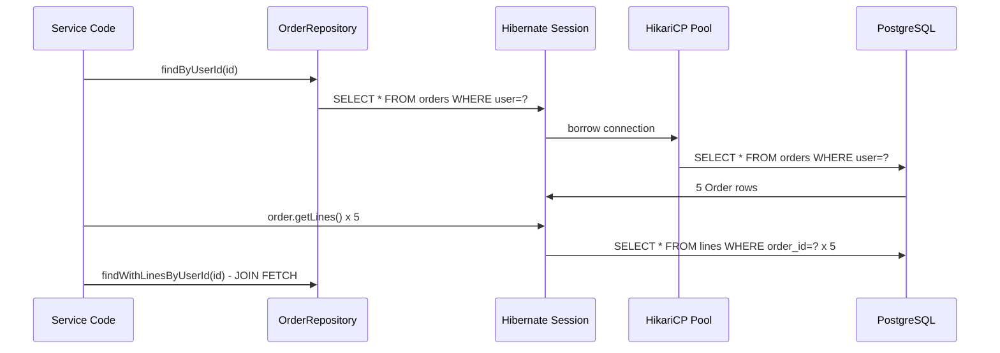

# Spring Data JPA & Hibernate Internals

## Quick Facts
- Area: Java
- Tag: JPA
- Source: `src/modules/topics/java/java-spring-data-jpa.js`
- Tags: `jpa`, `hibernate`, `n+1`, `transactions`, `entity-lifecycle`
- Visual coverage: live visual, flow lab, UML lab, architecture map

## Concept
**L1 (30s):** JPA maps Java objects to SQL rows. Hibernate is the impl. N+1 is the #1 production bug. Always think about queries.
**L2 (2min):** EntityManager = persistence context (first-level cache). Entity states: transient -> managed -> detached -> removed. Dirty checking on commit saves changes automatically. Repositories abstract CRUD + paging. Fetching: LAZY (default @ToMany) vs EAGER (default @ToOne).
**L3 (10min):** N+1: iterating a lazy collection issues 1 query per parent. Fix: JOIN FETCH, @EntityGraph, @BatchSize. @Transactional works via AOP proxy - self-invocation bypasses it. read-only transactions skip dirty checking (big perf win). @Version = optimistic lock.
**L4 (30min):** Hibernate 2nd-level cache (Ehcache/Redis) is per-entity keyed by PK. QueryCache caches result sets. First-level cache is per-session/transaction. Connection pool (HikariCP default): max-lifetime, connection-timeout, leak-detection. MultipleBagFetchException: can't JOIN FETCH 2+ bag collections - use Set or split queries.

## Why It Matters
**Production incident:** Checkout service queries orders with 10 line items each. findByUserId returns 100 orders -> Hibernate lazily loads lines for each = 101 queries. With 50 concurrent users = 5050 DB queries/second. DB CPU spikes, latency p99 = 8s. Fix: JOIN FETCH drops to 1 query. Response time: 80ms.

## Architecture / Mental Model


## Runtime / Sequence


## Animation Plan
- Flow lab available: step-by-step path highlighting.
- UML sequence simulation available: actor messages animate in order.
- Architecture map available: clickable nodes and sync/async links.
- Live visual exists in app: topic-specific canvas/ReactViz animation.

Flow steps:

1. Transient: no ID, not tracked - new Order() - just a Java object, JPA unaware
2. persist() -> Managed - em.persist(order) - entity enters persistence context, gets ID from sequence
3. commit -> SQL flush - Hibernate compares entity snapshot to current state -> generates INSERT/UPDATE
4. detach/session close - Entity leaves context. Future changes ignored. Lazy loads throw LazyInitializationException
5. remove -> Managed->Removed - em.remove(order) - scheduled for DELETE on commit

## Example
```java
@Entity @Table(name="orders")
class Order {
    @Id @GeneratedValue Long id;
    @ManyToOne(fetch=FetchType.LAZY) User user;
    @OneToMany(mappedBy="order", cascade=CascadeType.ALL)
    List<OrderLine> lines = new ArrayList<>();
    @Version int version; // optimistic lock
}

interface OrderRepository extends JpaRepository<Order, Long> {
    // BAD: N+1 - lines loaded lazily one by one
    List<Order> findByUserId(Long userId);

    // GOOD: single JOIN FETCH query
    @Query("select distinct o from Order o left join fetch o.lines where o.user.id = :uid")
    List<Order> findWithLines(@Param("uid") Long uid);
}

@Service
class OrderService {
    @Transactional(readOnly = true) // skip dirty checking
    List<OrderDto> recent(Long uid) {
        return repo.findWithLines(uid).stream().map(OrderDto::from).toList();
    }
}
```

## Complexity And Performance
- Time/space complexity depends on input size, data volume, and implementation choices.
- Track latency, throughput, memory, saturation, error rate, and correctness invariants.

## Interview Drills
1. N+1 select problem - what is it, 3 fixes?
   Answer: N+1: loading N parents + 1 extra query per parent for children = N+1 total queries. Fix: (1) JOIN FETCH in JPQL, (2) @EntityGraph on repository, (3) @BatchSize(100) for batch loading. Bonus: DTO projection skips entity loading entirely.
   Follow-ups: Cartesian explosion with multiple fetches?; MultipleBagFetchException - why?

2. Why is @Transactional sometimes ignored?
   Answer: Spring AOP creates a proxy. Only external calls go through the proxy. `this.method()` bypasses it -> no transaction. Fix: inject self (@Autowired), use ApplicationContext.getBean(), or AspectJ weaving.
   Follow-ups: REQUIRES_NEW propagation use case?; Why does @Transactional + private fail?

3. Optimistic vs pessimistic locking?
   Answer: Optimistic: @Version column, checked on commit via WHERE version=?. Zero overhead on reads. Fails with OptimisticLockException - caller retries. Pessimistic: SELECT FOR UPDATE - holds DB lock. Use optimistic when conflicts rare (web apps), pessimistic when high contention (financial).
   Follow-ups: PESSIMISTIC_READ vs PESSIMISTIC_WRITE?; How to retry on OptimisticLockException?

## Trade-offs
Pros:
- Strong type safety
- Repository abstraction is testable
- Dirty tracking reduces boilerplate
- readOnly transactions free performance gain

Cons:
- N+1 and lazy loading traps
- Schema migrations separate (Flyway/Liquibase)
- Heavy reflection - cold start slower
- MultipleBagFetchException surprises

When to use:
**JPA** for rich domain models with relationships. **jOOQ/MyBatis** when SQL ownership matters. **JDBI/JdbcClient** for thin services.

## Gotchas
- @Transactional on private / self-invoked methods = silently ignored (proxy bypass)
- Lazy collections accessed outside transaction = LazyInitializationException at runtime
- EAGER @ManyToMany loads all related entities on EVERY query - catastrophic on large tables
- em.merge() returns a NEW managed instance - don't use the original detached object after
- MultipleBagFetchException: can't JOIN FETCH 2+ collections - use Set or split into 2 queries
- readOnly=true transaction skips dirty checking - always set on read methods for free perf gain
- @Version optimistic lock: OptimisticLockException thrown on commit, not on read

