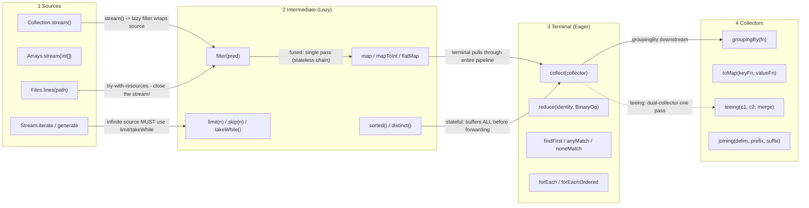
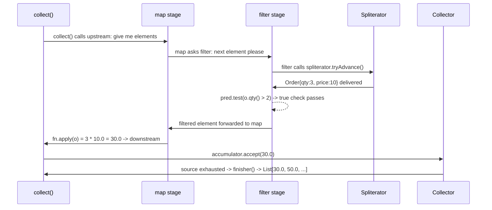

# Streams API, Collectors & Lazy Evaluation

## Quick Facts

- Area: Java
- Tag: Streams
- Source: `src/modules/topics/java/java-streams.js`
- Tags: `streams`, `collectors`, `lambda`, `functional`, `lazy`
- Visual coverage: live visual, flow lab, UML lab, architecture map

## Concept

**L1 (30s ELI5):** Stream is an assembly line. Raw materials (list) -> filter belt -> transform belt -> collection box. Nothing moves until the collection box is attached.

**L2 (2min core):** Lazy pull model: intermediate ops (filter, map, flatMap) store predicates/functions, return new Stream wrappers. Terminal op (collect, reduce, forEach) drives the loop - calls `spliterator.tryAdvance()` one element at a time through ALL stages. Stateless ops fuse in a single pass. Stateful ops (sorted, distinct) buffer ALL elements before outputting any.

**L3 (10min edge cases):** Stream consumed after first terminal op - reuse throws `IllegalStateException`. `parallelStream()` uses shared common ForkJoinPool - blocking tasks starve ALL parallel streams in JVM. `sorted() + limit(n)` is NOT short-circuit: sorted buffers all first. `Collectors.toMap()` throws `IllegalStateException` on duplicate key - always pass merge function. `Files.lines()` must be closed or file handle leaks.

**L4 (30min deep):** Spliterator characteristics: SIZED, ORDERED, SORTED, DISTINCT, SUBSIZED - affect fusion and parallel splitting. Op fusion in ReferencePipeline: linked list of StatelessOp/StatefulOp wrappers; terminal creates sink chain, processes each element through all sinks in one loop. Parallel: ForkJoinPool splits via `trySplit()`; leaf tasks run sequential sub-pipelines; results merged via `Collector.combiner()`. `Collector.Characteristics.CONCURRENT`: skips combiner - single shared mutable container (e.g. ConcurrentHashMap).

## Why It Matters

Declarative pipelines reduce bug surface vs hand-written loops, but **`parallelStream`** is a footgun on shared pools (one slow task blocks every consumer). In data pipelines, `Collectors.groupingBy` + `mapping` replaces 30 lines of imperative aggregation.

## Architecture / Mental Model



## Runtime / Sequence



## Animation Plan

- Flow lab available: step-by-step path highlighting.
- UML sequence simulation available: actor messages animate in order.
- Architecture map available: clickable nodes and sync/async links.
- Live visual exists in app: topic-specific canvas/ReactViz animation.

Flow steps:

1. list.stream() - SOURCE created, nothing runs - list.stream() creates an ArraySpliterator wrapping the list. Zero elements touched. Zero predicates called. Just a pipeline descriptor object in heap. Think of it like defining a SQL query - execution hasn't started.
2. filter(pred) - LAZY: predicate stored, not called - filter() returns a new StatelessOp stream wrapping the source. Predicate stored as a lambda. No elements touched. You can chain 100 filters without touching a single element. Like adding WHERE clauses to a SQL query.
3. map(fn) - LAZY: mapper stored, not called - map() wraps the filtered stream. FUSION: for stateless ops (filter + map), JVM can fuse them into a single loop - element enters filter, if passes goes straight to map, no intermediate List created. Like SQL predicate pushdown.
4. collect() TERMINAL - THIS triggers everything! - collect(Collectors.toList()) is the terminal op. It calls into the pipeline: "give me all elements". Now the pipeline EXECUTES. All lazy ops run. This is the ONLY time any element is touched. After this, the stream is CONSUMED - can't...
5. Spliterator.tryAdvance() - one element at a time - Terminal op drives a loop: spliterator.tryAdvance(element -> pipeline(element)) until exhausted. Each call: fetch ONE raw element from source -> run through filter -> if passes -> run through map -> give to collector. Sequential,...
6. Collector accumulates -> finisher() -> final result - For toList(): ArrayList grows element by element. For groupingBy(): Map populated. For teeing(): TWO collectors run simultaneously on same element - no double iteration! When source exhausted: collector.finisher() called, stream.close()...

## Example

```java
import java.util.*;
import java.util.stream.*;
import static java.util.stream.Collectors.*;

record Order(String userId, String product, int qty, double price) {}

public class StreamsDemo {
    public static void main(String[] args) {
        List<Order> orders = List.of(
            new Order("u1", "A", 2, 10),
            new Order("u1", "B", 1, 50),
            new Order("u2", "A", 5, 10),
            new Order("u3", "C", 3, 20)
        );

        // Revenue per user, sorted desc
        Map<String, Double> revenue = orders.stream()
            .collect(groupingBy(Order::userId,
                summingDouble(o -> o.qty() * o.price())));

        revenue.entrySet().stream()
            .sorted(Map.Entry.<String, Double>comparingByValue().reversed())
            .forEach(e -> System.out.println(e.getKey() + " = $" + e.getValue()));

        // Top-K by spend using teeing (Java 12+)
        var stats = orders.stream().collect(teeing(
            summingDouble(o -> o.qty() * o.price()),
            counting(),
            (sum, count) -> Map.of("total", sum, "count", (double) count)
        ));
        System.out.println(stats);
    }
}
```

Notes:
Avoid `parallelStream` for short pipelines or when tasks share I/O. Use `Collectors.toUnmodifiableMap` for immutable results.

## Complexity And Performance

- Time/space complexity depends on input size, data volume, and implementation choices.
- Track latency, throughput, memory, saturation, error rate, and correctness invariants.

## Interview Drills

1. When NOT to use parallel streams?
   Answer: Three red flags: (a) tasks share a downstream resource (DB, HTTP), causing pool starvation since the common FJP is global; (b) the pipeline is short (< 10k elements) - splitting overhead dominates; (c) ordering matters (`findFirst` semantics differ from `findAny`).
   Follow-ups: What is split-on-Spliterator cost?; Custom ForkJoinPool?

2. Difference between map and flatMap?
   Answer: `map` is 1->1, returns `Stream<R>`. `flatMap` is 1->N, returns `Stream<R>` by flattening `Stream<Stream<R>>`. Use `flatMap` to expand collections, parse multi-line input, or chain optional/empty results.
   Follow-ups: flatMap with Optional?; Lazy flatMap and short-circuit ops?

3. Why does collect(groupingBy(...)) with a stateful downstream break parallel streams?
   Answer: `groupingBy` uses a `HashMap` internally - not thread-safe. For parallel streams, the combiner must merge two partial Maps. The default downstream `toList()` produces an `ArrayList`, which is fine. But if you use a **stateful downstream** like `sorting` or a custom mutable accumulator, thread safety is your responsibility. Prefer `toConcurrentMap` or `groupingByConcurrent` for parallel.
   Follow-ups: What is Collector.Characteristics.CONCURRENT?; Why use toConcurrentMap over toMap for parallel?

## Trade-offs

Pros:

- Declarative, composable.
- Stream fusion avoids intermediate collections.
- Collectors framework covers 90% of aggregation needs.

Cons:

- Debugging stack traces are opaque.
- Parallel streams share the global FJP.
- Stateful ops break lazy fusion.

When to use:
Default to **sequential streams**. Drop to **for-loops** when you need early-exit complex state. Use **parallelStream** only for CPU-bound, large, side-effect-free pipelines on dedicated pools.

## Gotchas

- Stream consumed after terminal op: reusing throws IllegalStateException. Streams are single-use - create fresh from source.
- parallelStream() uses common ForkJoinPool shared JVM-wide: blocking tasks (DB, HTTP) starve ALL parallel streams in process.
- sorted() + limit(n) is NOT short-circuit: sorted() buffers ALL elements first, then limit() drops the rest. O(n log n) always.
- Collectors.toMap() throws IllegalStateException on duplicate key with no merge function. Always pass (a, b) -> b or similar.
- Files.lines(path) must be closed: backed by NIO file channel. Wrap in try-with-resources or stream.close(). Leaks file descriptors.
- flatMap breaks lazy fusion: each inner stream is eagerly computed before short-circuit ops (findFirst) can stop it.
