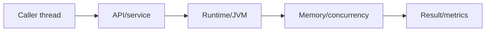
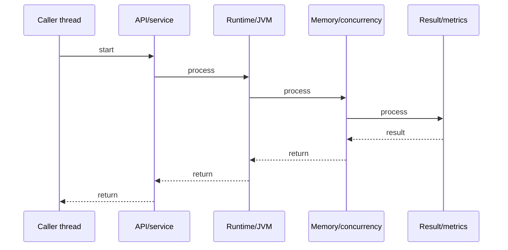

# String Pool Internals

## Quick Facts
- Area: Java
- Tag: Internals
- Source: `src/modules/topics/java/java-string-pool.js`
- Tags: `java`, `string-pool`, `intern`, `heap`, `memory`
- Visual coverage: live visual

## Concept
The String Pool (interned string table) is a hash table in the JVM heap (moved from PermGen to heap in Java 7+). String literals are automatically interned - the JVM checks the pool before creating a new object. String.intern() manually adds heap strings to the pool. Two interned strings with same content share one object - == comparison works. new String("x") always creates a new heap object outside the pool.

## Why It Matters
String is the most common Java object. Without pooling, every identical string literal creates a redundant heap object. Understanding intern behavior prevents subtle == vs .equals() bugs in production and helps tune memory for string-heavy workloads (e.g., log parsing, XML/JSON processing).

## Architecture / Mental Model


## Runtime / Sequence


## Animation Plan
- Flow lab can use generated mental model steps above.
- UML sequence can use generated sequence diagram above.
- Architecture map can use generated area mental model above.
- Live visual exists in app: topic-specific canvas/ReactViz animation.

Flow steps:

1. Caller thread
2. API/service
3. Runtime/JVM
4. Memory/concurrency
5. Result/metrics

## Example
```java
// String pool behavior
String s1 = "hello";           // -> pool: creates/reuses "hello"
String s2 = "hello";           // -> pool: reuses same object
String s3 = new String("hello"); // -> heap: NEW object outside pool
String s4 = s3.intern();        // -> pool: returns pooled "hello"

System.out.println(s1 == s2);   // true  - same pool object
System.out.println(s1 == s3);   // false - s3 is heap object
System.out.println(s1 == s4);   // true  - s4 is pooled

// Concatenation at compile time -> pooled
String s5 = "hel" + "lo";      // compile-time constant -> pool
System.out.println(s1 == s5);   // true

// Runtime concatenation -> heap object
String part = "hel";
String s6 = part + "lo";        // runtime -> new heap String
System.out.println(s1 == s6);   // false

// ALWAYS use .equals() for content comparison
System.out.println(s1.equals(s3)); // true - content equal
```

## Complexity And Performance
- Time/space complexity depends on deployment, data size, and chosen implementation.
- Track p50/p95/p99 latency, throughput, memory, saturation, and error rate for production topics.

## Interview Drills
1. Where does the String Pool live in Java 7+ vs Java 6?

2. Why does new String("hello") not use the pool?

3. When would you call String.intern() in production?

4. Why is == unreliable for String comparison?

5. How does compile-time concatenation differ from runtime?

## Trade-offs
Pros:
- Memory deduplication - same string content = one object
- Pool lookup O(1) - hash table
- String literals automatically pooled - zero effort

Cons:
- Pool has overhead - hash table entries for every distinct string
- Aggressive intern() of dynamic strings can cause memory leak (pool never GCd in Java 6)
- Java 7+ pool is on heap - GC can collect unused interned strings

## Gotchas
- == compares references, not content - always use .equals() or Objects.equals()
- new String("x") creates TWO objects: one in pool (the literal "x"), one on heap
- String.format() / StringBuilder always produce heap strings - never pooled
- Java 6: pool in PermGen -> OutOfMemoryError:PermGen if too many intern() calls

