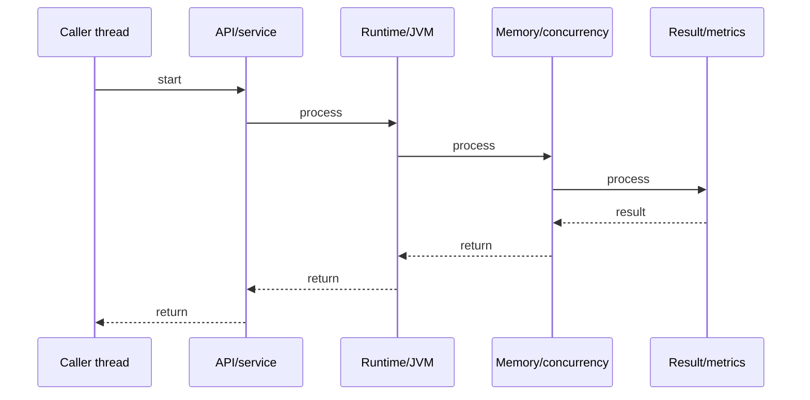

# Virtual Threads (Project Loom)

## Quick Facts
- Area: Java
- Tag: Concurrency
- Source: `src/modules/topics/java/java-virtual-threads.js`
- Tags: `java`, `virtual-threads`, `project-loom`, `concurrency`, `java21`
- Visual coverage: live visual

## Concept
Virtual threads (Java 21 GA) are lightweight JVM-managed threads. Unlike platform threads (1:1 OS thread mapping), many virtual threads multiplex onto a small pool of carrier (OS) threads. When a virtual thread blocks on I/O, the JVM unmounts it from the carrier thread - freeing the carrier to run another virtual thread. No thread pool sizing needed: create millions of virtual threads, one per task.

## Why It Matters
Traditional thread-per-request servers bottleneck at ~10K OS threads. Reactive/async code (WebFlux, CompletableFuture) solves scale but sacrifices readability. Virtual threads give synchronous-looking code with reactive-level throughput. Spring Boot 3.2+ enables virtual threads by default with one config line.

## Architecture / Mental Model


## Runtime / Sequence


## Animation Plan
- Flow lab can use generated mental model steps above.
- UML sequence can use generated sequence diagram above.
- Architecture map can use generated area mental model above.
- Live visual exists in app: topic-specific canvas/ReactViz animation.

Flow steps:

1. Caller thread
2. API/service
3. Runtime/JVM
4. Memory/concurrency
5. Result/metrics

## Example
```java
// Java 21 - Virtual threads
// Old way: thread pool limits concurrency
ExecutorService pool = Executors.newFixedThreadPool(200);

// New way: unbounded virtual threads
ExecutorService vThreads = Executors.newVirtualThreadPerTaskExecutor();

// One virtual thread per HTTP request - blocking I/O is fine
try (var executor = Executors.newVirtualThreadPerTaskExecutor()) {
    List<Future<String>> futures = urls.stream()
        .map(url -> executor.submit(() -> {
            // Blocking HTTP call - carrier thread freed while waiting
            return HttpClient.newHttpClient()
                .send(HttpRequest.newBuilder(URI.create(url)).build(),
                      HttpResponse.BodyHandlers.ofString())
                .body();
        }))
        .toList();
}

// Spring Boot 3.2 - enable virtual threads
// application.properties:
// spring.threads.virtual.enabled=true

// Directly:
Thread vt = Thread.ofVirtual().name("my-vt").start(() -> {
    System.out.println("Running on: " + Thread.currentThread());
});
```

## Complexity And Performance
- Time/space complexity depends on input size, data volume, and implementation choices.
- Track latency, throughput, memory, saturation, error rate, and correctness invariants.

## Interview Drills
1. What is the difference between platform threads and virtual threads?

2. How does the JVM handle a virtual thread blocked on I/O?

3. What is a carrier thread and how many exist by default?

4. Why should you NOT use synchronized blocks in virtual threads?

5. What is thread pinning and when does it occur?

## Trade-offs
Pros:
- Millions of concurrent threads - scales with I/O bound work
- Synchronous code style, no callback hell or reactive chains
- Zero code change needed for most blocking I/O (JDBC, HTTP)
- JVM handles scheduling - no thread pool sizing

Cons:
- CPU-bound tasks: no benefit - still need OS thread parallelism
- synchronized blocks pin virtual thread to carrier (cannot unmount)
- Thread-local variables bloat: millions of threads = millions of ThreadLocal copies
- Requires Java 21+ (LTS)

## Gotchas
- synchronized pins the virtual thread - use ReentrantLock instead in Loom-aware code
- Thread pools defeat the purpose - use newVirtualThreadPerTaskExecutor() not fixed pools
- ThreadLocal still works but memory usage explodes with millions of threads - prefer ScopedValue (Java 21)
- JDBC drivers may not yet support structured concurrency - check driver compatibility

