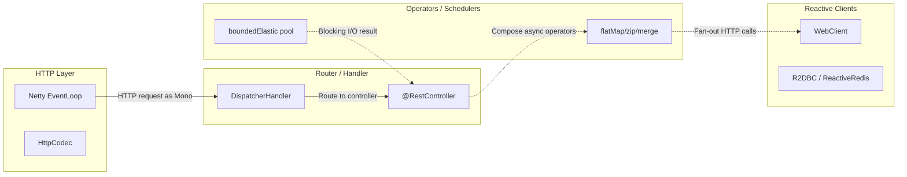
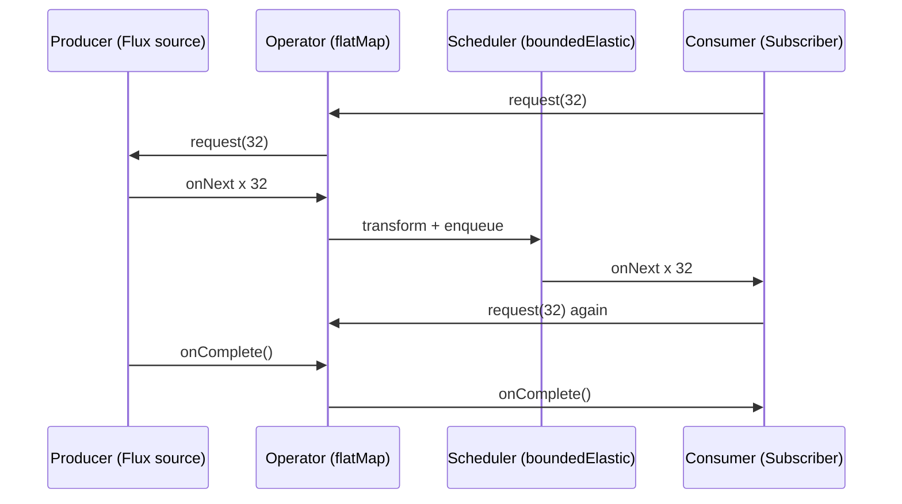

# Reactive Spring (WebFlux) & Project Reactor

## Quick Facts

- Area: Java
- Tag: Reactive
- Source: `src/modules/topics/java/java-webflux.js`
- Tags: `webflux`, `reactor`, `mono`, `flux`, `backpressure`
- Visual coverage: live visual, flow lab, UML lab, architecture map

## Concept

**L1 (30s):** Reactive = event-loop + backpressure. One thread handles thousands of connections. No blocking allowed.
**L2 (2min):** `Mono<T>` = 0 or 1 item (like CompletableFuture but lazy + backpressure). `Flux<T>` = 0..N stream. Both are _cold_ - nothing runs until subscribed. Reactor's event loop (Netty) demultiplexes I/O; your code runs in non-blocking operator chains. **Backpressure**: subscriber calls `request(n)`; producer emits <= n items.
**L3 (10min):** Schedulers: `boundedElastic` for blocking calls (JDBC, files), `parallel` for CPU work. `subscribeOn` switches where the subscription runs; `publishOn` switches where downstream runs. Hot publishers (Sinks, SSE) share items regardless of subscribers. Cold publishers re-run for each subscriber.
**L4 (30min):** Reactor backpressure internals use Reactive Streams spec - `Publisher/Subscriber/Subscription/Processor`. `flatMap` maintains an internal `FluxFlatMap` with configurable concurrency (default 256). Over-concurrency causes `OutOfMemoryError`. Context propagation replaces ThreadLocal for MDC trace IDs.

## Why It Matters

**Production case:** Ecommerce checkout aggregates 5 external APIs (shipping, inventory, pricing, fraud, loyalty). With MVC + virtual threads all 5 block a thread each. With WebFlux + WebClient, all 5 fly in parallel on 1 thread. Real perf: 1200 RPS on 2 cores, vs 180 RPS blocking equivalent.

## Architecture / Mental Model



## Runtime / Sequence



## Animation Plan

- Flow lab available: step-by-step path highlighting.
- UML sequence simulation available: actor messages animate in order.
- Architecture map available: clickable nodes and sync/async links.
- Live visual exists in app: topic-specific canvas/ReactViz animation.

Flow steps:

1. Subscribe triggers demand - subscribe() calls onSubscribe() -> Subscription created
2. Items flow downstream - Source emits -> map transforms each item
3. Filtering & limiting - filter drops items not matching predicate
4. Scheduler handoff - publishOn moves execution to boundedElastic pool
5. Subscriber receives item - onNext(item) fires - your business logic runs

## Example

```java
@RestController @RequiredArgsConstructor
class QuoteController {
    private final WebClient client;

    @GetMapping(value="/quote/{sku}", produces=APPLICATION_NDJSON_VALUE)
    Flux<Quote> quote(@PathVariable String sku) {
        Flux<Quote> a = vendor("https://vendor-a/quote/" + sku);
        Flux<Quote> b = vendor("https://vendor-b/quote/" + sku);
        Flux<Quote> c = vendor("https://vendor-c/quote/" + sku);
        return Flux.merge(a, b, c)
            .timeout(Duration.ofMillis(800))
            .onErrorResume(e -> Flux.empty())
            .take(2);
    }

    private Flux<Quote> vendor(String url) {
        return client.get().uri(url).retrieve()
            .bodyToFlux(Quote.class)
            .subscribeOn(Schedulers.parallel());
    }
}
```

## Complexity And Performance

- Time/space complexity depends on input size, data volume, and implementation choices.
- Track latency, throughput, memory, saturation, error rate, and correctness invariants.

## Interview Drills

1. Mono vs Flux vs CompletableFuture - key differences?
   Answer: `CompletableFuture` is eager (starts immediately), single result, no backpressure. `Mono` is lazy, 0/1 item, backpressure aware. `Flux` is lazy, 0..N, full reactive streams. Reactor pipelines compose streaming + error handling cleanly.
   Follow-ups: Hot vs cold publisher?; When does subscribeOn vs publishOn matter?

2. How does backpressure flow through flatMap?
   Answer: Subscriber calls `request(n)`. flatMap maintains an inner subscriber with its own demand. Default maxConcurrency=256. If inner Monos complete faster than outer demand, extras queue. Set flatMap(fn, concurrency) to throttle.
   Follow-ups: What is onBackpressureBuffer?; How do you size flatMap concurrency?

3. WebFlux vs virtual threads - when to choose each?
   Answer: WebFlux: streaming (SSE, WebSocket), high-fanout aggregation, existing reactive codebase. Virtual threads + MVC: simpler code, same scalability for CRUD, easier debugging, no operator chains.
   Follow-ups: Can you mix both in one app?; R2DBC vs JDBC with virtual threads?

## Trade-offs

Pros:

- Few threads handle massive connection counts
- First-class backpressure
- Composable streaming operators
- WebClient supports connection pooling + timeouts

Cons:

- Steep learning curve, noisy stack traces
- ThreadLocal requires Context propagation
- R2DBC ecosystem thinner than JPA
- Debugging async chains is hard

When to use:
**Streaming, SSE, WebSocket, high-fanout aggregators.** For CRUD in Java 21+, virtual threads + MVC is simpler and equally scalable.

## Gotchas

- Never call `.block()` inside a reactive chain - deadlock on the event loop
- ThreadLocal (MDC, security context) is lost on thread switches - use Reactor Context
- `.subscribe()` inside `.flatMap()` = fire-and-forget, errors silently swallowed
- WebClient without `.timeout()` will wait forever - always set a deadline
- Hot publisher (Sinks) drops items if no subscriber yet - buffer or replay sink needed
- boundedElastic pool is bounded (default 10xCPU) - too much blocking I/O = queue buildup
