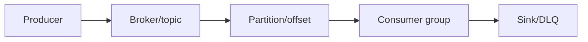
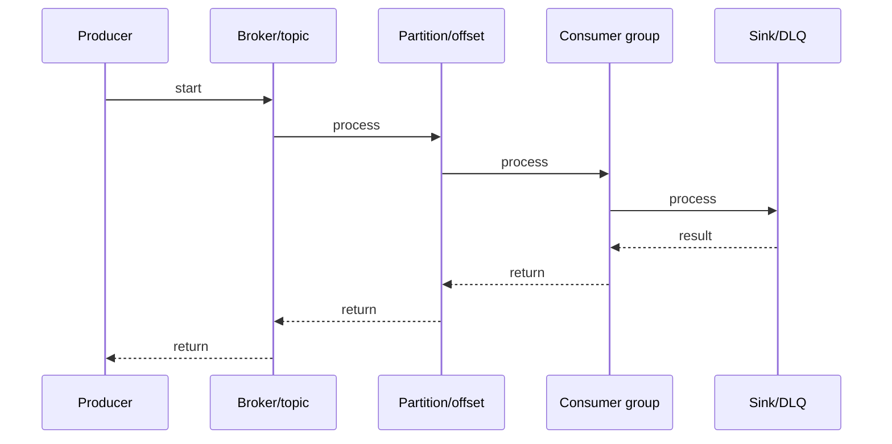

# Kafka Log Compaction

## Quick Facts
- Area: Kafka and Messaging
- Tag: storage
- Source: `src/modules/topics/kafka/kafka-compaction.js`
- Tags: `kafka`, `log-compaction`, `cleanup`, `tombstone`, `changelog`, `ktable`
- Visual coverage: live visual

## Concept
**L1 (30s ELI5):** Log compaction = keep only the latest version of each key. Like a dictionary - old definitions overwritten by new ones. Delete a key by writing null (tombstone).

**L2 (2min core):** Background cleaner thread scans old segments, builds key->latest-offset map, removes older versions. Active segment (tail) never compacted. Tombstone (null value) marks deletion, retained for delete.retention.ms before final removal.

**L3 (10min edge cases):** min.cleanable.dirty.ratio controls when compaction triggers. Compacted topics have offset gaps. Consumers reading compacted topic see latest values but may see duplicates during compaction window. cleanup.policy=compact,delete combines time-based expiry with compaction.

**L4 (30min deep):** Cleaner uses log.cleaner.dedupe.buffer.size (128MB) in-memory hash for offset map. If buffer too small, multiple passes needed. log.cleaner.io.max.bytes.per.second throttles I/O. min.compaction.lag.ms prevents too-fresh data from compaction. Compaction is per-partition, parallel across partitions. Kafka Streams changelog topics: compaction + barrier offsets enable state store recovery without full topic scan.

## Why It Matters
Compaction enables Kafka as a state store, not just a stream. KTables, Debezium CDC sinks, and microservice event-sourcing all rely on compacted topics to maintain current state without unbounded log growth.

## Architecture / Mental Model


## Runtime / Sequence


## Animation Plan
- Flow lab can use generated mental model steps above.
- UML sequence can use generated sequence diagram above.
- Architecture map can use generated area mental model above.
- Live visual exists in app: topic-specific canvas/ReactViz animation.

Flow steps:

1. Producer
2. Broker/topic
3. Partition/offset
4. Consumer group
5. Sink/DLQ

## Example
```bash
# Create compacted topic
kafka-topics.sh --create \
  --topic user-profiles \
  --partitions 6 \
  --replication-factor 3 \
  --config cleanup.policy=compact \
  --config min.cleanable.dirty.ratio=0.1 \
  --config segment.ms=3600000 \
  --config delete.retention.ms=86400000

# Produce: key=user-1, value={"name":"Alice"}
echo '{"name":"Alice"}' | kafka-console-producer.sh \
  --topic user-profiles \
  --property parse.key=true \
  --property key.separator=: \
  --broker-list localhost:9092 \
  <<< "user-1:{"name":"Alice"}"

# Tombstone: delete user-1
echo "user-1:" | kafka-console-producer.sh \
  --topic user-profiles \
  --property parse.key=true \
  --property key.separator=: \
  --property null.marker= \
  --broker-list localhost:9092

# Java: write tombstone programmatically
producer.send(new ProducerRecord<>("user-profiles", "user-1", null));
```

## Complexity And Performance
- Time/space complexity depends on input size, data volume, and implementation choices.
- Track latency, throughput, memory, saturation, error rate, and correctness invariants.

## Interview Drills
1. Question

2. Question

3. Question

4. Question

## Trade-offs
Compaction trades storage space for operational complexity. Log gaps break naive offset-sequential iteration. Background cleaner uses I/O and memory (throttle with log.cleaner.io.max.bytes.per.second). Compacted + delete provides bounded storage with current-state guarantee.

## Gotchas
- Compaction is async - consumers may still see old values until background cleaner runs
- Active (tail) segment never compacted - must roll to new segment before it's eligible
- Tombstones only retained for delete.retention.ms - offline consumers that miss this window won't see the delete
- Offset gaps after compaction - don't assume consecutive offsets in compacted topics
- min.cleanable.dirty.ratio=0 means compact aggressively but causes constant I/O pressure
- cleanup.policy=compact prevents retention.ms-based deletion - data lives forever unless tombstoned
- KTable changelog compaction: essential for fast restarts - without it, full topic replay from offset 0

