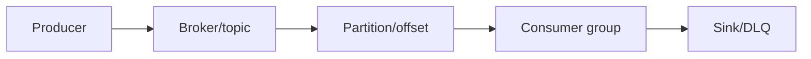
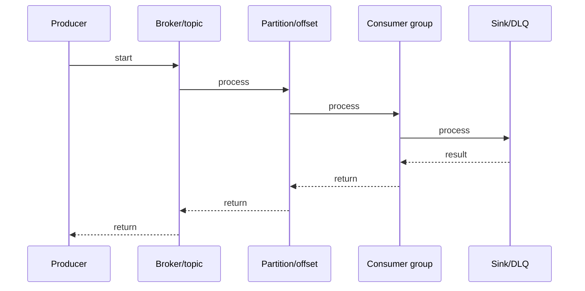

# Kafka Connect

## Quick Facts
- Area: Kafka and Messaging
- Tag: connect
- Source: `src/modules/topics/kafka/kafka-connect.js`
- Tags: `kafka`, `connect`, `source-connector`, `sink-connector`, `SMT`, `CDC`, `Debezium`
- Visual coverage: live visual

## Concept
**L1 (30s ELI5):** Kafka Connect = plug-and-play data pipelines. Source connector pulls from DB/S3 into Kafka. Sink connector pushes from Kafka to DB/S3/ES. Zero custom code for common systems.

**L2 (2min core):** Connectors spawn Tasks (parallelism units). Workers host tasks. Distributed mode: offset/config/status stored in Kafka internal topics. REST API to deploy/manage connectors. SMTs for lightweight transforms.

**L3 (10min edge cases):** JDBC vs Debezium: polling vs WAL-based CDC. DLQ for bad records. errors.tolerance=all avoids connector failure on single bad record. JDBC sink: upsert mode for idempotency. S3 sink: file rotation by time/size.

**L4 (30min deep):** Distributed mode uses consumer group protocol for task assignment. connect-offsets (compacted): source offsets per partition. connect-configs (compacted): connector/task configs. connect-status (compacted): connector states. SMT chain: transforms applied in order, each sees result of previous. Custom SMTs: implement Transformation interface.

## Why It Matters
Connect handles the operational burden of data pipelines: offset tracking, parallelism, failure recovery, schema evolution. 200+ open-source connectors (Confluent Hub). Alternative to custom Kafka consumers/producers for integration use cases.

## Architecture / Mental Model


## Runtime / Sequence


## Animation Plan
- Flow lab can use generated mental model steps above.
- UML sequence can use generated sequence diagram above.
- Architecture map can use generated area mental model above.
- Live visual exists in app: topic-specific canvas/ReactViz animation.

Flow steps:

1. Producer
2. Broker/topic
3. Partition/offset
4. Consumer group
5. Sink/DLQ

## Example
```bash
# Deploy Debezium PostgreSQL source connector via REST API
curl -X POST http://connect:8083/connectors \
  -H "Content-Type: application/json" \
  -d '{
    "name": "orders-cdc",
    "config": {
      "connector.class": "io.debezium.connector.postgresql.PostgresConnector",
      "tasks.max": "1",
      "database.hostname": "postgres",
      "database.port": "5432",
      "database.user": "debezium",
      "database.password": "secret",
      "database.dbname": "orders",
      "database.server.name": "orders-db",
      "table.include.list": "public.orders",
      "plugin.name": "pgoutput",
      "slot.name": "debezium_slot",
      "errors.tolerance": "all",
      "errors.deadletterqueue.topic.name": "dlq.orders-cdc",
      "transforms": "route,mask",
      "transforms.route.type": "RegexRouter",
      "transforms.route.regex": "orders-db.public.(.*)",
      "transforms.route.replacement": "cdc.$1",
      "transforms.mask.type": "ReplaceField",
      "transforms.mask.blacklist": "credit_card"
    }
  }'

# Check connector status
curl http://connect:8083/connectors/orders-cdc/status
```

## Complexity And Performance
- Time/space complexity depends on deployment, data size, and chosen implementation.
- Track p50/p95/p99 latency, throughput, memory, saturation, and error rate for production topics.

## Interview Drills
1. Question

2. Question

3. Question

4. Question

## Trade-offs
Connect: zero-code for standard integrations, but limited transform logic. Custom consumer/producer: full control but you own offset management, parallelism, failure handling. Debezium: powerful CDC but operationally complex (replication slots, snapshot management).

## Gotchas
- JDBC Source misses hard DELETEs - only detects rows with updated timestamp or new ID. Use Debezium for full CDC
- Debezium requires DB replication slot (PostgreSQL) or binlog (MySQL) - coordinate with DBA
- tasks.max is an upper bound - actual tasks = min(tasks.max, source parallelism e.g., table count)
- errors.tolerance=all silently drops bad records unless DLQ configured - configure DLQ!
- SMTs are not for heavy logic - for complex transforms use Kafka Streams downstream of the connector
- Distributed mode stores state in Kafka topics - don't change connect-offsets topic config or you lose offset tracking
- Schema changes: JDBC sink auto.evolve=true adds columns but can't remove them without manual intervention

