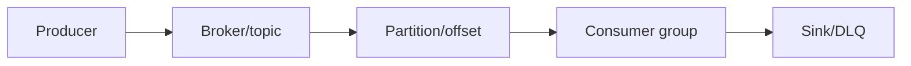
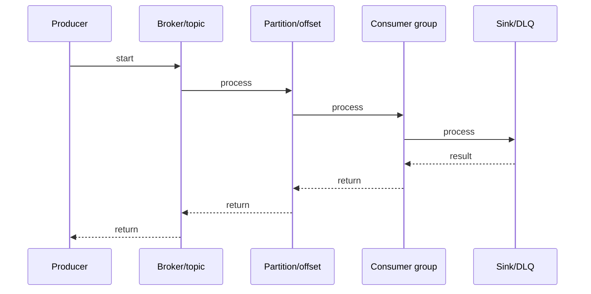

# Kafka Consumer Groups

## Quick Facts

- Area: Kafka and Messaging
- Tag: consumer
- Source: `src/modules/topics/kafka/kafka-consumer-groups.js`
- Tags: `kafka`, `consumer-groups`, `rebalance`, `partition-assignment`, `offsets`
- Visual coverage: live visual

## Concept

**L1 (30s ELI5):** Consumer group = team sharing a partition queue. Each partition -> exactly one consumer. Add consumers -> Kafka redistributes work (rebalance).

**L2 (2min core):** Group coordinator (broker) manages membership via JoinGroup/SyncGroup protocol. One consumer elected leader, runs assignment algo, sends plan to coordinator. Coordinator distributes to all members. Offsets committed to \_\_consumer_offsets (50 partitions, compacted).

**L3 (10min edge cases):** Three timeouts: session.timeout.ms (heartbeat deadline), heartbeat.interval.ms (send freq, must be < session/3), max.poll.interval.ms (time between poll() calls - catches processing hangs, not heartbeat hangs). Rebalance strategies: Range (per-topic consecutive, hotspots), RoundRobin (even across all partitions), Sticky (preserves prev assignment). Eager vs Cooperative: eager revokes ALL partitions, cooperative only revokes moving partitions.

**L4 (30min deep):** \_\_consumer_offsets has 50 partitions. Coordinator = broker leading hash(group.id)%50 partition. SyncGroup: leader sends full assignment, followers send empty. Protocol negotiation: all members must agree - one eager member forces group to eager. Static membership (group.instance.id) skips rebalance on restart within session.timeout. Incremental cooperative uses 2 rounds: round 1 find movers, round 2 assign.

## Why It Matters

Horizontal scale: add consumers = linear throughput up to partition count. Fault tolerance: consumer dies -> auto-reassign. Exactly-once = consumer groups + transactional offset commits.

## Architecture / Mental Model



## Runtime / Sequence



## Animation Plan

- Flow lab can use generated mental model steps above.
- UML sequence can use generated sequence diagram above.
- Architecture map can use generated area mental model above.
- Live visual exists in app: topic-specific canvas/ReactViz animation.

Flow steps:

1. Producer
2. Broker/topic
3. Partition/offset
4. Consumer group
5. Sink/DLQ

## Example

```java
Properties props = new Properties();
props.put(ConsumerConfig.GROUP_ID_CONFIG, "my-group");
// Cooperative: no stop-the-world rebalance
props.put(ConsumerConfig.PARTITION_ASSIGNMENT_STRATEGY_CONFIG,
    CooperativeStickyAssignor.class.getName());
// Heartbeat must be < session/3
props.put(ConsumerConfig.SESSION_TIMEOUT_MS_CONFIG, 30000);
props.put(ConsumerConfig.HEARTBEAT_INTERVAL_MS_CONFIG, 10000);
// Set based on max processing time for a batch
props.put(ConsumerConfig.MAX_POLL_INTERVAL_MS_CONFIG, 300000);
props.put(ConsumerConfig.MAX_POLL_RECORDS_CONFIG, 500);

KafkaConsumer<String, String> consumer = new KafkaConsumer<>(props);
Map<TopicPartition, OffsetAndMetadata> currentOffsets = new HashMap<>();

consumer.subscribe(List.of("orders"), new ConsumerRebalanceListener() {
    public void onPartitionsRevoked(Collection<TopicPartition> parts) {
        consumer.commitSync(currentOffsets); // commit before revoke
    }
    public void onPartitionsAssigned(Collection<TopicPartition> parts) {
        parts.forEach(p -> loadState(p)); // init state for new partitions
    }
});

while (true) {
    ConsumerRecords<String, String> records = consumer.poll(Duration.ofMillis(100));
    for (ConsumerRecord<String, String> r : records) {
        process(r);
        currentOffsets.put(
            new TopicPartition(r.topic(), r.partition()),
            new OffsetAndMetadata(r.offset() + 1));
    }
    consumer.commitAsync(currentOffsets, null);
}
```

## Complexity And Performance

- Time/space complexity depends on input size, data volume, and implementation choices.
- Track latency, throughput, memory, saturation, error rate, and correctness invariants.

## Interview Drills

1. Question

2. Question

3. Question

4. Question

## Trade-offs

More consumers = more rebalances. Cooperative: faster rebalances, requires all members to opt in. Sticky: min moves, slightly more complex assignment. Large groups: increase group.initial.rebalance.delay.ms to let all members join before first assignment.

## Gotchas

- max.poll.interval.ms exceeded kicks consumer even if heartbeats healthy - heartbeat thread poll thread
- heartbeat.interval.ms must be < session.timeout.ms / 3 or broker won't wait 3 missed beats
- Eager rebalance: ALL partitions revoked first -> all consumers pause. 50ms becomes 2s in large clusters
- Range assignor: consumer-0 gets P0 from every subscribed topic -> hotspot if P0 is high-traffic
- Mixed assignor strategies in a group -> entire group falls back to eager
- Static membership (group.instance.id): consumer can restart without triggering rebalance if back within session.timeout.ms
- \_\_consumer_offsets coordinator = broker for hash(group.id) % 50 - that broker is your performance bottleneck
