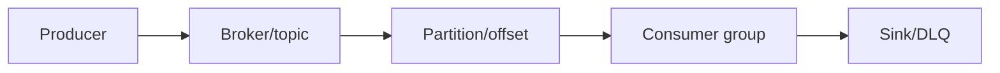
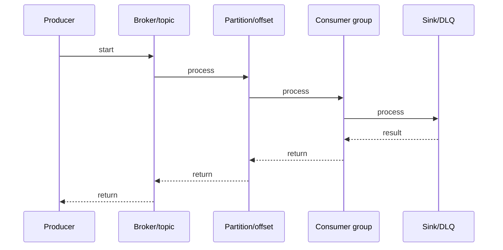

# Kafka Offsets & Delivery Semantics

## Quick Facts
- Area: Kafka and Messaging
- Tag: offsets
- Source: `src/modules/topics/kafka/kafka-offsets-commits.js`
- Tags: `kafka`, `offsets`, `at-least-once`, `exactly-once`, `delivery-semantics`, `auto-commit`
- Visual coverage: live visual

## Concept
**L1 (30s ELI5):** Offset = bookmark in a partition. Commit = save bookmark. At-least-once = save after reading (may re-read). At-most-once = save before reading (may lose). Exactly-once = atomic save + publish.

**L2 (2min core):** Each partition has an independent offset sequence. Consumer commits to __consumer_offsets. Committed offset = next offset to fetch. Consumer lag = fetch position - committed offset. Auto-commit commits highest fetched, not processed.

**L3 (10min edge cases):** commitAsync: no retry (would override newer commit with stale one). commitSync: blocking, retries. Pattern: commitAsync in loop + commitSync in shutdown/rebalance. EOS: transactional.id + initTransactions() + sendOffsetsToTransaction(). Consumer needs isolation.level=read_committed.

**L4 (30min deep):** PID (producer ID) assigned per transactional.id. Epoch bumped on restart -> fences zombie producers. TransactionCoordinator = dedicated broker per tx. Two-phase commit within Kafka: prepare -> commit markers written to all involved partitions. Consumer sees commit marker -> reads records as visible. Abort marker -> records skipped. Idempotent producer: sequence numbers per PID+partition -> deduplicates retries.

## Why It Matters
Kafka is stateless - offset tracking is 100% consumer-side. This enables replay (seek to beginning), parallel consumers, and flexible delivery semantics per use case.

## Architecture / Mental Model


## Runtime / Sequence


## Animation Plan
- Flow lab can use generated mental model steps above.
- UML sequence can use generated sequence diagram above.
- Architecture map can use generated area mental model above.
- Live visual exists in app: topic-specific canvas/ReactViz animation.

Flow steps:

1. Producer
2. Broker/topic
3. Partition/offset
4. Consumer group
5. Sink/DLQ

## Example
```java
// At-least-once (recommended default)
props.put(ConsumerConfig.ENABLE_AUTO_COMMIT_CONFIG, false);
KafkaConsumer<String,String> consumer = new KafkaConsumer<>(props);
Map<TopicPartition,OffsetAndMetadata> offsets = new HashMap<>();

try {
    while (running) {
        var records = consumer.poll(Duration.ofMillis(100));
        for (var r : records) {
            process(r); // idempotent
            offsets.put(new TopicPartition(r.topic(), r.partition()),
                        new OffsetAndMetadata(r.offset() + 1)); // N+1!
        }
        consumer.commitAsync(offsets, null);
    }
} finally {
    consumer.commitSync(offsets); // flush on shutdown
}

// Exactly-once (Kafka->Kafka)
props.put(ProducerConfig.TRANSACTIONAL_ID_CONFIG, "my-tx-id");
KafkaProducer<String,String> producer = new KafkaProducer<>(props);
producer.initTransactions();
producer.beginTransaction();
try {
    producer.send(new ProducerRecord<>("output", key, value));
    producer.sendOffsetsToTransaction(offsets, consumer.groupMetadata());
    producer.commitTransaction();
} catch (Exception e) {
    producer.abortTransaction();
}
```

## Complexity And Performance
- Time/space complexity depends on input size, data volume, and implementation choices.
- Track latency, throughput, memory, saturation, error rate, and correctness invariants.

## Interview Drills
1. Question

2. Question

3. Question

4. Question

## Trade-offs
Auto-commit: simple but dangerous. Manual commitSync: safe but slow. commitAsync + commitSync in finally: best of both. EOS: strong guarantee, ~40% throughput reduction, Kafka-only.

## Gotchas
- auto-commit commits highest FETCHED offset, not processed. Default 5s interval -> data loss on crash
- Committed offset = NEXT to fetch. commit(record.offset()) re-fetches same record. Must commit record.offset()+1
- commitAsync does NOT retry - retrying with stale offset could override a newer commit and cause reprocessing
- EOS only works Kafka->Kafka. Kafka->DB requires idempotent consumer logic even with transactions
- isolation.level=read_committed: consumer won't see records until transaction committed. Adds latency
- seek() changes fetch position but NOT committed offset. After rebalance, consumer restarts from last commit
- Zombie producer fencing: if producer restarts with same transactional.id, old epoch is invalidated

