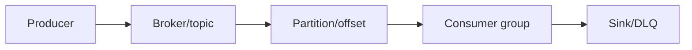
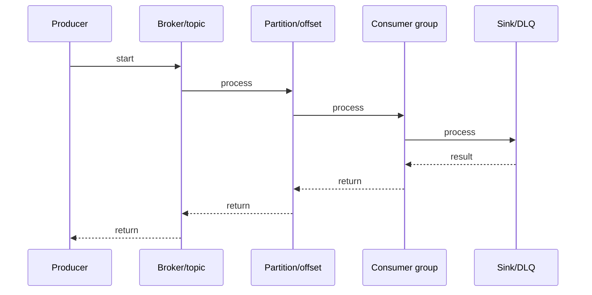

# Kafka Producer & Consumer - Full End-to-End Flow

## Quick Facts
- Area: Kafka and Messaging
- Tag: Core
- Source: `src/modules/topics/kafka/kafka-producer-consumer.js`
- Tags: `kafka`, `producer`, `consumer`, `batching`, `acks`, `poll`, `serializer`, `partitioner`, `linger.ms`
- Visual coverage: live visual

## Concept
**L1 (30s ELI5):** Kafka producer is a newspaper publisher - serializes, partitions, batches, sends. Consumer is a subscriber - polls at own pace, commits which issue it read.

**L2 (2min core):** Producer: serialize -> partition (murmur2 hash of key) -> RecordAccumulator batch -> Sender fires to leader -> ISR replicates -> ack. Consumer: poll() loop (heartbeat + fetch + rebalance handling) -> process -> commitSync(). Offset stored in __consumer_offsets internal topic.

**L3 (10min edge cases):** acks=1 + leader failure = data loss. Auto-commit + crash = loss. max.poll.interval.ms exceeded = rebalance loop. Large messages >1MB need both broker AND consumer config. buffer.memory full -> blocks for max.block.ms -> TimeoutException. enable.idempotence forces max.in.flight=1 per partition.

**L4 (30min deep):** RecordAccumulator uses per-partition Deque<ProducerBatch> with MemoryRecordsBuilder writing to ByteBuffer from a BufferPool (avoids GC). Sender uses NIO Selector + NetworkClient for async I/O across multiple brokers. ProduceRequest v8+ includes PID, epoch, sequence for idempotence. ISR tracked in ZooKeeper/KRaft - leader updates ISR when follower lag > replica.lag.time.max.ms. FetchRequest specifies fetch.min.bytes (reduce empty polls) and fetch.max.wait.ms.

## Why It Matters
Producer/consumer config determines throughput, durability, latency, and exactly-once behavior. Wrong defaults cause silent data loss in production. acks=all + idempotence + manual commit = production standard.

## Architecture / Mental Model


## Runtime / Sequence


## Animation Plan
- Flow lab can use generated mental model steps above.
- UML sequence can use generated sequence diagram above.
- Architecture map can use generated area mental model above.
- Live visual exists in app: topic-specific canvas/ReactViz animation.

Flow steps:

1. Producer
2. Broker/topic
3. Partition/offset
4. Consumer group
5. Sink/DLQ

## Example
```java
// Production producer
Properties p = new Properties();
p.put("bootstrap.servers", "b1:9092,b2:9092,b3:9092");
p.put("key.serializer",    "org.apache.kafka.common.serialization.StringSerializer");
p.put("value.serializer",  "org.apache.kafka.common.serialization.StringSerializer");
p.put("acks",              "all");
p.put("enable.idempotence","true");   // PID+seq dedup, retries=MAX_INT
p.put("batch.size",        "65536");  // 64KB
p.put("linger.ms",         "5");
p.put("compression.type",  "snappy");

KafkaProducer<String,String> prod = new KafkaProducer<>(p);
prod.send(new ProducerRecord<>("orders", orderId, json), (meta, ex) -> {
    if (ex != null) log.error("Failed: {}", orderId, ex);
    else            log.debug("offset={} partition={}", meta.offset(), meta.partition());
});

// Production consumer
Properties c = new Properties();
c.put("bootstrap.servers",     "b1:9092,b2:9092,b3:9092");
c.put("group.id",              "order-processor-v2");
c.put("key.deserializer",      "org.apache.kafka.common.serialization.StringDeserializer");
c.put("value.deserializer",    "org.apache.kafka.common.serialization.StringDeserializer");
c.put("auto.offset.reset",     "earliest");
c.put("enable.auto.commit",    "false");     // manual commit
c.put("max.poll.records",      "200");
c.put("max.poll.interval.ms",  "300000");

KafkaConsumer<String,String> consumer = new KafkaConsumer<>(c);
consumer.subscribe(List.of("orders"));
try {
    while (!shutdown.get()) {
        var records = consumer.poll(Duration.ofMillis(100));
        for (var r : records) processOrder(r.value());
        if (!records.isEmpty()) consumer.commitSync();
    }
} finally { consumer.close(); }
```

## Complexity And Performance
- Time/space complexity depends on input size, data volume, and implementation choices.
- Track latency, throughput, memory, saturation, error rate, and correctness invariants.

## Interview Drills
1. Question

2. Question

3. Question

4. Question

## Trade-offs
High throughput: large batch.size + linger.ms=50ms + snappy compression. Tradeoff: higher latency. Low latency: linger.ms=0 + small batches. Tradeoff: more requests, lower throughput. Strong durability: acks=all + min.insync.replicas=2. Tradeoff: +5-10ms per produce. Exactly-once: transactions. Tradeoff: 10-20% overhead + complexity.

## Gotchas
- acks=1 + leader dies before replication = DATA LOST. Use acks=all + min.insync.replicas=2.
- enable.auto.commit=true + slow processing = at-most-once delivery. Always false in production.
- producer.send() is async - no callback = exceptions silently swallowed. ALWAYS add callback.
- max.poll.interval.ms exceeded during processing = consumer kicked from group = rebalance loop. Fix: reduce max.poll.records or increase max.poll.interval.ms.
- Tuning message.max.bytes (broker) without fetch.message.max.bytes (consumer) = MessageSizeTooLargeException on produce but fetch broken. Must tune BOTH.
- enable.idempotence=true forces max.in.flight.requests.per.connection=1 per partition and retries=MAX_INT. Don't override these manually.

