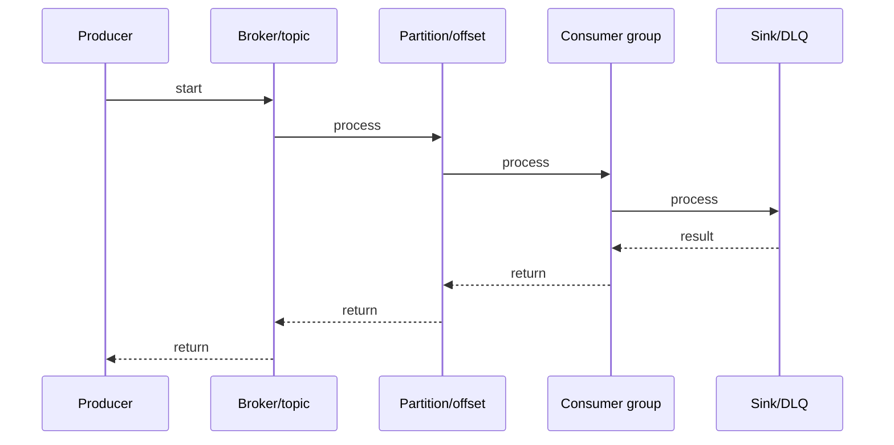

# Kafka Replication & ISR

## Quick Facts

- Area: Kafka and Messaging
- Tag: replication
- Source: `src/modules/topics/kafka/kafka-replication-isr.js`
- Tags: `kafka`, `replication`, `ISR`, `leader`, `follower`, `acks`, `HWM`, `LEO`
- Visual coverage: live visual

## Concept

**L1 (30s ELI5):** Kafka replicates each partition to N brokers. One is leader (takes writes), others are followers (copy). If leader dies, a follower takes over. No data loss if all ISR have the data.

**L2 (2min core):** ISR = In-Sync Replicas - replicas within replica.lag.time.max.ms of leader. HWM = High Watermark = min(all ISR LEOs) = what consumers can read. LEO = Log End Offset = what's written on each replica. acks=all waits for all ISR to confirm.

**L3 (10min edge cases):** acks=all alone not enough - need min.insync.replicas>=2. ISR shrink allows acks=all to proceed with fewer replicas. unclean.leader.election.enable=true: allows out-of-ISR leader (data loss risk). Preferred replica election: Kafka prefers original leader for balance.

**L4 (30min deep):** Leader tracks follower fetch offsets via FetchRequest/FetchResponse. Follower sends FetchRequest with its LEO -> leader knows if follower is caught up. Leader's ISR update propagated via ZooKeeper/KRaft. On leader failure: controller reads ISR from metadata, picks highest LEO follower. Follower truncates log to HWM before starting. Epoch-based leader tracking prevents split-brain.

## Why It Matters

Replication provides durability and availability. Kafka's ISR model trades strict synchrony for performance - followers fetch asynchronously but are tracked. HWM ensures consumers always see consistent state.

## Architecture / Mental Model


## Runtime / Sequence



## Animation Plan

- Flow lab can use generated mental model steps above.
- UML sequence can use generated sequence diagram above.
- Architecture map can use generated area mental model above.
- Live visual exists in app: topic-specific canvas/ReactViz animation.

Flow steps:

1. Producer
2. Broker/topic
3. Partition/offset
4. Consumer group
5. Sink/DLQ

## Example

```java
// Producer config for strong durability
Properties props = new Properties();
// All ISR must acknowledge
props.put(ProducerConfig.ACKS_CONFIG, "all");
// Enable idempotent producer (exactly-once per partition)
props.put(ProducerConfig.ENABLE_IDEMPOTENCE_CONFIG, true);
// Retry on transient failures
props.put(ProducerConfig.RETRIES_CONFIG, Integer.MAX_VALUE);
// Prevent out-of-order retries
props.put(ProducerConfig.MAX_IN_FLIGHT_REQUESTS_PER_CONNECTION, 5);

// Topic config (at creation)
// replication.factor=3: 3 copies of each partition
// min.insync.replicas=2: at least 2 must ack (with acks=all)
// If ISR drops to 1 -> NotEnoughReplicasException

// Broker config
// unclean.leader.election.enable=false (default, prevents data loss)
// replica.lag.time.max.ms=30000 (follower lag threshold for ISR)
// auto.leader.rebalance.enable=true (restore preferred leaders after failover)
```

## Complexity And Performance

- Time/space complexity depends on input size, data volume, and implementation choices.
- Track latency, throughput, memory, saturation, error rate, and correctness invariants.

## Interview Drills

1. Question

2. Question

3. Question

4. Question

## Trade-offs

Higher replication factor = more durability, more disk/network. acks=all + min.insync.replicas=2 = strong guarantee with ~2x write latency. Unclean election: availability vs consistency trade-off. ISR-based model: better throughput than synchronous replication.

## Gotchas

- acks=all without min.insync.replicas>=2 = same as acks=1 if ISR has only leader
- Consumers can only read up to HWM - records between HWM and leader LEO are invisible
- ISR shrink data loss: data on leader is safe, but ISR shrink allows acks=all with fewer replicas
- unclean.leader.election=true prevents unavailability but risks data loss - disabled by default
- Follower truncates to HWM on leader rejoin - data written beyond HWM on old leader is discarded
- replica.lag.time.max.ms too short -> ISR fluctuates under GC pauses or load spikes
