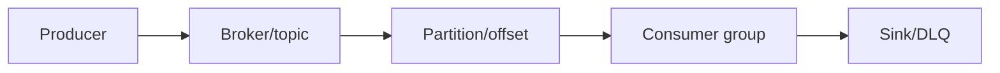
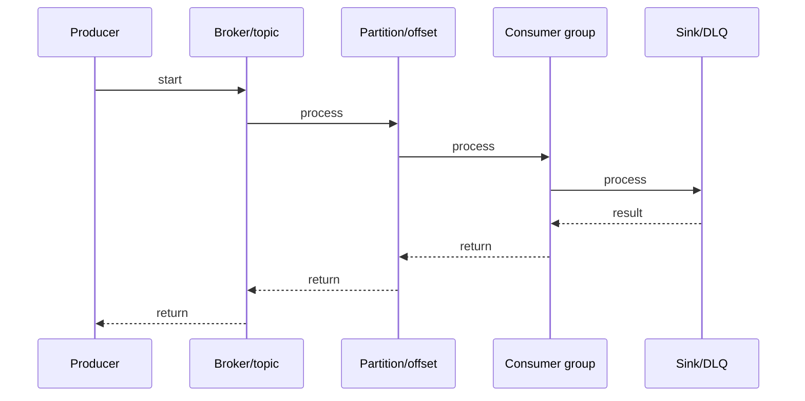

# Schema Registry

## Quick Facts

- Area: Kafka and Messaging
- Tag: schema
- Source: `src/modules/topics/kafka/kafka-schema-registry.js`
- Tags: `kafka`, `schema-registry`, `avro`, `protobuf`, `json-schema`, `compatibility`, `evolution`
- Visual coverage: live visual

## Concept

**L1 (30s ELI5):** Schema Registry = central contract for message shapes. Producers say "my data looks like this" (schema). Consumers use same schema to decode. Evolve schema without breaking consumers.

**L2 (2min core):** Producer serializer registers schema -> gets integer ID. Sends [magic byte][4-byte ID][binary payload]. Consumer deserializer reads ID -> fetches schema from registry (cached) -> deserializes. Compatibility modes (BACKWARD/FORWARD/FULL) control what schema changes are allowed.

**L3 (10min edge cases):** Subject naming strategies: TopicNameStrategy (default, one schema per topic), RecordNameStrategy (by type), TopicRecordNameStrategy (topic + type). Avro optional fields: ["null","type"] union, null must be first for default=null. Registry HA: multiple instances, \_schemas compacted topic as source of truth.

**L4 (30min deep):** Registry REST API: POST /subjects/{subject}/versions -> returns schema ID. GET /schemas/ids/{id} -> returns schema. Compatibility check: new schema compared against latest version (or all versions for BACKWARD_TRANSITIVE). Schema IDs are global, content-addressed (hash). Caching: SchemaRegistryClient caches ID<->schema in memory. TTL configurable. Subject aliases for topic renames.

## Why It Matters

Without Schema Registry: JSON breaks when field names change. Avro without registry: schema must be embedded in every record (huge overhead). Registry: 5-byte overhead, central governance, evolutionary schema, type safety across polyglot producers/consumers.

## Architecture / Mental Model



## Runtime / Sequence



## Animation Plan

- Flow lab can use generated mental model steps above.
- UML sequence can use generated sequence diagram above.
- Architecture map can use generated area mental model above.
- Live visual exists in app: topic-specific canvas/ReactViz animation.

Flow steps:

1. Producer
2. Broker/topic
3. Partition/offset
4. Consumer group
5. Sink/DLQ

## Example

```java
// Producer with Avro + Schema Registry
Properties props = new Properties();
props.put(ProducerConfig.BOOTSTRAP_SERVERS_CONFIG, "broker:9092");
props.put(ProducerConfig.KEY_SERIALIZER_CLASS_CONFIG, StringSerializer.class);
props.put(ProducerConfig.VALUE_SERIALIZER_CLASS_CONFIG, KafkaAvroSerializer.class);
props.put("schema.registry.url", "http://schema-registry:8081");

// Schema auto-registered on first use
KafkaProducer<String, Order> producer = new KafkaProducer<>(props);
Order order = Order.newBuilder()
    .setId(123L).setUserId("user-1").setAmount(99.99).build();
producer.send(new ProducerRecord<>("orders", "user-1", order));

// Consumer
props.put(ConsumerConfig.VALUE_DESERIALIZER_CLASS_CONFIG, KafkaAvroDeserializer.class);
props.put(KafkaAvroDeserializerConfig.SPECIFIC_AVRO_READER_CONFIG, true);
KafkaConsumer<String, Order> consumer = new KafkaConsumer<>(props);
consumer.subscribe(List.of("orders"));

// Check/set compatibility via REST
// curl -X PUT http://schema-registry:8081/config/orders-value \
//   -H "Content-Type: application/json" \
//   -d '{"compatibility": "FULL"}'

// Register schema via REST
// curl -X POST http://schema-registry:8081/subjects/orders-value/versions \
//   -H "Content-Type: application/vnd.schemaregistry.v1+json" \
//   -d '{"schema": "{"type":"record","name":"Order",...}"}'
```

## Complexity And Performance

- Time/space complexity depends on input size, data volume, and implementation choices.
- Track latency, throughput, memory, saturation, error rate, and correctness invariants.

## Interview Drills

1. Question

2. Question

3. Question

4. Question

## Trade-offs

Avro: smallest, best Kafka integration, dynamic. Protobuf: strongest typing, best multi-language. JSON Schema: readable, debuggable, largest. Registry adds operational complexity but pays off at scale with multiple teams/services sharing topics.

## Gotchas

- BACKWARD compatibility (default) means old consumers can read NEW data - deploy consumers before producers
- Avro optional field union must put 'null' first: ["null","string"] not ["string","null"] for default=null
- Renaming an Avro field is BREAKING - use field aliases ('aliases':['oldName']) for backward compat during migration
- Schema Registry is a single point of failure - run multiple instances backed by Kafka \_schemas topic
- Producer caches schema ID locally - Registry downtime doesn't immediately break production if schemas already cached
- TopicNameStrategy: all producers to same topic must use same schema. Use RecordNameStrategy for union topics
- Schema deletion is soft-delete by default - hard-delete requires 'permanent=true' param
