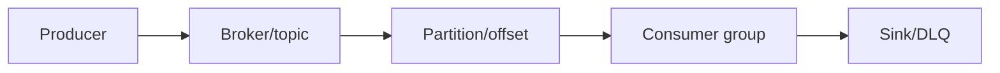
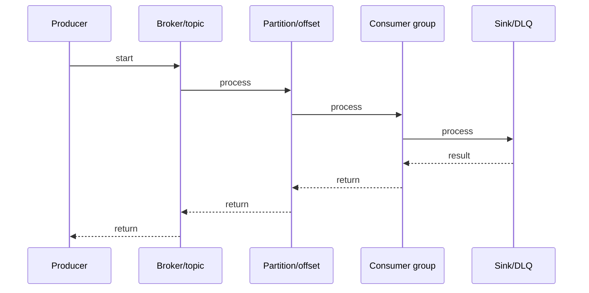

# Kafka Streams

## Quick Facts

- Area: Kafka and Messaging
- Tag: streams
- Source: `src/modules/topics/kafka/kafka-streams.js`
- Tags: `kafka`, `streams`, `KStream`, `KTable`, `windowing`, `stateful`, `topology`
- Visual coverage: live visual

## Concept

**L1 (30s ELI5):** Kafka Streams = Java library to process records one-by-one as they arrive. Filter, transform, join, aggregate - all inside your app. No separate cluster needed.

**L2 (2min core):** Topology = DAG of source -> processor -> sink nodes. KStream = infinite event stream (all events). KTable = latest value per key (changelog). Stateful ops use RocksDB local store + compacted changelog topic backup.

**L3 (10min edge cases):** Task = partition = unit of parallelism. num.stream.threads controls threads per app instance. Windowing: tumbling (non-overlapping), hopping (overlapping), sliding (per-event), session (inactivity-bounded). exactly_once_v2: per-task tx coordinators (faster than v1).

**L4 (30min deep):** StreamTask lifecycle: poll -> process -> punctuate -> commit. Standby replicas (num.standby.replicas) pre-warm state on other instances -> faster failover. Processing time vs event time: use timestamps from record metadata. Punctuators: scheduled callbacks for periodic actions (window close, flush). Interactive queries: serve state store contents via REST without separate DB.

## Why It Matters

Zero-ops: no separate streaming cluster. Co-located with your app. Exactly-once out of the box. Deep Kafka integration: changelog topics, interactive queries. Better than Spark/Flink for Kafka-to-Kafka pipelines.

## Architecture / Mental Model



## Runtime / Sequence



## Animation Plan

- Flow lab can use generated mental model steps above.
- UML sequence can use generated sequence diagram above.
- Architecture map can use generated area mental model above.
- Live visual exists in app: topic-specific canvas/ReactViz animation.

Flow steps:

1. Producer
2. Broker/topic
3. Partition/offset
4. Consumer group
5. Sink/DLQ

## Example

```java
StreamsBuilder builder = new StreamsBuilder();

// KStream: filter + transform
KStream<String, Order> orders = builder
    .stream("orders", Consumed.with(Serdes.String(), orderSerde))
    .filter((key, order) -> order.getAmount() > 100);

// KTable: latest user profile per userId
KTable<String, UserProfile> profiles = builder
    .table("user-profiles", Consumed.with(Serdes.String(), profileSerde));

// Stream-Table join: enrich order with user name
KStream<String, EnrichedOrder> enriched = orders
    .join(profiles,
        (order, profile) -> new EnrichedOrder(order, profile.getName()),
        Joined.with(Serdes.String(), orderSerde, profileSerde));

// Windowed aggregation: count orders per user per 5min
enriched
    .groupByKey()
    .windowedBy(TimeWindows.ofSizeWithNoGrace(Duration.ofMinutes(5)))
    .count()
    .toStream()
    .to("order-counts", Produced.with(WindowedSerdes.timeWindowedSerdeFrom(String.class), Serdes.Long()));

Properties props = new Properties();
props.put(StreamsConfig.APPLICATION_ID_CONFIG, "order-processor");
props.put(StreamsConfig.BOOTSTRAP_SERVERS_CONFIG, "broker:9092");
props.put(StreamsConfig.PROCESSING_GUARANTEE_CONFIG, StreamsConfig.EXACTLY_ONCE_V2);
props.put(StreamsConfig.NUM_STREAM_THREADS_CONFIG, 4);

KafkaStreams streams = new KafkaStreams(builder.build(), props);
streams.start();
```

## Complexity And Performance

- Time/space complexity depends on input size, data volume, and implementation choices.
- Track latency, throughput, memory, saturation, error rate, and correctness invariants.

## Interview Drills

1. Question

2. Question

3. Question

4. Question

## Trade-offs

Kafka Streams: simple ops, no cluster, great for Kafka->Kafka. Flink/Spark: more complex joins, batch+streaming, multi-source. KSQL/ksqlDB: SQL on streams but limited expressiveness. Choose Streams for pure Kafka pipelines in Java/Scala.

## Gotchas

- State store rebuild on restart can be slow with large state - use num.standby.replicas for faster failover
- exactly_once_v2 requires Kafka 2.5+. Has ~40% throughput overhead. Use at_least_once for non-critical pipelines
- Repartition on groupBy/join creates internal topics - extra I/O. Ensure co-partitioning to avoid
- KTable backed by compacted topic - cold start reads entire topic to build state
- Stream-stream join: both events must arrive within JoinWindows. Late events outside window = no join output
- To reset application: kafka-streams-application-reset.sh - clears local state + resets offsets
- Interactive queries: state only queryable on instance that owns that partition's task
