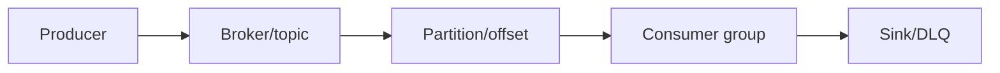
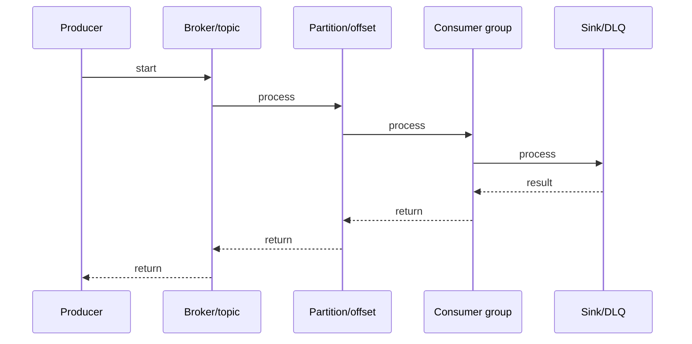

# Kafka Topics, Partitions & Log Storage

## Quick Facts
- Area: Kafka and Messaging
- Tag: Core
- Source: `src/modules/topics/kafka/kafka-topics-partitions.js`
- Tags: `kafka`, `topics`, `partitions`, `ordering`, `segment`, `index`, `log`, `storage`
- Visual coverage: live visual

## Concept
**L1 (30s ELI5):** Topic = named channel. Partition = ordered lane within channel. Key determines lane. Same key = same lane = ordering. More lanes = more readers in parallel.

**L2 (2min core):** Topic splits into N partitions distributed across brokers. Each partition = append-only log of segments (.log + .index + .timeindex). Partitioner assigns: murmur2(key) % N (key present) or sticky-round-robin (null key). Consumer group: each partition assigned to exactly one consumer. Max parallelism = partition count.

**L3 (10min edge cases):** Adding partitions remaps key->partition (breaks ordering). Too many partitions: slow failover, high file handles. Null key (Kafka 2.4+): sticky partition, not pure round-robin. HWM vs LEO: consumers only read up to HWM. Segment roll: 1GB or 7 days -> old segment eligible for deletion/compaction.

**L4 (30min deep):** .index: sparse (every ~4KB), stores (relativeOffset, filePosition) pairs. Seek algorithm: binary search .index -> find lower bound -> scan .log from that byte. .timeindex: (timestamp, relativeOffset) pairs. HWM tracked per leader; advanced when all ISR members fetch up to that offset. ReplicaFetcherThread: pull model (follower fetches from leader), not push. LogSegment loaded into page cache - OS handles caching, Kafka avoids heap allocation for reads.

## Why It Matters
Partition design determines throughput ceiling, ordering guarantees, and consumer parallelism. Wrong partition count or key strategy causes: out-of-order events, hot partitions, inability to scale consumers.

## Architecture / Mental Model


## Runtime / Sequence


## Animation Plan
- Flow lab can use generated mental model steps above.
- UML sequence can use generated sequence diagram above.
- Architecture map can use generated area mental model above.
- Live visual exists in app: topic-specific canvas/ReactViz animation.

Flow steps:

1. Producer
2. Broker/topic
3. Partition/offset
4. Consumer group
5. Sink/DLQ

## Example
```bash
# Create topic: 12 partitions, RF=3, 7-day retention
kafka-topics.sh --create --topic orders \
  --bootstrap-server broker1:9092 \
  --partitions 12 \
  --replication-factor 3 \
  --config retention.ms=604800000 \
  --config segment.bytes=1073741824 \
  --config min.insync.replicas=2

# Describe topic (shows partition leaders, ISR)
kafka-topics.sh --describe --topic orders
# Topic: orders  Partition: 0  Leader: 1  Replicas: 1,2,3  Isr: 1,2,3
# Topic: orders  Partition: 1  Leader: 2  Replicas: 2,3,1  Isr: 2,3,1

# Check consumer group lag per partition
kafka-consumer-groups.sh --describe --group order-processor-v2 \
  --bootstrap-server broker1:9092
# GROUP               TOPIC  PARTITION  CURRENT-OFFSET  LOG-END-OFFSET  LAG
# order-processor-v2  orders 0          10432           10432           0
# order-processor-v2  orders 1          9821            10000           179

# Custom partitioner in Java
public class RegionPartitioner implements Partitioner {
    public int partition(String topic, Object key, byte[] keyBytes,
                        Object value, byte[] valueBytes, Cluster cluster) {
        int n = cluster.partitionCountForTopic(topic);
        String region = ((String)key).split(":")[0];  // "US:order-123" -> "US"
        return switch(region) {
            case "US"   -> 0 % n;
            case "EU"   -> 1 % n;
            case "APAC" -> 2 % n;
            default     -> (Utils.murmur2(keyBytes) & Integer.MAX_VALUE) % n;
        };
    }
    public void close() {}
    public void configure(Map<String,?> configs) {}
}
```

## Complexity And Performance
- Time/space complexity depends on deployment, data size, and chosen implementation.
- Track p50/p95/p99 latency, throughput, memory, saturation, and error rate for production topics.

## Interview Drills
1. Question

2. Question

3. Question

4. Question

## Trade-offs
More partitions: higher throughput ceiling, more parallelism. Cost: slower failover, more file handles, more RAM. Fewer partitions: simpler management, faster failover. Cost: lower max throughput. Key-based partitioning: ordering guarantee. Cost: hot partitions if keys skewed. Null key: even distribution. Cost: no ordering.

## Gotchas
- Adding partitions to existing topic remaps keys: murmur2(key) % OLD_N % NEW_N. Keys route to different partitions. Breaks ordering. Plan upfront.
- Max consumer group parallelism = partition count. 7th consumer on 6-partition topic = idle. No benefit.
- Too many partitions per broker: slow leader election on failure, high file descriptor usage, RAM for index. Target 10-100 partitions/broker.
- Null key (Kafka 2.4+): sticky partition, NOT pure round-robin. Short-lived producers may send entire batch to one partition.
- Consumer can only see records up to High Watermark (HWM). Records between HWM and LEO are uncommitted - not yet delivered to consumers.
- Segment roll: new segment = new file handles. segment.ms too low = too many small files, slow compaction. Default 7 days is safe.

