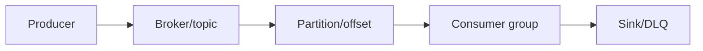
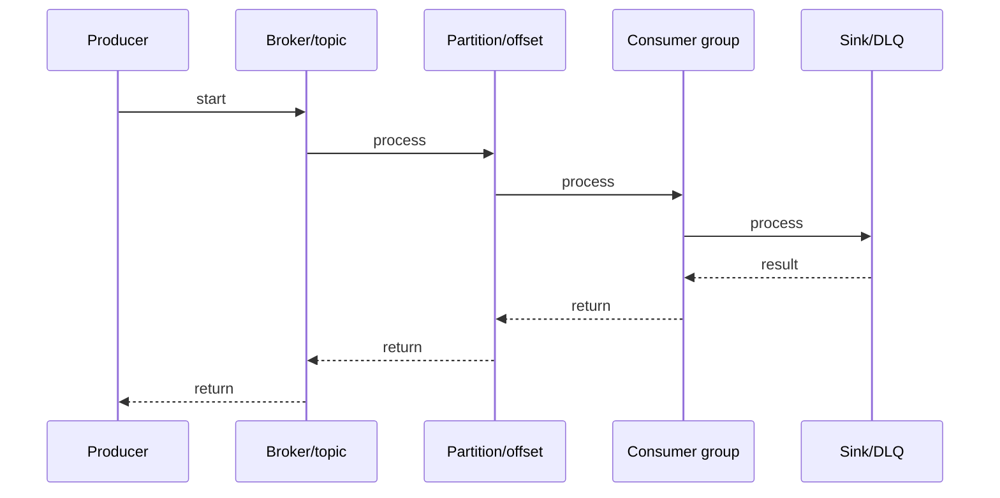

# RabbitMQ Acks & Delivery

## Quick Facts
- Area: Kafka and Messaging
- Tag: rabbitmq
- Source: `src/modules/topics/kafka/rmq-acks-delivery.js`
- Tags: `rabbitmq`, `acks`, `nacks`, `prefetch`, `consumer-ack`, `publisher-confirm`, `delivery`
- Visual coverage: live visual

## Concept
**L1 (30s ELI5):** Ack = "got it, done". Nack = "failed, put it back (or discard)". Prefetch = "give me max N at a time". Publisher confirm = broker says "I saved your message".

**L2 (2min core):** Consumer ack modes: auto (remove on deliver, at-most-once), manual (remove on basicAck, at-least-once). basicNack: requeue=true (retry) or false (DLQ). Prefetch (basicQos): limits unacked messages per consumer. Publisher confirms: broker acks when durably stored.

**L3 (10min edge cases):** Delivery tag = channel-scoped counter. multiple=true in ack/nack acks all messages up to that tag. Prefetch per-consumer vs per-channel (global). AMQP transactions: 200x slower than confirms, use only for atomic multi-operation.

**L4 (30min deep):** Unacked messages tracked in per-channel unacked set. On channel close: all unacked requeued. Memory: unacked messages held in memory (not written to disk until channel closed). Publisher confirms: broker writes to WAL, acks producer. With quorum queues: ack only after majority have written.

## Why It Matters
Ack semantics define delivery guarantee. Manual ack = at-least-once. Publisher confirms = producer delivery guarantee. Prefetch = backpressure. Together they enable robust, reliable messaging without overwhelming consumers.

## Architecture / Mental Model


## Runtime / Sequence


## Animation Plan
- Flow lab can use generated mental model steps above.
- UML sequence can use generated sequence diagram above.
- Architecture map can use generated area mental model above.
- Live visual exists in app: topic-specific canvas/ReactViz animation.

Flow steps:

1. Producer
2. Broker/topic
3. Partition/offset
4. Consumer group
5. Sink/DLQ

## Example
```java
// Consumer: manual ack with prefetch
channel.basicQos(10); // prefetch = 10 unacked max
channel.basicConsume("orders", false, // autoAck=false
    (tag, delivery) -> {
        try {
            process(delivery.getBody());
            channel.basicAck(delivery.getEnvelope().getDeliveryTag(), false);
        } catch (Exception e) {
            // nack + don't requeue -> goes to DLQ
            channel.basicNack(
                delivery.getEnvelope().getDeliveryTag(),
                false,  // multiple=false
                false   // requeue=false -> DLQ
            );
        }
    },
    tag -> {});

// Publisher confirms (async)
channel.confirmSelect();
channel.addConfirmListener(
    (deliveryTag, multiple) -> {
        // ack: message durably stored
        pendingConfirms.remove(deliveryTag);
    },
    (deliveryTag, multiple) -> {
        // nack: retry
        retry(pendingConfirms.get(deliveryTag));
    }
);
long tag = channel.getNextPublishSeqNo();
pendingConfirms.put(tag, message);
channel.basicPublish("orders", "payment",
    MessageProperties.PERSISTENT_TEXT_PLAIN, message);
```

## Complexity And Performance
- Time/space complexity depends on deployment, data size, and chosen implementation.
- Track p50/p95/p99 latency, throughput, memory, saturation, and error rate for production topics.

## Interview Drills
1. Question

2. Question

3. Question

4. Question

## Trade-offs
Manual ack: reliable but requires ack on every message. Auto ack: fast, risky. prefetch high: throughput, memory risk. prefetch low: safe, slow. Publisher confirms: guaranteed delivery at cost of round-trip per batch.

## Gotchas
- autoAck=true = at-most-once. Message removed on delivery. Consumer crash = data lost
- basicNack(requeue=true) can create infinite retry loops for poison messages. Use DLQ instead
- Prefetch=0 (unlimited): all messages sent to consumer. Slow consumer -> memory bloat in consumer
- Delivery tag is channel-scoped. Don't ack across channels or after channel reconnect
- Publisher confirms message delivered to consumer. Confirms only say broker durably stored
- AMQP transactions: 200x slower than confirms. Use only for truly atomic multi-message operations
- Connection close requeues ALL unacked messages - design for redelivery

