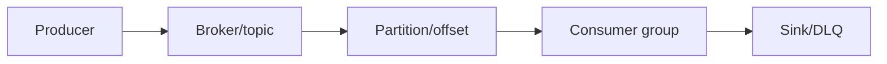
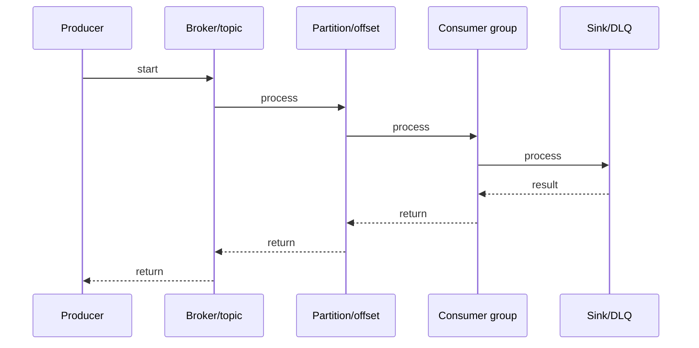

# RabbitMQ Dead Letter Queues

## Quick Facts

- Area: Kafka and Messaging
- Tag: Reliability
- Source: `src/modules/topics/kafka/rmq-dlq.js`
- Tags: `rabbitmq`, `dlq`, `retry`, `ttl`, `x-death`
- Visual coverage: live visual

## Concept

  <h2 style="color:#f59134;margin-bottom:6px">Dead Letter Queues (DLQ)</h2>
  
Messages that can't be delivered go to a <em style="color:#f59134">Dead Letter Exchange</em> -> routed to a DLQ. Think of it as a morgue for failed messages.

  

    

      
WHY messages die

      

         <b>rejected</b> - nack/reject, requeue=false 
         <b>expired</b> - TTL elapsed in queue 
         <b>maxlen</b> - queue overflow, x-overflow=drop-head
      

    

    

      
FLOW

      

        Producer -> Exchange -> Work Queue 
         (fail / expire / overflow) 
        x-dead-letter-exchange -> DLX 
         
        DLQ (inspect / retry / alert)
      

    

    

      
x-death header

      

        Each dead-letter hop appends entry to x-death array: 
        <code style="color:#f59134">{ queue, reason, time, count }</code> 
        Enables retry counting & loop detection.
      

    

  

  

    
Queue declaration with DLX

    <pre style="color:#cdd9e5;font-size:12px;margin:0;overflow:auto">// Work queue - messages that fail go to dlx.payment
channel.assertQueue('payment.work', {
  arguments: {
    'x-dead-letter-exchange': 'dlx.payment',
    'x-dead-letter-routing-key': 'payment.dead',
    'x-message-ttl': 30000        // 30 s - expire -> DLX
  }
});

// Dead letter exchange (direct)
channel.assertExchange('dlx.payment', 'direct', { durable: true });

// Dead letter queue - bound to DLX
channel.assertQueue('payment.dlq', { durable: true });
channel.bindQueue('payment.dlq', 'dlx.payment', 'payment.dead');</pre>

  

  

    
Retry via TTL trampoline pattern

    <pre style="color:#cdd9e5;font-size:12px;margin:0;overflow:auto">// Retry queue: wait N ms then dead-letter BACK to work exchange
channel.assertQueue('payment.retry', {
  arguments: {
    'x-dead-letter-exchange': 'payment.exchange',   // bounce back
    'x-dead-letter-routing-key': 'payment',
    'x-message-ttl': 5000                           // wait 5 s
  }
});

// On nack - send to retry queue
channel.nack(msg, false, false); // requeue=false -> DLX
// DLX routes to retry queue, waits 5s, re-publishes to work queue</pre>

  

## Why It Matters

Understanding this topic helps you build more efficient, reliable, and maintainable systems. It explains the practical impact of the design or algorithm in production.
## Architecture / Mental Model

## Runtime / Sequence

## Animation Plan

- Flow lab can use generated mental model steps above.
- UML sequence can use generated sequence diagram above.
- Architecture map can use generated area mental model above.
- Live visual exists in app: topic-specific canvas/ReactViz animation.

Flow steps:

1. Producer
2. Broker/topic
3. Partition/offset
4. Consumer group
5. Sink/DLQ

## Example

Example code, configuration, or architecture depends on the concrete problem. Use the implementation in the linked source file as a starting point.
## Complexity And Performance

- Time/space complexity depends on input size, data volume, and implementation choices.
- Track latency, throughput, memory, saturation, error rate, and correctness invariants.

## Interview Drills

1. How to implement exponential backoff with RabbitMQ?

2. What triggers dead-lettering - all three reasons?

3. How to avoid infinite retry loops?

4. Difference between classic and quorum queue dead-lettering guarantees?

## Trade-offs

DLQ pros: no message loss, retry visibility, debugging. Cons: operational overhead, DLQ must be monitored, retry pattern adds latency. Alternative: idempotent consumer + discard.

## Gotchas

- DLX on DLQ = infinite loop
- x-death count can reset on routing key change
- Per-message expiration must be string not number
- DLQ not monitored = silent message loss
