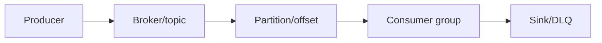
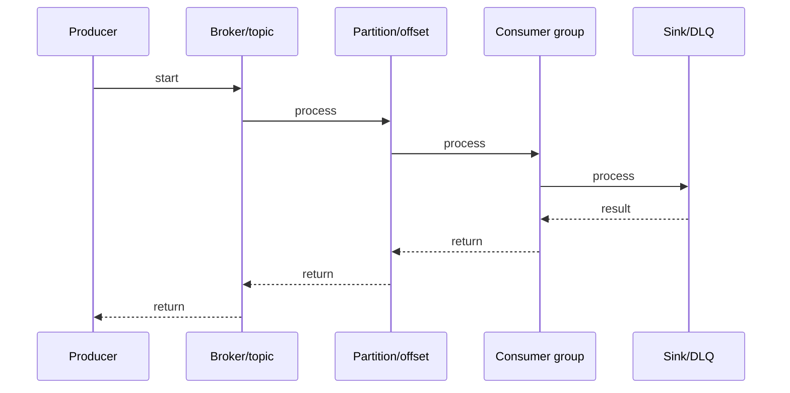

# RabbitMQ Exchanges

## Quick Facts

- Area: Kafka and Messaging
- Tag: rabbitmq
- Source: `src/modules/topics/kafka/rmq-exchanges.js`
- Tags: `rabbitmq`, `exchange`, `direct`, `fanout`, `topic`, `headers`, `routing`
- Visual coverage: live visual

## Concept

**L1 (30s ELI5):** Exchange = post office router. Message arrives with routing key. Exchange decides which queue(s) to deliver to based on type and bindings.

**L2 (2min core):** 4 types: Direct (exact key match), Fanout (all queues), Topic (wildcard: \* = 1 word, # = 0+), Headers (x-match all/any on headers). Bindings connect exchange to queue with optional binding key. Default exchange: queue name = routing key (built-in direct for all queues).

**L3 (10min edge cases):** Unroutable: mandatory flag returns to producer, alternate-exchange catches them. Exchange-to-exchange bindings: fanout trees. Durable exchange + durable queue + persistent message = full durability. Temporary exchanges/queues: auto-delete when no consumers.

**L4 (30min deep):** Exchange metadata stored in Mnesia (Erlang distributed DB). Bindings stored in routing table (ETS). Topic pattern matching via binary tree. Fanout = O(n) queues. Direct = O(1) hash lookup. Headers = O(header count x binding count). AMQP 0-9-1 protocol: exchanges are first-class objects, declared by clients.

## Why It Matters

Exchange routing decouples producers from consumers. Producer knows exchange, not queues. Add new consumer = create queue + binding. Zero producer changes. RabbitMQ's routing flexibility (vs Kafka's partition-based) enables fine-grained message routing.

## Architecture / Mental Model



## Runtime / Sequence



## Animation Plan

- Flow lab can use generated mental model steps above.
- UML sequence can use generated sequence diagram above.
- Architecture map can use generated area mental model above.
- Live visual exists in app: topic-specific canvas/ReactViz animation.

Flow steps:

1. Producer
2. Broker/topic
3. Partition/offset
4. Consumer group
5. Sink/DLQ

## Example

```java
// Java with Spring AMQP
@Configuration
public class RabbitConfig {
    // Direct exchange
    @Bean DirectExchange ordersExchange() {
        return new DirectExchange("orders.direct", true, false);
    }
    // Fanout exchange
    @Bean FanoutExchange notifyExchange() {
        return new FanoutExchange("notifications.fanout");
    }
    // Topic exchange
    @Bean TopicExchange eventsExchange() {
        return new TopicExchange("events.topic");
    }
    @Bean Queue paymentQueue() { return new Queue("payment-queue", true); }
    @Bean Binding paymentBinding(Queue paymentQueue, DirectExchange ordersExchange) {
        return BindingBuilder.bind(paymentQueue).to(ordersExchange).with("payment");
    }
    @Bean Binding logAllOrders(Queue auditQueue, TopicExchange eventsExchange) {
        return BindingBuilder.bind(auditQueue).to(eventsExchange).with("order.#");
    }
}

// Send message
rabbitTemplate.convertAndSend("orders.direct", "payment", orderPayload);
rabbitTemplate.convertAndSend("events.topic", "order.payment.success", event);
```

## Complexity And Performance

- O(n)
- O(1)
- O(header count x binding count)

## Interview Drills

1. Question

2. Question

3. Question

4. Question

## Trade-offs

RabbitMQ routing: powerful but broker-side complexity. Kafka: partition-based, consumer-side routing (filter). RabbitMQ suited for complex routing/workflow; Kafka for high-throughput stream processing.

## Gotchas

- Unroutable messages silently dropped by default - use mandatory=true or alternate-exchange
- Topic _ matches EXACTLY one dot-separated word. order._ matches order.paid but not order.payment.done
- Default exchange ("") routes to queue by name - every queue automatically bound
- Durable exchange survives restart but bindings to transient queues do not
- Headers exchange is slow - O(headers x bindings). Avoid for high-throughput routing
- Exchange-to-exchange bindings not in AMQP spec - RabbitMQ extension only
