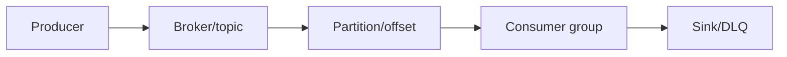
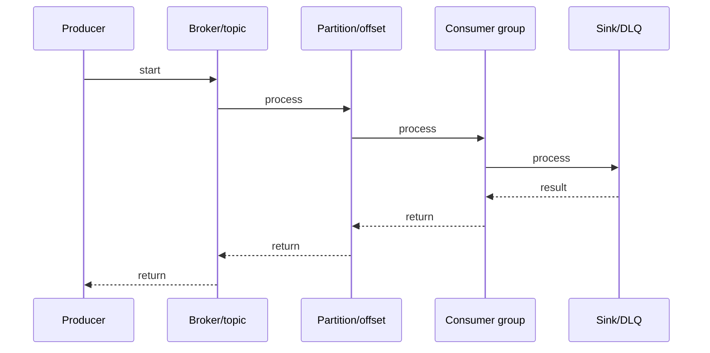

# RabbitMQ Queues & Bindings

## Quick Facts

- Area: Kafka and Messaging
- Tag: rabbitmq
- Source: `src/modules/topics/kafka/rmq-queues-bindings.js`
- Tags: `rabbitmq`, `queues`, `bindings`, `durable`, `exclusive`, `ttl`, `priority`, `quorum`
- Visual coverage: live visual

## Concept

**L1 (30s ELI5):** Queue = mailbox. Durable = survives restart. TTL = message auto-expires. Priority = high-priority delivered first. Quorum = replicated across multiple brokers for HA.

**L2 (2min core):** Queue properties: durable (metadata persistence), exclusive (single-connection), auto-delete (delete when no consumers). Message persistence = delivery_mode=2. TTL: x-message-ttl (queue) or expiration (per-message). Priority: x-max-priority=N.

**L3 (10min edge cases):** Lazy queues: write to disk immediately to reduce RAM. x-expires: queue-level auto-delete on inactivity. Priority queues: N priority levels = N sub-queues internally. Quorum queues: Raft-based, majority ack, no split-brain.

**L4 (30min deep):** Quorum queues use Raft for leader election and log replication. Delivery-limit prevents poison messages. Stream queues (RMQ 3.9+): append-only log with consumer offsets - Kafka semantics in RabbitMQ. Messages not removed on consume. Per-consumer offset tracking.

## Why It Matters

Right queue type = significant ops difference. Classic durable: simplest. Quorum: HA. Stream: replay/fan-out. Priority: QoS. Matching queue type to use case prevents data loss and performance degradation.

## Architecture / Mental Model



## Runtime / Sequence



## Animation Plan

- Flow lab can use generated mental model steps above.
- UML sequence can use generated sequence diagram above.
- Architecture map can use generated area mental model above.
- Live visual exists in app: topic-specific canvas/ReactViz animation.

Flow steps:

1. Producer
2. Broker/topic
3. Partition/offset
4. Consumer group
5. Sink/DLQ

## Example

```java
// Declare quorum queue (Spring AMQP)
@Bean
Queue ordersQueue() {
    return QueueBuilder.durable("orders")
        .quorum()                          // x-queue-type=quorum
        .withArgument("x-quorum-initial-group-size", 3)
        .withArgument("x-delivery-limit", 5) // max retries before DLQ
        .build();
}

// Priority queue
@Bean Queue priorityQueue() {
    return QueueBuilder.durable("alerts")
        .withArgument("x-max-priority", 10)
        .build();
}

// TTL queue
@Bean Queue ttlQueue() {
    return QueueBuilder.durable("sessions")
        .withArgument("x-message-ttl", 1800000) // 30 min TTL
        .withArgument("x-dead-letter-exchange", "dlx")
        .build();
}

// Publish with priority
Message msg = MessageBuilder
    .withBody(payload.getBytes())
    .setDeliveryMode(MessageDeliveryMode.PERSISTENT) // persistent!
    .setPriority(9) // high priority
    .build();
rabbitTemplate.send("orders", "payment", msg);
```

## Complexity And Performance

- Time/space complexity depends on input size, data volume, and implementation choices.
- Track latency, throughput, memory, saturation, error rate, and correctness invariants.

## Interview Drills

1. Question

2. Question

3. Question

4. Question

## Trade-offs

Durability costs disk I/O. Priority queues cost memory (N sub-queues). Quorum queues cost write latency (majority ack). Stream queues trade simplicity for replay capability. Choose based on: durability requirements, throughput needs, HA requirements.

## Gotchas

- Durable queue + transient message (delivery_mode=1) = queue survives restart but messages lost
- Per-message TTL (expiration property): checked at delivery time (head of queue), not when message arrives
- x-expires deletes the ENTIRE QUEUE on inactivity - not individual messages (that's x-message-ttl)
- Priority queue: x-max-priority=255 creates 255 internal sub-queues. Use 1-10 max in practice
- Quorum queues: no per-message TTL support. Use stream queues or classic with TTL instead
- Lazy queues: lower RAM, higher latency (disk I/O). Default in RMQ 3.12+ for classic queues
- Stream queue consumers must specify offset - they don't auto-start from last position
