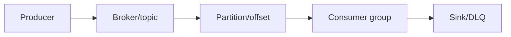
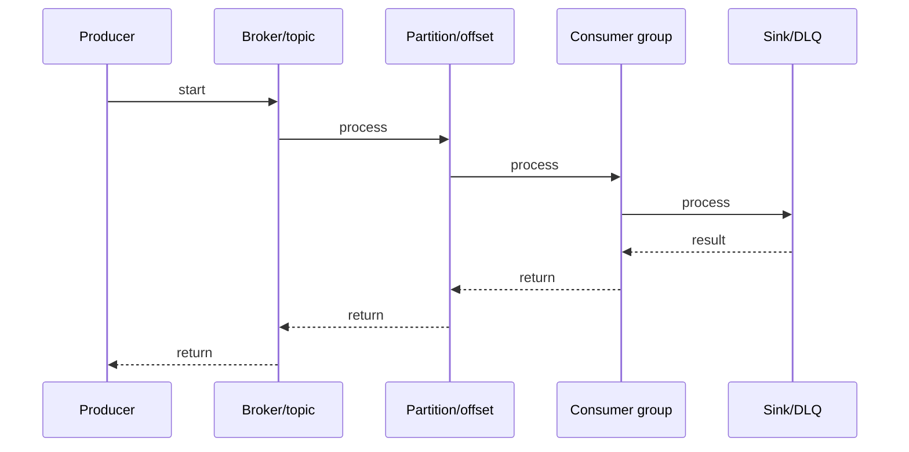

# RabbitMQ vs Kafka

## Quick Facts
- Area: Kafka and Messaging
- Tag: Comparison
- Source: `src/modules/topics/kafka/rmq-vs-kafka.js`
- Tags: `rabbitmq`, `kafka`, `push`, `pull`, `tradeoffs`, `architecture`
- Visual coverage: live visual

## Concept

  <h2 style="color:#a371f7;margin-bottom:6px">RabbitMQ vs Apache Kafka</h2>
  
Two radically different messaging philosophies. Wrong choice = years of pain. Right choice = superpowers.

  

    

      
RabbitMQ - Smart Broker

      

         AMQP protocol (binary, efficient) 
         Push-based - broker pushes to consumer 
         Exchanges + bindings route intelligently 
         Message deleted after ack 
         Per-queue QoS / prefetch 
         Built for task queues, RPC, routing 
         Max ~50K msg/s per node 
         10K+ queues per node OK
      

    

    

      
Kafka - Dumb Broker, Smart Consumers

      

         Custom binary protocol 
         Pull-based - consumers poll offsets 
         Topics + partitions, no routing logic 
         Messages retained by time/size 
         Consumer groups track offsets 
         Built for event streaming, replay, audit 
         1M+ msg/s per cluster normal 
         Replay = rewind consumer offset
      

    

  

  

    
When to use which

    

      

        
Choose RabbitMQ when:

        

          check Task queues (background jobs) 
          check Complex routing (topic/header exchanges) 
          check RPC request/reply patterns 
          check Per-message TTL, priority needed 
          check Message must be deleted after processing 
          check Polyglot clients (AMQP + STOMP + MQTT)
        

      

      

        
Choose Kafka when:

        

          check Event sourcing / event log 
          check Multiple consumers of same data 
          check Replay / audit trail needed 
          check Very high throughput (10M+ events/day) 
          check Stream processing (Kafka Streams) 
          check Microservice decoupling at scale
        

      

    

  

## Why It Matters
_No notes yet._

## Architecture / Mental Model

## Runtime / Sequence

## Animation Plan
- Flow lab can use generated mental model steps above.
- UML sequence can use generated sequence diagram above.
- Architecture map can use generated area mental model above.
- Live visual exists in app: topic-specific canvas/ReactViz animation.

Flow steps:

1. Producer
2. Broker/topic
3. Partition/offset
4. Consumer group
5. Sink/DLQ

## Example
_No code example configured._

## Complexity And Performance
- Time/space complexity depends on input size, data volume, and implementation choices.
- Track latency, throughput, memory, saturation, error rate, and correctness invariants.

## Interview Drills
1. Why Kafka for event sourcing but not RabbitMQ?

2. How does RabbitMQ back-pressure work vs Kafka?

3. Can one system replace the other?

4. Latency: which is faster and why?

## Trade-offs
RabbitMQ: low latency, complex routing, task-oriented. Cons: no replay, memory pressure. Kafka: high throughput, replay, multi-consumer. Cons: higher ops, no routing, latency higher.

## Gotchas
- RabbitMQ: message acked = gone forever. No replay.
- Kafka: consumer lag is invisible to broker - monitor externally.
- Kafka has no per-message TTL or priority.
- RabbitMQ push-based: slow consumer backs up queue in broker memory.

