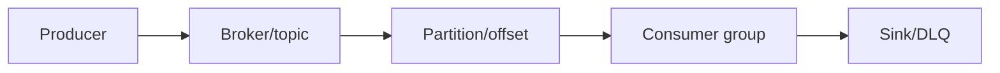
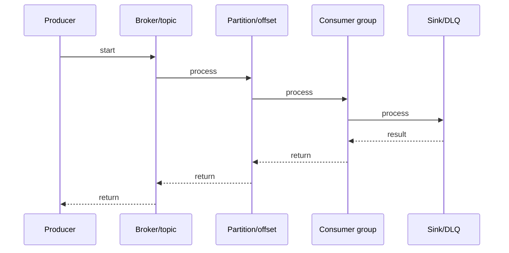

# WarpStream Architecture

## Quick Facts

- Area: Kafka and Messaging
- Tag: Cloud-Native
- Source: `src/modules/topics/kafka/warpstream-arch.js`
- Tags: `warpstream`, `s3`, `byoc`, `serverless`, `stateless`
- Visual coverage: live visual

## Concept

  <h2 style="color:#38bdf8;margin-bottom:6px">WarpStream Architecture</h2>
  
Kafka-compatible streaming built on <b style="color:#38bdf8">object storage (S3)</b>. No local disks, no ZooKeeper, no replication overhead. Stateless agents + S3 = infinite scale, zero ops.

  

    

      
Stateless Agents

      

        No local disk. All state in S3. 
        Agents are ephemeral containers. 
        Scale horizontally, kill/restart freely. 
        No leader election needed per broker.
      

    

    

      
S3 as WAL

      

        Messages buffered in agent memory. 
        Flushed to S3 every ~250ms. 
        No replication between brokers. 
        S3 is the single source of truth.
      

    

    

      
BYOC Model

      

        Bring Your Own Cloud. 
        Agents run in <b>your</b> VPC/account. 
        Data never leaves your cloud. 
        WarpStream control plane = metadata only.
      

    

  

  

    
Architecture at a glance

    <pre style="color:#cdd9e5;font-size:12px;margin:0">

                    Your Cloud (BYOC)

Producers -> WarpStream Agent (stateless, K8s pod)

                  buffer ~250ms

              S3 / GCS / ABS  <- Source of Truth

                  read (fetch)

Consumers <- WarpStream Agent (any agent, stateless)

Metadata coordination -> WarpStream Control Plane (SaaS)
(partition assignments, offsets, schema)

</pre>
  

  

    
Connect - Kafka-compatible

    <pre style="color:#cdd9e5;font-size:12px;margin:0">// WarpStream is wire-compatible with Kafka 3.x client protocol
// Minimal config change to point Kafka clients at WarpStream

Properties props = new Properties();
props.put("bootstrap.servers", "serverless.warpstream.com:9092");
// Everything else identical to Kafka client config

// Existing Kafka Connect connectors work unchanged
// Schema Registry API compatible
// Consumer group protocol identical</pre>

  

## Why It Matters

_No notes yet._

## Architecture / Mental Model

## Runtime / Sequence

## Animation Plan

- Flow lab can use generated mental model steps above.
- UML sequence can use generated sequence diagram above.
- Architecture map can use generated area mental model above.
- Live visual exists in app: topic-specific canvas/ReactViz animation.

Flow steps:

1. Producer
2. Broker/topic
3. Partition/offset
4. Consumer group
5. Sink/DLQ

## Example

_No code example configured._

## Complexity And Performance

- Time/space complexity depends on input size, data volume, and implementation choices.
- Track latency, throughput, memory, saturation, error rate, and correctness invariants.

## Interview Drills

1. How does WarpStream achieve Kafka wire compatibility?

2. What's the latency trade-off vs Kafka?

3. How does BYOC model protect data?

4. Why is scaling cheaper/faster than Kafka?

## Trade-offs

WarpStream pros: infinite scale, zero ops, 80% cheaper (claimed), BYOC compliance. Cons: higher latency (~250ms+), agent buffer risk, not OSS, Kafka Streams incompatible.

## Gotchas

- ~250ms latency (S3 flush interval). Not for sub-100ms requirements.
- Agent crash before flush = buffer lost. Design for producer retries.
- Not open-source. Kafka Streams not compatible.
- S3 egress costs can surprise at scale.
