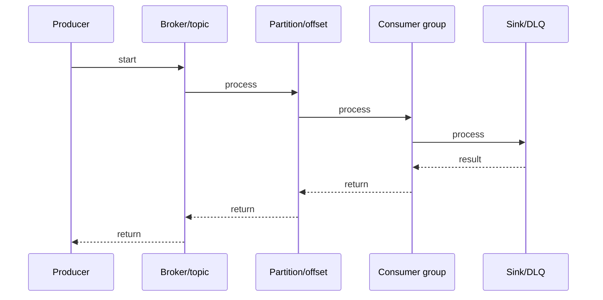

# WarpStream vs Kafka

## Quick Facts
- Area: Kafka and Messaging
- Tag: Comparison
- Source: `src/modules/topics/kafka/warpstream-vs-kafka.js`
- Tags: `warpstream`, `kafka`, `cost`, `latency`, `ops`, `s3`
- Visual coverage: live visual

## Concept

  <h2 style="color:#38bdf8;margin-bottom:6px">WarpStream vs Apache Kafka</h2>
  
Same protocol, radically different architecture. Kafka = stateful brokers + local disk. WarpStream = stateless agents + S3. Choose based on latency, cost, and ops maturity.

  

    

      
Apache Kafka

      

         Stateful brokers (local NVMe disks) 
         ZooKeeper -> KRaft (newer) 
         Replication: broker-to-broker copy 
         p99 latency: ~5ms (acks=1) 
         Partition rebalance = slow (data move) 
         Self-managed: significant ops expertise 
         Confluent Cloud: expensive ($0.11+/GB)
      

    

    

      
WarpStream

      

         Stateless agents (no local disk) 
         S3 as WAL + storage 
         No replication overhead 
         p99 latency: ~250ms-1s (S3 flush) 
         Scale: add/remove pods in seconds 
         Managed ops, BYOC model 
         Cost: S3 prices (~$0.023/GB)
      

    

  

  

    
When WarpStream wins vs when Kafka wins

    

      

        
WarpStream is better:

        

          check Analytics / logging (latency OK 500ms+) 
          check Cost-sensitive (S3 &lt;&lt; broker disk) 
          check Compliance (BYOC, data in your cloud) 
          check Spiky workloads (scale pods instantly) 
          check Small ops team (no Kafka expertise)
        

      

      

        
Kafka is better:

        

          check Ultra-low latency (&lt;10ms required) 
          check Kafka Streams / ksqlDB (ecosystem) 
          check Mature OSS ecosystem 
          check High-frequency trading / gaming 
          check Complex stream processing topologies
        

      

    

  

## Why It Matters
_No notes yet._

## Architecture / Mental Model

## Runtime / Sequence

## Animation Plan
- Flow lab can use generated mental model steps above.
- UML sequence can use generated sequence diagram above.
- Architecture map can use generated area mental model above.
- Live visual exists in app: topic-specific canvas/ReactViz animation.

Flow steps:

1. Producer
2. Broker/topic
3. Partition/offset
4. Consumer group
5. Sink/DLQ

## Example
_No code example configured._

## Complexity And Performance
- Time/space complexity depends on deployment, data size, and chosen implementation.
- Track p50/p95/p99 latency, throughput, memory, saturation, and error rate for production topics.

## Interview Drills
1. Is WarpStream truly Kafka-compatible?

2. What's the durability risk and how to mitigate?

3. When would you NOT use WarpStream?

4. How does BYOC model work for compliance?

## Trade-offs
WarpStream wins: cost, ops simplicity, BYOC compliance, instant scaling. Kafka wins: latency (<10ms), Streams ecosystem, mature OSS tooling. Both: event replay, consumer groups, Schema Registry.

## Gotchas
- WarpStream != Kafka ecosystem. Streams/ksqlDB not compatible.
- Agent crash before S3 flush = buffer loss. Use producer retries.
- S3 egress costs at cross-region scale can negate savings.
- Not open-source. Evaluate vendor lock-in risk.

