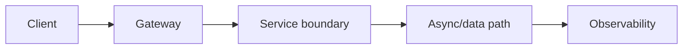
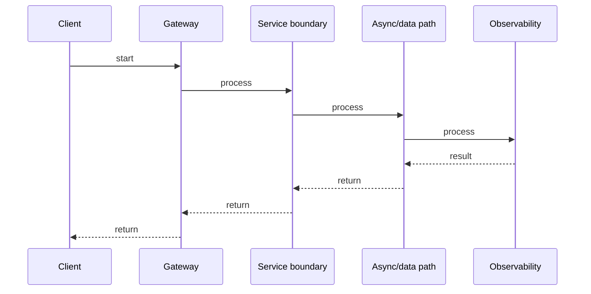

# API Gateway: Routing, Auth & Rate Limiting

## Quick Facts

- Area: Microservices
- Tag: Gateway
- Source: `src/modules/topics/microservices/ms-api-gateway.js`
- Tags: `api gateway`, `rate limiting`, `auth`, `reverse proxy`, `kong`, `envoy`
- Visual coverage: generated diagrams only

## Concept

An **API Gateway** is the single entry point to a microservice mesh. Responsibilities:

- **Routing**: path/host-based to upstream services.
- **Authentication**: JWT validation, OAuth2 token introspection - offloaded from services.
- **Rate limiting**: token bucket / sliding window per client or IP.
- **TLS termination, request transformation, logging, tracing injection**.
  Popular implementations: **Kong** (nginx-based, plugin ecosystem), **AWS API Gateway**, **Envoy Proxy** (xDS config, used by Istio), **Traefik**.
  **Backend-for-Frontend (BFF)** is a gateway variant per client type (mobile, web).

## Why It Matters

Without a gateway, every service reinvents auth and rate limiting - inconsistently. The gateway enables **cross-cutting concerns at the edge** without coupling services. Rate limiting at the gateway prevents cascading overload. TLS termination at the gateway removes per-service certificate management.

## Architecture / Mental Model



## Runtime / Sequence



## Animation Plan

- Flow lab can use generated mental model steps above.
- UML sequence can use generated sequence diagram above.
- Architecture map can use generated area mental model above.

Flow steps:

1. Client
2. Gateway
3. Service boundary
4. Async/data path
5. Observability

## Example

```go
// Simplified Gateway middleware in Go
package gateway

import (
    "context"
    "fmt"
    "net/http"
    "net/http/httputil"
    "net/url"
    "sync"
    "time"
)

// Token bucket rate limiter per client key
type Bucket struct {
    tokens   float64
    capacity float64
    rate     float64  // tokens per second
    last     time.Time
    mu       sync.Mutex
}

func (b *Bucket) Allow() bool {
    b.mu.Lock()
    defer b.mu.Unlock()
    now := time.Now()
    elapsed := now.Sub(b.last).Seconds()
    b.last = now
    b.tokens = min(b.capacity, b.tokens+elapsed*b.rate)
    if b.tokens < 1 {
        return false
    }
    b.tokens--
    return true
}

type Gateway struct {
    buckets sync.Map
    upstream *url.URL
}

func (g *Gateway) bucket(key string) *Bucket {
    v, _ := g.buckets.LoadOrStore(key, &Bucket{tokens: 100, capacity: 100, rate: 10, last: time.Now()})
    return v.(*Bucket)
}

func (g *Gateway) ServeHTTP(w http.ResponseWriter, r *http.Request) {
    // 1. Auth - validate JWT (simplified)
    tok := r.Header.Get("Authorization")
    if tok == "" {
        http.Error(w, "unauthorized", http.StatusUnauthorized)
        return
    }
    clientID := parseClientID(tok)   // validate & extract

    // 2. Rate limit per client
    if !g.bucket(clientID).Allow() {
        w.Header().Set("Retry-After", "1")
        http.Error(w, "rate limit exceeded", http.StatusTooManyRequests)
        return
    }

    // 3. Inject trace header, proxy upstream
    r.Header.Set("X-Client-Id", clientID)
    proxy := httputil.NewSingleHostReverseProxy(g.upstream)
    proxy.ServeHTTP(w, r)
}

func parseClientID(tok string) string {
    return fmt.Sprintf("client-%d", len(tok)%100) // stub
}

func min(a, b float64) float64 { if a < b { return a }; return b }
```

Notes:
In production, share rate limit state via **Redis** (sliding window with Lua scripts) for multi-instance gateways. Use a dedicated JWT library with signature verification and expiry checks.

## Complexity And Performance

- Time/space complexity depends on input size, data volume, and implementation choices.
- Track latency, throughput, memory, saturation, error rate, and correctness invariants.

## Interview Drills

1. What is the difference between a gateway and a service mesh?
   Answer: A **gateway** handles **north-south traffic** (client -> cluster). A **service mesh** (Istio, Linkerd) handles **east-west traffic** (service -> service) via sidecar proxies. The mesh gives you mTLS between services, circuit breaking, retries, and distributed tracing without changing application code. Gateways and meshes are complementary - deploy both in large orgs.
   Follow-ups: What is mTLS and why does it matter?; How does xDS configuration work in Envoy?

2. How do you implement rate limiting without Redis?
   Answer: In-memory token bucket (per replica) for low-traffic services - simple, zero latency, but allows per-replica x N requests total. For distributed rate limiting: Redis INCR with TTL (imprecise), Redis + Lua sliding window, or a dedicated service (Envoy's external rate limit gRPC API). Accept the tradeoff: strict distributed rate limiting adds latency; approximate is often good enough.
   Follow-ups: What is the sliding window vs fixed window difference?; How does Cloudflare rate limit at edge?

## Trade-offs

Pros:

- Centralizes auth, rate limiting, TLS - services stay thin.
- Single place to add observability headers (trace IDs) for all traffic.
- Enables canary routing and A/B testing without deploying new services.

Cons:

- Single point of failure - must be HA with multiple replicas.
- Gateway latency adds to every request.
- Over-centralizing business logic in the gateway creates a bottleneck.

When to use:
**Always** use a gateway for public APIs. Use a **service mesh** when east-west mTLS and observability are required. Avoid putting business logic in the gateway - keep it infrastructure only.

## Gotchas

Watch for edge cases, assumptions, and hidden performance costs that can make this topic fail in production if handled incorrectly.
