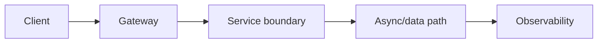
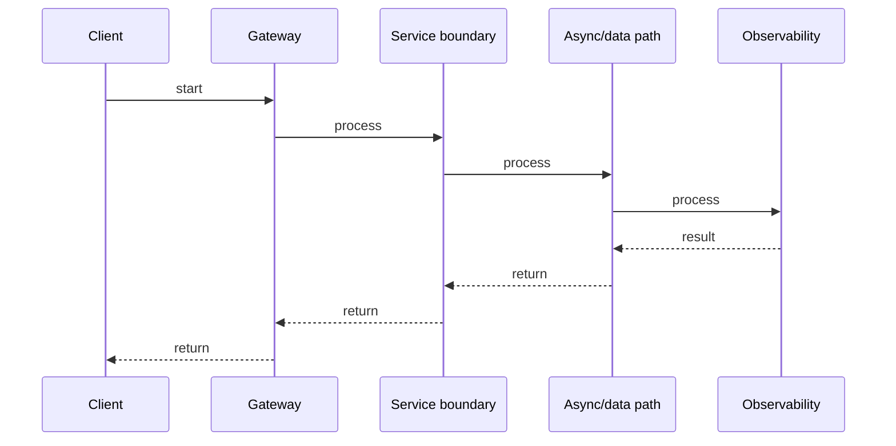

# CQRS & Event Sourcing

## Quick Facts
- Area: Microservices
- Tag: CQRS
- Source: `src/modules/topics/microservices/ms-cqrs-event-sourcing.js`
- Tags: `cqrs`, `event sourcing`, `event store`, `read model`, `projection`, `axon`
- Visual coverage: generated diagrams only

## Concept
**CQRS (Command Query Responsibility Segregation)** splits the write model (commands) from the read model (queries). Benefits: each side scales and evolves independently.
**Event Sourcing** persists domain **events** as the source of truth instead of current state. The current state is derived by replaying events. Key concepts:
- **Event Store**: append-only log of domain events (EventStoreDB, Kafka, PostgreSQL table).
- **Projection/Read Model**: materialized view rebuilt by replaying events.
- **Snapshot**: periodic state snapshot to avoid full replay on every load.
- **Command handler**: validates command -> produces events -> appends to store.

## Why It Matters
Event sourcing gives a built-in **audit log** and **time travel** - replay events to any point in time. It enables debugging production issues by replaying events locally. Combined with CQRS, read models can be rebuilt (after bugs) or added (new features) without touching the event store. Used by trading platforms, banks, and event-heavy domains.

## Architecture / Mental Model


## Runtime / Sequence


## Animation Plan
- Flow lab can use generated mental model steps above.
- UML sequence can use generated sequence diagram above.
- Architecture map can use generated area mental model above.

Flow steps:

1. Client
2. Gateway
3. Service boundary
4. Async/data path
5. Observability

## Example
```java
// Event Sourcing: aggregate root pattern
import java.util.*;
import java.time.Instant;

// Events - immutable facts
sealed interface OrderEvent permits OrderPlaced, ItemAdded, OrderConfirmed, OrderCancelled {}
record OrderPlaced(String orderId, String userId, Instant at) implements OrderEvent {}
record ItemAdded(String orderId, String productId, int qty, Instant at) implements OrderEvent {}
record OrderConfirmed(String orderId, Instant at) implements OrderEvent {}
record OrderCancelled(String orderId, String reason, Instant at) implements OrderEvent {}

// Aggregate: state derived from events
class OrderAggregate {
    private String id;
    private String userId;
    private List<String> items = new ArrayList<>();
    private String status = "DRAFT";

    // Rebuild from event log
    public static OrderAggregate reconstitute(List<OrderEvent> events) {
        var agg = new OrderAggregate();
        events.forEach(agg::apply);
        return agg;
    }

    // Command handler: validate -> produce events
    public List<OrderEvent> handle(ConfirmOrderCommand cmd) {
        if (!"DRAFT".equals(status))
            throw new IllegalStateException("can only confirm DRAFT orders, current: " + status);
        if (items.isEmpty())
            throw new IllegalStateException("cannot confirm empty order");
        return List.of(new OrderConfirmed(id, Instant.now()));
    }

    // Event applier: pure state mutation - no side effects
    private void apply(OrderEvent event) {
        switch (event) {
            case OrderPlaced(var oid, var uid, var at) -> { id = oid; userId = uid; status = "DRAFT"; }
            case ItemAdded(_, var pid, var qty, _)     -> items.add(pid + "x" + qty);
            case OrderConfirmed(_, _)                  -> status = "CONFIRMED";
            case OrderCancelled(_, _, _)               -> status = "CANCELLED";
        }
    }

    public String getStatus() { return status; }
}

// Read model projection - rebuilt by consuming the event stream
class OrderSummaryProjection {
    private final Map<String, OrderSummary> store = new HashMap<>();

    public void on(OrderPlaced e) { store.put(e.orderId(), new OrderSummary(e.orderId(), e.userId(), "DRAFT", 0)); }
    public void on(OrderConfirmed e) { store.get(e.orderId()).status = "CONFIRMED"; }
    public OrderSummary get(String id) { return store.get(id); }
}

record OrderSummary(String id, String userId, String status, int itemCount) {
    String status; { } // mutable for projection
    OrderSummary(String id, String userId, String status, int itemCount) {
        this.id = id; this.userId = userId; this.status = status; this.itemCount = itemCount;
    }
}

record ConfirmOrderCommand(String orderId) {}
```

Notes:
The **apply** method must be a pure function - no side effects, no I/O. Side effects (emails, external calls) happen in event handlers *after* the events are persisted. This is critical for correct replay behaviour.

## Complexity And Performance
- Time/space complexity depends on input size, data volume, and implementation choices.
- Track latency, throughput, memory, saturation, error rate, and correctness invariants.

## Interview Drills
1. What are the downsides of event sourcing?
   Answer: (1) **Query complexity**: you can't query "all orders over $100" directly - needs a read model. (2) **Schema evolution**: changing past event structures requires migration or versioning strategy (upcasters). (3) **Eventual consistency** between event store and read models. (4) **Learning curve**: most teams and frameworks are built around current-state CRUD. Use event sourcing only when the audit log, time travel, or event-driven integration benefits outweigh the complexity.
   Follow-ups: What is an upcaster in event sourcing?; How do you handle event versioning?

2. How do you handle aggregate growth in event sourcing?
   Answer: Long-lived aggregates accumulate thousands of events - replaying all is slow. Solution: **snapshots** - persist the aggregate state at event N, store the snapshot, then replay only events after N on next load. Snapshot frequency is a tunable (every 100 events, or daily). The snapshot is a cache - the event log remains authoritative.
   Follow-ups: How do you invalidate a snapshot?; Snapshot storage format?

## Trade-offs
Pros:
- Full audit log built in - zero extra work for compliance.
- Rebuild any read model from scratch by replaying events.
- Time travel: load aggregate state at any past point.

Cons:
- Eventual consistency between write and read sides.
- Queries require read models - no ad-hoc SQL on entity state.
- Event schema evolution (upcasters) adds maintenance burden.

When to use:
**Event Sourcing** for audit-heavy domains (finance, healthcare, e-commerce order management). **CQRS** without event sourcing when read/write scalability differs but audit trail isn't needed. Traditional CRUD for most CRUD services.

## Gotchas
_No gotchas configured._

