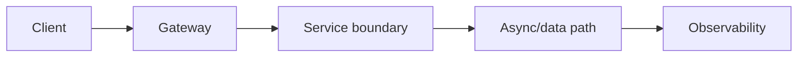
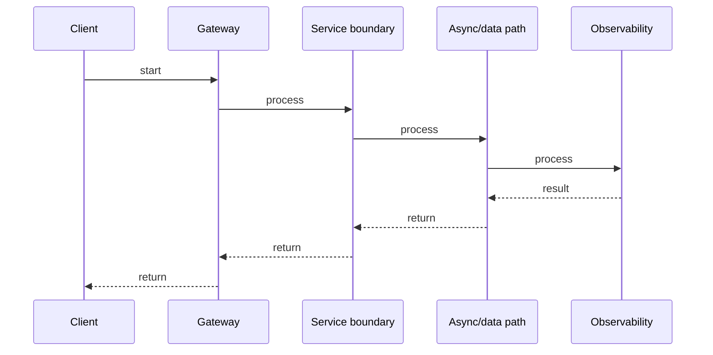

# gRPC, Protocol Buffers & Service Contracts

## Quick Facts

- Area: Microservices
- Tag: gRPC
- Source: `src/modules/topics/microservices/ms-grpc-protobuf.js`
- Tags: `grpc`, `protobuf`, `protocol buffers`, `streaming`, `http2`, `idl`
- Visual coverage: generated diagrams only

## Concept

**gRPC** is an RPC framework using HTTP/2 transport and **Protocol Buffers** (protobuf) for serialization. Types:

- **Unary**: one request -> one response (traditional RPC).
- **Server streaming**: one request -> stream of responses.
- **Client streaming**: stream of requests -> one response.
- **Bidirectional streaming**: both sides stream (real-time).
  Protobuf is binary, schema-versioned, 3-10x smaller than JSON, and generates typed client/server code for 12+ languages. **Reflection** and **gRPC-Gateway** expose JSON/REST.

## Why It Matters

For service-to-service internal APIs, gRPC gives **typed contracts** (no guessing field names), **binary efficiency** (smaller payloads), **bidirectional streaming** (real-time use cases), and **built-in load balancing** with Envoy. Schema evolution is backward-compatible by design - adding optional fields doesn't break old clients.

## Architecture / Mental Model



## Runtime / Sequence



## Animation Plan

- Flow lab can use generated mental model steps above.
- UML sequence can use generated sequence diagram above.
- Architecture map can use generated area mental model above.

Flow steps:

1. Client
2. Gateway
3. Service boundary
4. Async/data path
5. Observability

## Example

```go
// proto definition -> generated Go code (shown as if hand-written for clarity)
// proto file:
// service OrderService {
//   rpc CreateOrder (CreateOrderRequest) returns (OrderResponse);
//   rpc WatchOrders (WatchRequest) returns (stream OrderEvent);
// }

package main

import (
    "context"
    "io"
    "log"
    "net"
    "time"
    "google.golang.org/grpc"
    "google.golang.org/grpc/codes"
    "google.golang.org/grpc/status"
    "google.golang.org/grpc/keepalive"
    pb "example.com/orders/proto"
)

//  Server implementation
type orderServer struct {
    pb.UnimplementedOrderServiceServer
}

func (s *orderServer) CreateOrder(ctx context.Context, req *pb.CreateOrderRequest) (*pb.OrderResponse, error) {
    if req.Quantity <= 0 {
        return nil, status.Errorf(codes.InvalidArgument, "quantity must be positive, got %d", req.Quantity)
    }
    // business logic ...
    return &pb.OrderResponse{Id: "ord-123", Status: "created"}, nil
}

// Server streaming: push order events to subscriber
func (s *orderServer) WatchOrders(req *pb.WatchRequest, stream pb.OrderService_WatchOrdersServer) error {
    ticker := time.NewTicker(time.Second)
    defer ticker.Stop()
    for {
        select {
        case <-stream.Context().Done():
            return stream.Context().Err()
        case t := <-ticker.C:
            if err := stream.Send(&pb.OrderEvent{
                OrderId: req.UserId + "-event",
                At:      t.UnixMilli(),
            }); err != nil {
                return err
            }
        }
    }
}

func main() {
    lis, _ := net.Listen("tcp", ":50051")
    srv := grpc.NewServer(
        grpc.KeepaliveParams(keepalive.ServerParameters{
            MaxConnectionIdle: 15 * time.Second,
        }),
        grpc.ChainUnaryInterceptor(authInterceptor, loggingInterceptor),
    )
    pb.RegisterOrderServiceServer(srv, &orderServer{})
    log.Fatal(srv.Serve(lis))
}

func authInterceptor(ctx context.Context, req any, info *grpc.UnaryServerInfo, handler grpc.UnaryHandler) (any, error) {
    // validate token from metadata ...
    return handler(ctx, req)
}

func loggingInterceptor(ctx context.Context, req any, info *grpc.UnaryServerInfo, handler grpc.UnaryHandler) (any, error) {
    start := time.Now()
    resp, err := handler(ctx, req)
    log.Printf("method=%s dur=%s err=%v", info.FullMethod, time.Since(start), err)
    return resp, err
}
```

Notes:
Always use `status.Errorf(codes.X, ...)` to return typed gRPC errors - clients can branch on status codes. Use **interceptors** (middleware) for auth, logging, and tracing - same concept as HTTP middleware.

## Complexity And Performance

- Time/space complexity depends on input size, data volume, and implementation choices.
- Track latency, throughput, memory, saturation, error rate, and correctness invariants.

## Interview Drills

1. How does protobuf handle schema evolution?
   Answer: Protobuf fields are identified by **field numbers**, not names. Rules: (1) Never reuse a field number - old clients will misinterpret new data. (2) New fields are optional by default - old clients ignore unknown fields, old servers return zero values for new fields. (3) Removing fields: mark as `reserved` to prevent reuse. (4) Never change a field's type. This gives backward and forward compatibility without versioning the entire API.
   Follow-ups: What is reserved in proto3?; How does proto3 differ from proto2?

2. When would you choose REST over gRPC for service-to-service calls?
   Answer: **REST** when: clients are browsers (gRPC-Web requires a proxy), the API is public (REST is universally toolable), you need simple cache-ability (HTTP caching on GET), or teams don't want the proto toolchain. **gRPC** when: performance matters (binary, HTTP/2 multiplexing), you need streaming, or strong typed contracts across many language teams. Internally in a microservice cluster, gRPC is almost always the better choice.
   Follow-ups: What is gRPC-Gateway?; How do you document gRPC APIs?

## Trade-offs

Pros:

- Binary protobuf: 3-10x smaller than JSON, schema-enforced.
- HTTP/2 multiplexing: many calls over one connection.
- Generated typed clients in 12+ languages from one .proto file.

Cons:

- Not human-readable - debugging requires grpcurl or Postman.
- gRPC-Web requires a proxy for browser clients.
- Proto toolchain adds build complexity.

When to use:
**gRPC** for internal service-to-service APIs. **REST/JSON** for public APIs and browser clients. **GraphQL** for flexible client-driven queries with a single backend endpoint.

## Gotchas

Watch for edge cases, assumptions, and hidden performance costs that can make this topic fail in production if handled incorrectly.
