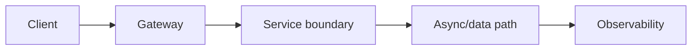
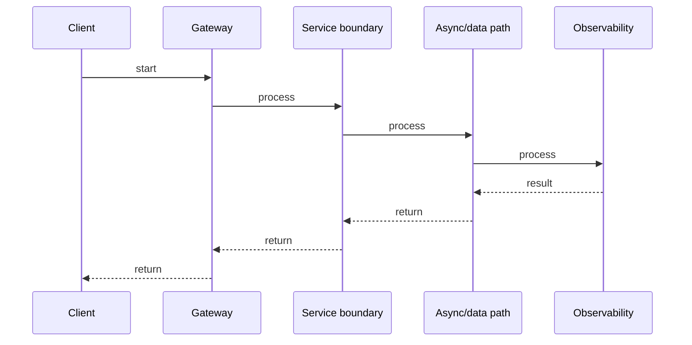

# Kafka: Event-Driven Architecture & Exactly-Once

## Quick Facts
- Area: Microservices
- Tag: Kafka
- Source: `src/modules/topics/microservices/ms-kafka-event-driven.js`
- Tags: `kafka`, `event driven`, `consumer group`, `exactly once`, `partitions`, `offsets`
- Visual coverage: generated diagrams only

## Concept
**Apache Kafka** is a distributed commit log. Key concepts:
- **Topic -> Partitions**: ordered, immutable log per partition.
- **Consumer Groups**: each partition consumed by exactly one consumer in a group - horizontal scale.
- **Offsets**: consumer tracks position; Kafka doesn't push.
- **Delivery semantics**: at-most-once (auto-commit), at-least-once (commit after process), exactly-once (idempotent producer + transactional consumer).
- **Compacted topics**: retain only the latest value per key - used for event sourcing read models.
- **Schema Registry**: Avro/Protobuf schemas with versioning and compatibility checks.

## Why It Matters
Kafka decouples producers from consumers in time and space - no direct RPC. This enables **event sourcing**, **CQRS**, **audit logs**, and **async workflows**. Consumer groups allow independent replay at different rates. The durable log is the ground truth; services can replay from offset 0 to rebuild state after a bug. Exactly-once is the hardest part - understand the two-phase commit involved.

## Architecture / Mental Model


## Runtime / Sequence


## Animation Plan
- Flow lab can use generated mental model steps above.
- UML sequence can use generated sequence diagram above.
- Architecture map can use generated area mental model above.

Flow steps:

1. Client
2. Gateway
3. Service boundary
4. Async/data path
5. Observability

## Example
```java
// Kafka exactly-once producer + Spring Kafka consumer
import org.apache.kafka.clients.producer.*;
import org.springframework.kafka.annotation.*;
import org.springframework.kafka.support.Acknowledgment;
import org.springframework.transaction.annotation.Transactional;

//  Idempotent + transactional producer 
class OrderEventProducer {
    private final KafkaTemplate<String, OrderEvent> kafka;
    private final OrderRepository repo;

    // @Transactional spans both DB write and Kafka send - outbox pattern alternative
    @Transactional("kafkaTransactionManager")
    public void publishOrderCreated(Order order) {
        repo.save(order);  // DB write inside Kafka transaction scope
        kafka.executeInTransaction(ops ->
            ops.send("orders.events",
                     order.getId(),
                     new OrderEvent("ORDER_CREATED", order))
        );
    }
}

//  Consumer with manual ack (at-least-once) 
@KafkaListener(
    topics = "orders.events",
    groupId = "inventory-service",
    containerFactory = "batchFactory"     // batch processing for throughput
)
public void onOrderEvent(
    List<ConsumerRecord<String, OrderEvent>> records,
    Acknowledgment ack
) {
    for (var r : records) {
        try {
            process(r.value());
        } catch (RetryableException e) {
            // send to retry topic, don't ack -> reprocessed
            retryProducer.send("orders.events.retry", r);
        } catch (FatalException e) {
            // send to DLQ, ack to skip
            dlqProducer.send("orders.events.dlq", r);
        }
    }
    ack.acknowledge();  // commits offset after all records processed
}

//  Consumer group lag monitoring 
// kafka-consumer-groups.sh --bootstrap-server localhost:9092 \
//   --describe --group inventory-service
```

Notes:
The **outbox pattern** is the safe alternative to `@Transactional` across DB + Kafka: write the event to an `outbox` table in the same DB transaction, then a separate relay polls and publishes to Kafka. Eliminates dual-write failure modes.

## Complexity And Performance
- Time/space complexity depends on input size, data volume, and implementation choices.
- Track latency, throughput, memory, saturation, error rate, and correctness invariants.

## Interview Drills
1. How does Kafka achieve exactly-once delivery?
   Answer: Three components: (1) **Idempotent producer** - each message gets a sequence number; the broker deduplicates retries per producer epoch. (2) **Transactional producer** - `beginTransaction`, `send`, `commitTransaction` atomically. (3) **Transactional consumer** - reads only committed messages (`isolation.level=read_committed`). Together, a consume-transform-produce pipeline is exactly-once. Note: exactly-once is producer-broker-consumer - your downstream DB still needs idempotency on the consumer side.
   Follow-ups: What is a producer epoch?; How does the outbox pattern compare?; What is a zombie producer?

2. How do you handle a slow consumer without losing messages?
   Answer: Kafka retains messages for the configured retention period regardless of consumption speed. Options: (1) **Scale consumers** up to the number of partitions. (2) **Repartition** the topic with more partitions to allow more parallelism. (3) **Batch consumption** - process N records per poll. (4) **Back-pressure**: pause the consumer with `consumer.pause()` until the downstream drains. Monitor lag via `consumer group describe` or Kafka exporter + Prometheus.
   Follow-ups: What is consumer group rebalancing and how do you minimize it?; What are sticky partition assignments?

## Trade-offs
Pros:
- Durable log enables replay - rebuild consumers from zero offset after bugs.
- Consumer groups scale consumption horizontally up to partition count.
- Decouples producers and consumers in time - producers don't wait for consumers.

Cons:
- Ordering is per-partition only - cross-partition ordering requires application logic.
- Exactly-once is complex and adds latency.
- Small message overhead - better for batched events than RPC-style calls.

When to use:
**Kafka** for async workflows, event sourcing, audit logs, and high-throughput pipelines. **RabbitMQ** for task queues with complex routing. **SQS/SNS** for AWS-native workloads. Avoid Kafka for synchronous request/response - use gRPC.

## Gotchas
_No gotchas configured._

