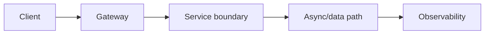
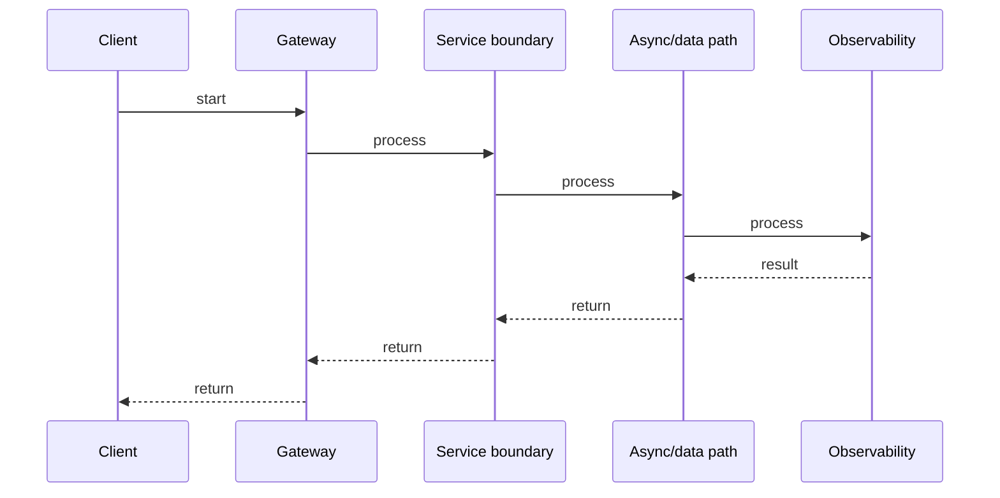

# Kubernetes: Deployments, Resources & Scaling

## Quick Facts
- Area: Microservices
- Tag: Kubernetes
- Source: `src/modules/topics/microservices/ms-kubernetes-deployment.js`
- Tags: `kubernetes`, `deployment`, `hpa`, `resources`, `pod`, `rolling update`
- Visual coverage: generated diagrams only

## Concept
Key Kubernetes primitives for production services:
- **Deployment**: declarative pod spec + replica count + rolling update strategy.
- **Resources**: `requests` (scheduler uses for placement) and `limits` (enforced - OOMKill if memory exceeded, CPU throttled).
- **HPA (Horizontal Pod Autoscaler)**: scales replicas based on CPU, memory, or custom metrics (KEDA for Kafka lag).
- **PodDisruptionBudget (PDB)**: minimum available pods during node drain.
- **ConfigMap / Secret**: externalize config from image.
- **Topology spread constraints**: spread pods across zones for HA.

## Why It Matters
Mis-set resource requests cause the scheduler to over-pack nodes -> OOMKills cascade. Under-set CPU limits cause noisy neighbor throttling. No PDB means rolling node drains take down too many pods simultaneously. Zero-downtime deployments require correct readiness probes AND correct `terminationGracePeriodSeconds`.

## Architecture / Mental Model


## Runtime / Sequence


## Animation Plan
- Flow lab can use generated mental model steps above.
- UML sequence can use generated sequence diagram above.
- Architecture map can use generated area mental model above.

Flow steps:

1. Client
2. Gateway
3. Service boundary
4. Async/data path
5. Observability

## Example
```go
# Kubernetes Deployment - production-grade (YAML shown in Go comment for syntax highlighting)
# apiVersion: apps/v1
# kind: Deployment
# metadata:
#   name: order-service
# spec:
#   replicas: 3
#   strategy:
#     type: RollingUpdate
#     rollingUpdate:
#       maxSurge: 1          # one extra pod during rollout
#       maxUnavailable: 0    # never reduce below desired
#   selector:
#     matchLabels:
#       app: order-service
#   template:
#     spec:
#       topologySpreadConstraints:
#       - maxSkew: 1
#         topologyKey: topology.kubernetes.io/zone
#         whenUnsatisfiable: DoNotSchedule
#       containers:
#       - name: app
#         image: order-service:v2.1.0
#         ports:
#         - containerPort: 8080
#         resources:
#           requests:
#             cpu: "250m"
#             memory: "256Mi"
#           limits:
#             cpu: "1"
#             memory: "512Mi"
#         readinessProbe:
#           httpGet:
#             path: /readyz
#             port: 8080
#           initialDelaySeconds: 5
#           periodSeconds: 5
#           failureThreshold: 3
#         livenessProbe:
#           httpGet:
#             path: /healthz
#             port: 8080
#           initialDelaySeconds: 15
#           periodSeconds: 10
#         env:
#         - name: DB_PASSWORD
#           valueFrom:
#             secretKeyRef:
#               name: order-db-secret
#               key: password
# ---
# kind: HorizontalPodAutoscaler
# spec:
#   minReplicas: 3
#   maxReplicas: 20
#   metrics:
#   - type: Resource
#     resource:
#       name: cpu
#       target:
#         type: Utilization
#         averageUtilization: 60
# ---
# kind: PodDisruptionBudget
# spec:
#   minAvailable: 2
#   selector:
#     matchLabels:
#       app: order-service

// Go app: read config from env (12-factor)
package main

import (
    "fmt"
    "os"
)

func main() {
    dbPassword := os.Getenv("DB_PASSWORD")   // injected via Secret
    fmt.Println("connecting with password len:", len(dbPassword))
}
```

Notes:
Set **requests = expected steady-state usage** and **limits = peak burst**. Never set CPU limit too low - JVM and GC need burst CPU at startup. Use `kubectl top pods` and VPA (Vertical Pod Autoscaler) recommendations to right-size.

## Complexity And Performance
- Time/space complexity depends on deployment, data size, and chosen implementation.
- Track p50/p95/p99 latency, throughput, memory, saturation, and error rate for production topics.

## Interview Drills
1. What happens when a pod exceeds its memory limit?
   Answer: The Linux kernel OOMKills the container - the pod is restarted (RestartPolicy). This is different from CPU: CPU throttling just slows the process, memory over-limit causes a hard kill. Symptoms: repeated `OOMKilled` in `kubectl describe pod`. Fix: increase the memory limit, find the memory leak, or use a streaming approach instead of loading data in memory.
   Follow-ups: What is eviction vs OOMKill?; How does the kubelet eviction manager work?

2. How do you achieve zero-downtime deployments in Kubernetes?
   Answer: Five requirements: (1) Readiness probe configured correctly - new pods only get traffic when ready. (2) `maxUnavailable: 0` in rolling update strategy. (3) Graceful shutdown in the app - handle SIGTERM, drain in-flight requests. (4) `terminationGracePeriodSeconds` > drain time. (5) PDB `minAvailable` ensures minimum running during node drains. All five must be in place - missing any one causes downtime.
   Follow-ups: What is preStop hook and when do you need it?; How does Kubernetes handle SIGTERM -> SIGKILL?

## Trade-offs
Pros:
- Declarative desired state - Kubernetes reconciles continuously.
- HPA scales automatically on real load metrics.
- Topology spread + PDB gives multi-zone HA with minimal config.

Cons:
- Resource right-sizing requires profiling - wrong values cause OOMKills or wasted cost.
- Rolling updates with stateful services (DBs) require extra care.
- HPA reacts slowly to sudden traffic spikes - pre-scale or use KEDA.

When to use:
**Kubernetes Deployment** for all stateless services. **StatefulSet** for stateful workloads (Kafka, Redis). **DaemonSet** for node-level agents (log shippers, metrics collectors). Use **KEDA** for event-driven autoscaling (Kafka consumer lag, queue depth).

## Gotchas
_No gotchas configured._

