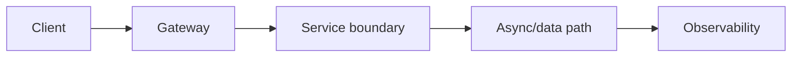
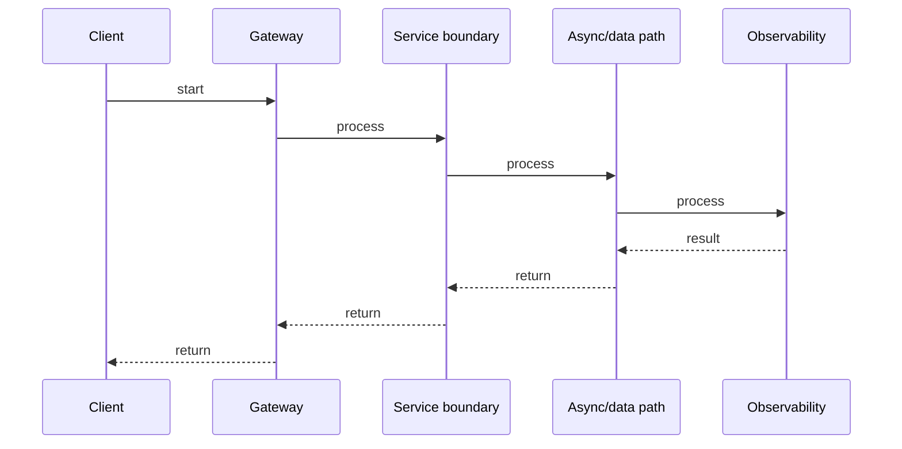

# Saga Pattern & Distributed Transactions

## Quick Facts

- Area: Microservices
- Tag: Saga
- Source: `src/modules/topics/microservices/ms-saga-distributed-tx.js`
- Tags: `saga`, `2pc`, `distributed transaction`, `choreography`, `orchestration`, `compensating`
- Visual coverage: generated diagrams only

## Concept

Distributed transactions across microservices cannot use ACID - services have separate DBs. The **Saga** pattern breaks a transaction into a sequence of local transactions, each publishing an event or command.
Two flavors:

- **Choreography**: services react to events. Decentralized, but hard to observe.
- **Orchestration**: a saga orchestrator issues commands and handles outcomes. Centralized logic, easier to trace (e.g., Temporal, Netflix Conductor, Camunda).
  **Compensating transactions** undo completed steps on failure - they must be idempotent and retryable.

## Why It Matters

2PC (two-phase commit) requires all participants to be available simultaneously - kills availability in distributed systems (CAP theorem). Sagas trade **isolation** (intermediate states are visible) for availability. This is the correct model for microservice workflows like order -> payment -> inventory -> shipping. Understanding the ACD properties (Atomic, Consistent, Durable; not Isolated) is essential for senior system design.

## Architecture / Mental Model



## Runtime / Sequence



## Animation Plan

- Flow lab can use generated mental model steps above.
- UML sequence can use generated sequence diagram above.
- Architecture map can use generated area mental model above.

Flow steps:

1. Client
2. Gateway
3. Service boundary
4. Async/data path
5. Observability

## Example

```java
// Orchestration Saga using Spring State Machine / Temporal (simplified)
// Order saga: Reserve inventory -> Charge payment -> Confirm order

import io.temporal.workflow.*;
import io.temporal.activity.*;
import java.time.Duration;

//  Workflow interface
@WorkflowInterface
public interface OrderSaga {
    @WorkflowMethod
    OrderResult execute(CreateOrderCommand cmd);
}

//  Activities (each is a local transaction)
@ActivityInterface
public interface InventoryActivity {
    String reserve(String productId, int qty);          // returns reservationId
    void cancel(String reservationId);                  // compensating action
}

@ActivityInterface
public interface PaymentActivity {
    String charge(String userId, Money amount);         // returns chargeId
    void refund(String chargeId);                       // compensating action
}

//  Saga implementation
public class OrderSagaImpl implements OrderSaga {
    private final InventoryActivity inventory = Workflow.newActivityStub(
        InventoryActivity.class,
        ActivityOptions.newBuilder().setStartToCloseTimeout(Duration.ofSeconds(10)).build()
    );
    private final PaymentActivity payment = Workflow.newActivityStub(
        PaymentActivity.class,
        ActivityOptions.newBuilder().setStartToCloseTimeout(Duration.ofSeconds(30)).build()
    );

    @Override
    public OrderResult execute(CreateOrderCommand cmd) {
        String reservationId = null;
        String chargeId = null;
        try {
            // Step 1: reserve inventory
            reservationId = inventory.reserve(cmd.productId(), cmd.quantity());

            // Step 2: charge payment
            chargeId = payment.charge(cmd.userId(), cmd.amount());

            // Step 3: confirm (all good)
            return OrderResult.success(reservationId, chargeId);

        } catch (Exception e) {
            // Compensate in reverse order
            if (chargeId != null)      payment.refund(chargeId);
            if (reservationId != null) inventory.cancel(reservationId);
            return OrderResult.failed(e.getMessage());
        }
    }
}
```

Notes:
Temporal persists workflow state in its DB - the workflow survives crashes and resumes mid-execution. Compensating transactions must be **idempotent**: calling `refund(chargeId)` twice should be safe. Use unique idempotency keys derived from the saga ID.

## Complexity And Performance

- Time/space complexity depends on input size, data volume, and implementation choices.
- Track latency, throughput, memory, saturation, error rate, and correctness invariants.

## Interview Drills

1. What problems does the Saga pattern NOT solve?
   Answer: Sagas don't provide **isolation** - other transactions can see intermediate states (e.g., inventory reserved but payment not yet charged). They also don't guarantee **atomicity in the traditional sense** - compensations are eventual. Solutions: (1) **Semantic lock**: mark order as PENDING until saga completes. (2) **Commutative updates**: design operations to be order-independent. (3) Pivot transaction pattern - make steps idempotent across ordering.
   Follow-ups: What is the ACD vs ACID distinction?; When would you use 2PC over Saga?

2. How do you handle a compensation failure in a Saga?
   Answer: Compensations must be **retried with exponential backoff** until they succeed - they cannot fail permanently (that's an unrecoverable inconsistency). Design compensations to be idempotent (check if already reversed before acting). For truly irrecoverable compensation failures, raise an alert for **manual intervention** - the system is in a dirty state. Temporal handles retries automatically; custom sagas need a compensation retry queue.
   Follow-ups: What is a pivot transaction?; How do you test Saga rollback paths?

## Trade-offs

Pros:

- Availability: no cross-service lock required - each service commits locally.
- Temporal / Conductor give durable, observable, retryable workflow state.
- Choreography scales well - services are fully decoupled.

Cons:

- No isolation - dirty reads between saga steps are possible.
- Compensating transactions add implementation complexity.
- Debugging choreography sagas requires distributed tracing - event chain is implicit.

When to use:
**Orchestration Saga** (Temporal) for complex multi-step workflows where observability matters. **Choreography** for simple 2-3 step flows with clear event contracts. **2PC** only within a single database that supports it.

## Gotchas

Watch for edge cases, assumptions, and hidden performance costs that can make this topic fail in production if handled incorrectly.
