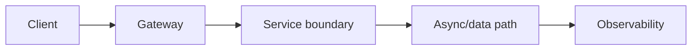
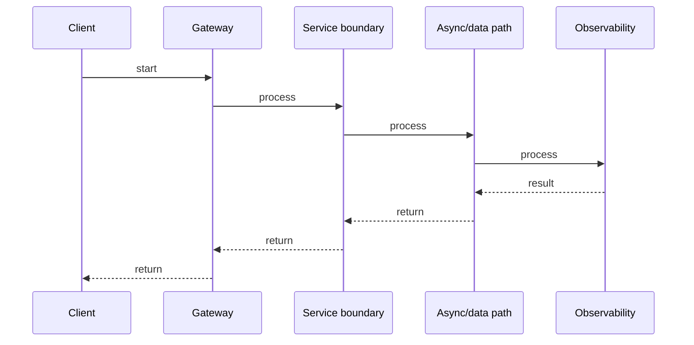

# Service Discovery, Load Balancing & Health Checks

## Quick Facts
- Area: Microservices
- Tag: Discovery
- Source: `src/modules/topics/microservices/ms-service-discovery-lb.js`
- Tags: `service discovery`, `consul`, `kubernetes`, `load balancing`, `health check`, `dns`
- Visual coverage: generated diagrams only

## Concept
Services must find each other without hardcoded IPs. Two models:
- **Client-side discovery**: client queries a registry (Consul, Eureka) and picks an instance. Client owns load balancing logic.
- **Server-side discovery**: client calls a load balancer (ELB, Envoy, kube-proxy); LB queries registry and routes.

**Kubernetes**: services are DNS entries (`svc.namespace.svc.cluster.local`) backed by kube-proxy or Envoy. Pod readiness and liveness probes drive endpoint registration.
**Health checks**: liveness (should restart?), readiness (should receive traffic?), startup (still booting?).

## Why It Matters
In cloud environments, pod IPs change constantly. DNS-based discovery with TTL and health checks ensures traffic only reaches healthy instances. Readiness probes are critical for zero-downtime deployments - new pods must pass readiness before old ones are terminated. Missing liveness probes cause zombie pods to silently absorb traffic.

## Architecture / Mental Model


## Runtime / Sequence


## Animation Plan
- Flow lab can use generated mental model steps above.
- UML sequence can use generated sequence diagram above.
- Architecture map can use generated area mental model above.

Flow steps:

1. Client
2. Gateway
3. Service boundary
4. Async/data path
5. Observability

## Example
```go
// Kubernetes-style health endpoint + graceful shutdown
package main

import (
    "context"
    "fmt"
    "net/http"
    "os/signal"
    "sync/atomic"
    "syscall"
    "time"
)

type App struct {
    ready    atomic.Bool  // true once startup is complete
    healthy  atomic.Bool  // true while DB is reachable
    db       DB
}

func (a *App) livenessHandler(w http.ResponseWriter, _ *http.Request) {
    if !a.healthy.Load() {
        w.WriteHeader(http.StatusServiceUnavailable)
        fmt.Fprintln(w, "unhealthy")
        return
    }
    fmt.Fprintln(w, "ok")
}

func (a *App) readinessHandler(w http.ResponseWriter, _ *http.Request) {
    if !a.ready.Load() {
        w.WriteHeader(http.StatusServiceUnavailable)
        fmt.Fprintln(w, "not ready")
        return
    }
    fmt.Fprintln(w, "ok")
}

func (a *App) Run() {
    mux := http.NewServeMux()
    mux.HandleFunc("/healthz", a.livenessHandler)    // liveness
    mux.HandleFunc("/readyz",  a.readinessHandler)   // readiness

    srv := &http.Server{Addr: ":8080", Handler: mux,
        ReadTimeout: 5*time.Second, WriteTimeout: 5*time.Second}

    // Background DB health check
    go func() {
        for range time.Tick(5 * time.Second) {
            a.healthy.Store(a.db.Ping() == nil)
        }
    }()

    // Startup: warm up caches, then signal ready
    a.warmup()
    a.ready.Store(true)

    // Graceful shutdown on SIGTERM (sent by k8s)
    ctx, stop := signal.NotifyContext(context.Background(), syscall.SIGTERM)
    defer stop()

    go srv.ListenAndServe()
    <-ctx.Done()

    a.ready.Store(false)          // stop receiving new traffic immediately
    time.Sleep(5 * time.Second)   // drain in-flight requests (k8s iptables lag)

    shutCtx, cancel := context.WithTimeout(context.Background(), 30*time.Second)
    defer cancel()
    srv.Shutdown(shutCtx)
}

func (a *App) warmup()  {}
type DB struct{}
func (d DB) Ping() error { return nil }
```

Notes:
In Kubernetes: set `terminationGracePeriodSeconds` to accommodate the drain sleep. Separate liveness and readiness - a temporarily overloaded pod should fail readiness (stops traffic) but not liveness (avoids unnecessary restart).

## Complexity And Performance
- Time/space complexity depends on input size, data volume, and implementation choices.
- Track latency, throughput, memory, saturation, error rate, and correctness invariants.

## Interview Drills
1. What is the difference between liveness and readiness probes?
   Answer: **Liveness**: "is this container broken beyond self-repair?" - if it fails, Kubernetes **restarts** the pod. Use for deadlocks or unrecoverable errors. **Readiness**: "is this container ready to serve traffic?" - if it fails, the pod is **removed from the Service endpoint** (no traffic) but not restarted. Use for temporary unavailability (DB connection pool exhausted, cache warming). **Never** make readiness depend on an external service - cascading failures will bring down healthy pods.
   Follow-ups: What is a startup probe and when is it needed?; How does Kubernetes drain a node?

2. How does client-side load balancing work in gRPC with Kubernetes?
   Answer: Kubernetes `Service` round-robins at the TCP level - bad for gRPC which uses persistent HTTP/2 connections. All traffic goes to the first connected pod. Fix: use **headless service** (`clusterIP: None`) - DNS returns all pod IPs. gRPC client library (with service config) or Envoy sidecar does round-robin across the pod list, creating per-pod gRPC connections. Istio automates this via the sidecar proxy.
   Follow-ups: What is connection-level vs request-level load balancing?; How does Envoy handle gRPC health checking?

## Trade-offs
Pros:
- Kubernetes DNS + Service abstraction is zero-config for most use cases.
- Readiness probes give zero-downtime rolling deployments automatically.
- Health checks remove bad pods from rotation without human intervention.

Cons:
- DNS TTL caching can delay registration/deregistration - tune client DNS TTL.
- Kubernetes Service is L4 - no gRPC-level load balancing without a mesh.
- Flapping probes cause thundering herd of restarts under transient failures.

When to use:
**Kubernetes Service + DNS** for most cases. **Headless Service + client-side LB** for gRPC. **Istio/Envoy** when you need sophisticated traffic shaping, retries, or mTLS.

## Gotchas
_No gotchas configured._

