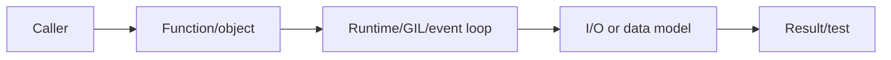
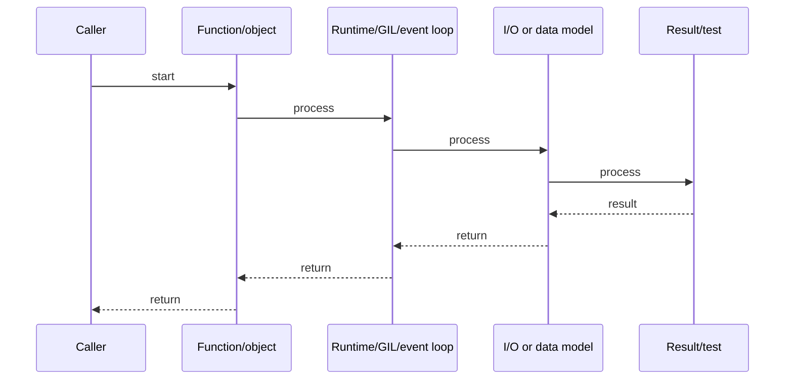

# Decorators, Descriptors & Metaclasses

## Quick Facts
- Area: Python
- Tag: Metaprogramming
- Source: `src/modules/topics/python/python-decorators-metaclasses.js`
- Tags: `decorators`, `descriptors`, `metaclasses`, `functools`, `class`
- Visual coverage: generated diagrams only

## Concept
**Decorators** are callables that wrap functions or classes. `@functools.wraps` preserves `__name__`, `__doc__`.
**Descriptors** implement `__get__`, `__set__`, `__delete__` - used by `property`, `classmethod`, `staticmethod`, and ORMs.
**Metaclasses** are classes whose instances are classes (`type` is the default metaclass). They intercept class creation in `__new__` and `__init_subclass__`. Used by Django ORM, Pydantic, ABCs.
Python's data model connects all three via `__dunder__` methods.

## Why It Matters
Framework code (FastAPI, SQLAlchemy, Pydantic) heavily uses these. As a senior engineer you need to **read and debug** metaclass-based ORMs, write reusable decorators that compose correctly, and understand why `@property` works the way it does. Metaclass ordering matters in MRO with multiple inheritance.

## Architecture / Mental Model


## Runtime / Sequence


## Animation Plan
- Flow lab can use generated mental model steps above.
- UML sequence can use generated sequence diagram above.
- Architecture map can use generated area mental model above.

Flow steps:

1. Caller
2. Function/object
3. Runtime/GIL/event loop
4. I/O or data model
5. Result/test

## Example
```python
import functools
import time
from typing import Callable, TypeVar, ParamSpec

P = ParamSpec("P")
R = TypeVar("R")

#  Decorator with arguments 
def retry(times: int = 3, delay: float = 0.1):
    def decorator(fn: Callable[P, R]) -> Callable[P, R]:
        @functools.wraps(fn)
        def wrapper(*args: P.args, **kwargs: P.kwargs) -> R:
            last_err: Exception | None = None
            for attempt in range(times):
                try:
                    return fn(*args, **kwargs)
                except Exception as e:
                    last_err = e
                    time.sleep(delay * (2 ** attempt))  # exp backoff
            raise RuntimeError(f"failed after {times} attempts") from last_err
        return wrapper
    return decorator

#  Descriptor: typed attribute 
class Positive:
    """Descriptor that enforces positive values."""
    def __set_name__(self, owner, name):
        self._name = f"_{name}"

    def __get__(self, obj, objtype=None):
        if obj is None: return self
        return getattr(obj, self._name, None)

    def __set__(self, obj, value):
        if value <= 0:
            raise ValueError(f"{self._name} must be positive, got {value}")
        setattr(obj, self._name, value)

#  Metaclass: register subclasses 
class PluginMeta(type):
    registry: dict[str, type] = {}
    def __new__(mcs, name, bases, namespace):
        cls = super().__new__(mcs, name, bases, namespace)
        if bases:  # skip the base class itself
            PluginMeta.registry[name] = cls
        return cls

class Plugin(metaclass=PluginMeta): pass
class CSVPlugin(Plugin): pass
class JSONPlugin(Plugin): pass

#  Usage 
class Order:
    price = Positive()
    qty   = Positive()
    def __init__(self, price, qty):
        self.price, self.qty = price, qty

@retry(times=3, delay=0.05)
def call_api(url: str) -> str:
    raise ConnectionError("timeout")  # will retry 3 times

print(PluginMeta.registry)     # {'CSVPlugin': ..., 'JSONPlugin': ...}
try: call_api("http://x")
except RuntimeError as e: print(e)
```

Notes:
Use `functools.wraps` on every wrapper to preserve introspection. Prefer `__init_subclass__` over metaclasses for subclass registration - it's simpler and composable.

## Complexity And Performance
- Time/space complexity depends on deployment, data size, and chosen implementation.
- Track p50/p95/p99 latency, throughput, memory, saturation, and error rate for production topics.

## Interview Drills
1. What is the descriptor protocol and how does @property use it?
   Answer: A descriptor is any object that defines `__get__`, `__set__`, or `__delete__`. `property` is a built-in descriptor: when accessed on an instance, Python calls `property.__get__(obj, type)` which runs your getter function. This is why `obj.x` can run code. Non-data descriptors (only `__get__`) are overridden by instance `__dict__`; data descriptors (`__get__` + `__set__`) take priority.
   Follow-ups: What is the MRO lookup order for attributes?; How does classmethod use the descriptor protocol?

2. When would you use a metaclass vs __init_subclass__ vs a class decorator?
   Answer: **Metaclass**: when you need to intercept `type.__new__` - modifying the class dict before the class is created. **`__init_subclass__`** (Python 3.6+): when subclasses should register themselves or get defaults - simpler, composable. **Class decorator**: when you want to add/modify behavior post-creation - most readable for straightforward wrappers. Prefer `__init_subclass__` > class decorator > metaclass in that order.
   Follow-ups: How do ABCs use metaclasses?; What is __class_getitem__?

## Trade-offs
Pros:
- Decorators enable cross-cutting concerns (logging, retry, auth) without inheritance.
- Descriptors make ORM field validation invisible to users.
- Metaclasses allow DSLs (Django models, Pydantic) with minimal boilerplate.

Cons:
- Metaclass conflicts with multiple inheritance require careful MRO management.
- Stacked decorators can obscure what a function actually does.
- Heavy metaprogramming makes code hard to trace and debug.

When to use:
Decorators for AOP concerns. Descriptors for reusable field validation. `__init_subclass__` for registry patterns. Metaclass only when `__init_subclass__` can't do the job.

## Gotchas
_No gotchas configured._

