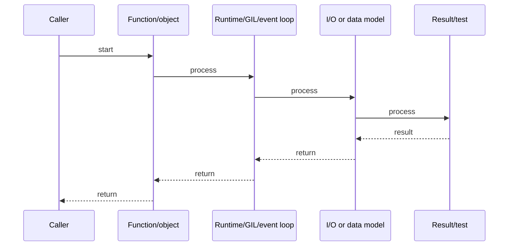

# FastAPI: Async REST, Dependency Injection & Pydantic

## Quick Facts

- Area: Python
- Tag: FastAPI
- Source: `src/modules/topics/python/python-fastapi.js`
- Tags: `fastapi`, `pydantic`, `async`, `openapi`, `dependency injection`
- Visual coverage: generated diagrams only

## Concept

**FastAPI** is a high-performance async web framework built on Starlette (ASGI) and Pydantic. Core features:

- **Type-driven validation**: Pydantic models for request/response bodies, query params, path params.
- **Automatic OpenAPI/Swagger docs** from type annotations.
- **Dependency Injection**: `Depends()` - scoped dependencies (request, session, auth).
- **Background tasks**: `BackgroundTasks` for fire-and-forget after response.
- **Lifecycle events**: `@app.lifespan` for startup/shutdown (DB pools, caches).

## Why It Matters

FastAPI rivals Node.js and Go in I/O throughput benchmarks while keeping Python ergonomics. The killer feature is eliminating manual serialization - annotate once, get validation, OpenAPI docs, and editor completion for free. The DI system makes auth and DB sessions testable without monkeypatching.

## Architecture / Mental Model


## Runtime / Sequence



## Animation Plan

- Flow lab can use generated mental model steps above.
- UML sequence can use generated sequence diagram above.
- Architecture map can use generated area mental model above.

Flow steps:

1. Caller
2. Function/object
3. Runtime/GIL/event loop
4. I/O or data model
5. Result/test

## Example

```python
from contextlib import asynccontextmanager
from typing import Annotated
import asyncpg
from fastapi import FastAPI, Depends, HTTPException, status, BackgroundTasks
from pydantic import BaseModel, Field, EmailStr

#  Lifespan: manage DB pool
@asynccontextmanager
async def lifespan(app: FastAPI):
    app.state.pool = await asyncpg.create_pool("postgresql://localhost/demo")
    yield
    await app.state.pool.close()

app = FastAPI(title="Order Service", lifespan=lifespan)

#  Pydantic models
class CreateOrder(BaseModel):
    user_email: EmailStr
    product_id: str
    quantity: int = Field(gt=0, le=100)

class OrderResponse(BaseModel):
    id: int
    status: str

#  Dependencies
async def get_db(request) -> asyncpg.Connection:
    async with request.app.state.pool.acquire() as conn:
        yield conn  # scoped to request

DBConn = Annotated[asyncpg.Connection, Depends(get_db)]

async def verify_token(authorization: str = "") -> str:
    if not authorization.startswith("Bearer "):
        raise HTTPException(status_code=status.HTTP_401_UNAUTHORIZED)
    return authorization.removeprefix("Bearer ")

Token = Annotated[str, Depends(verify_token)]

#  Endpoint
@app.post("/orders", response_model=OrderResponse, status_code=201)
async def create_order(
    body: CreateOrder,
    db: DBConn,
    token: Token,
    tasks: BackgroundTasks,
):
    row = await db.fetchrow(
        "INSERT INTO orders(email, product, qty) VALUES($1,$2,$3) RETURNING id",
        body.user_email, body.product_id, body.quantity,
    )
    tasks.add_task(send_confirmation, body.user_email)
    return OrderResponse(id=row["id"], status="created")

async def send_confirmation(email: str) -> None:
    pass  # fire-and-forget after response sent
```

Notes:
Use `asyncpg` (not psycopg2) for async DB. Test with `TestClient` for sync or `AsyncClient` (httpx) for async. Override dependencies in tests with `app.dependency_overrides`.

## Complexity And Performance

- Time/space complexity depends on input size, data volume, and implementation choices.
- Track latency, throughput, memory, saturation, error rate, and correctness invariants.

## Interview Drills

1. How does FastAPI's dependency injection differ from Spring's?
   Answer: FastAPI uses **function arguments** as the DI declaration - no annotation processing, no XML, no IoC container startup. `Depends(fn)` is resolved at request time with automatic scope management. Spring's IoC is application-scope by default; FastAPI scoping is per-request unless you use caching. Both support testing by swapping implementations.
   Follow-ups: How do you implement request-scoped dependencies?; How does FastAPI handle dependency errors?

2. How do you handle database transactions across multiple operations in FastAPI?
   Answer: Acquire a connection, start a transaction in the dependency, yield the connection, and either commit or rollback in the finally block. Pattern: `async with conn.transaction(): yield conn` inside the dependency. This ensures atomicity across multiple endpoint DB calls that use the same injected connection.
   Follow-ups: How do you handle nested transactions in asyncpg?; What is a savepoint?

## Trade-offs

Pros:

- Zero-boilerplate request validation via Pydantic.
- OpenAPI docs auto-generated - always in sync with code.
- DI makes auth, DB sessions, and rate limiting testable.

Cons:

- Pydantic v2 breaking changes - migration required from v1.
- ASGI adds complexity: must avoid blocking code in async paths.
- Smaller ecosystem than Django for admin, auth, and ORM.

When to use:
**FastAPI** for new async REST/GraphQL services. **Django** when you need the full admin, ORM, and auth battery out of the box. **Flask** for small scripts and prototypes.

## Gotchas

_No gotchas configured._
