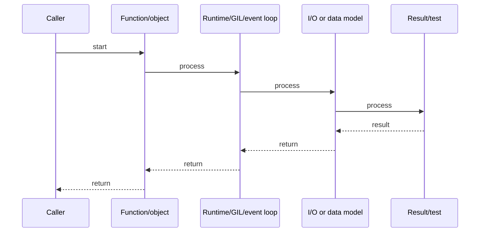

# GIL, Threading, Multiprocessing & asyncio

## Quick Facts
- Area: Python
- Tag: Concurrency
- Source: `src/modules/topics/python/python-gil-concurrency.js`
- Tags: `gil`, `threading`, `multiprocessing`, `asyncio`, `concurrent.futures`
- Visual coverage: generated diagrams only

## Concept
Python's **Global Interpreter Lock (GIL)** allows only one thread to execute Python bytecode at a time per interpreter process. This means:
- **CPU-bound** work: threads don't parallelize - use `multiprocessing` or `ProcessPoolExecutor`.
- **I/O-bound** work: threads release the GIL during I/O waits - `ThreadPoolExecutor` works fine.
- **asyncio**: single-threaded cooperative multitasking via an event loop. `async/await` switches on `await` points without the GIL overhead.
- **No-GIL Python (3.13 experimental)**: free-threaded build - watch this space.

## Why It Matters
Misunderstanding the GIL is the #1 Python performance mistake in senior interviews. Running a CPU-bound task with threads gives you **single-core performance with multi-threading overhead**. The `asyncio` model gives massive I/O concurrency with a single thread - used in production at scale by AIOHTTP, FastAPI, and databases like asyncpg.

## Architecture / Mental Model


## Runtime / Sequence


## Animation Plan
- Flow lab can use generated mental model steps above.
- UML sequence can use generated sequence diagram above.
- Architecture map can use generated area mental model above.

Flow steps:

1. Caller
2. Function/object
3. Runtime/GIL/event loop
4. I/O or data model
5. Result/test

## Example
```python
import asyncio
import time
from concurrent.futures import ProcessPoolExecutor, ThreadPoolExecutor

# CPU-bound: runs in separate processes (bypasses GIL)
def cpu_heavy(n: int) -> int:
    return sum(i * i for i in range(n))

# I/O-bound: simulated with asyncio sleep
async def fetch(url: str, delay: float) -> str:
    await asyncio.sleep(delay)   # releases event loop; real: aiohttp.get(url)
    return f"got {url}"

async def main() -> None:
    #  asyncio fan-out (I/O) 
    t0 = time.perf_counter()
    results = await asyncio.gather(
        fetch("https://a.example", 0.5),
        fetch("https://b.example", 0.3),
        fetch("https://c.example", 0.4),
    )
    print(f"async  : {results}  ({time.perf_counter()-t0:.2f}s)")
    # All 3 overlap -> ~0.5s total, not 1.2s

    #  CPU-bound: process pool 
    loop = asyncio.get_running_loop()
    with ProcessPoolExecutor() as pool:
        t0 = time.perf_counter()
        r = await loop.run_in_executor(pool, cpu_heavy, 10_000_000)
        print(f"cpu    : {r}  ({time.perf_counter()-t0:.2f}s)")

    #  Blocking I/O in threadpool (legacy libs) 
    with ThreadPoolExecutor(max_workers=4) as pool:
        r2 = await loop.run_in_executor(pool, time.sleep, 0.1)

asyncio.run(main())
```

Notes:
Use `asyncio.gather` for concurrent coroutines. Use `loop.run_in_executor(ProcessPoolExecutor())` to run CPU-bound code without blocking the event loop. Never call blocking code directly in a coroutine.

## Complexity And Performance
- Time/space complexity depends on deployment, data size, and chosen implementation.
- Track p50/p95/p99 latency, throughput, memory, saturation, and error rate for production topics.

## Interview Drills
1. Why does Python have the GIL and how do you work around it for CPU-bound tasks?
   Answer: The GIL was introduced to simplify CPython's memory management (reference counting is not thread-safe without it). Workarounds: (1) **`multiprocessing`** - separate interpreter per process, no shared GIL; (2) **C extensions** like NumPy release the GIL during computation; (3) **asyncio** for I/O (not CPU); (4) experimental **no-GIL CPython 3.13** (PEP 703).
   Follow-ups: What is the GIL release interval?; How does NumPy parallelise without Python threads?

2. What's the difference between asyncio.gather and asyncio.wait?
   Answer: `gather` collects all results in order, raises on first exception by default (unless `return_exceptions=True`). `wait` returns two sets - done and pending - and gives you control over which exceptions to handle. Use `gather` for fan-out when you want all results; `wait` when you need first-completed or partial failure handling.
   Follow-ups: How does asyncio.TaskGroup (3.11) compare?; What is asyncio.shield?

## Trade-offs
Pros:
- asyncio handles thousands of concurrent connections on a single thread.
- ProcessPoolExecutor gives true CPU parallelism with a familiar Future API.
- async/await syntax is readable and debuggable vs callback hell.

Cons:
- Mixing sync and async code requires careful bridge (run_in_executor).
- ProcessPoolExecutor has IPC overhead - not free for small tasks.
- Debugging async stack traces is harder than synchronous code.

When to use:
**asyncio** for I/O-bound services (APIs, websockets, DB queries). **ProcessPoolExecutor** for CPU-bound work (ML inference, image processing). **ThreadPoolExecutor** only for blocking legacy I/O libraries that have no async counterpart.

## Gotchas
_No gotchas configured._

