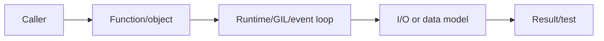
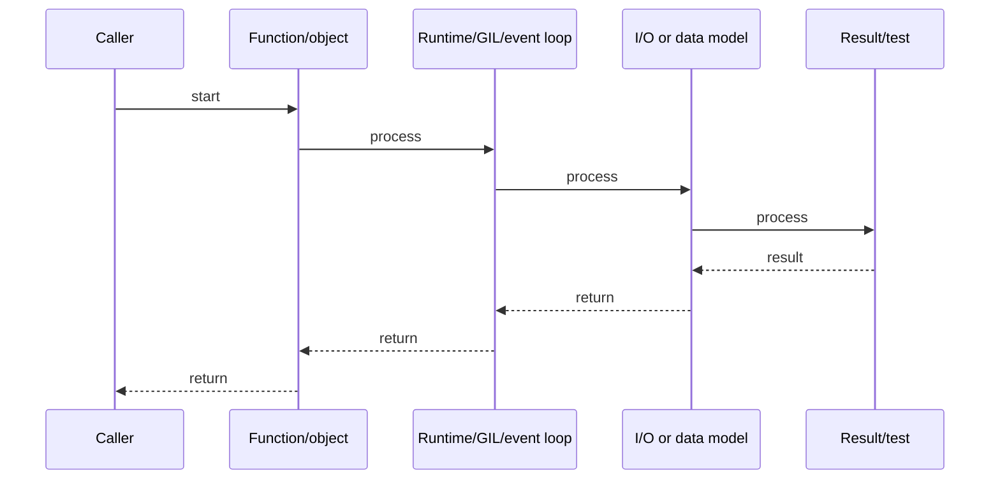

# Python Memory Model, Reference Counting & gc

## Quick Facts
- Area: Python
- Tag: Memory
- Source: `src/modules/topics/python/python-memory-gc.js`
- Tags: `reference counting`, `gc`, `memory`, `weakref`, `tracemalloc`, `__slots__`
- Visual coverage: generated diagrams only

## Concept
CPython manages memory via **reference counting** - each object tracks how many references point to it. When the count hits 0, it's immediately freed. **Cyclic garbage collector** (`gc` module) handles reference cycles (A -> B -> A) in three generations.
Key tools:
- **`__slots__`**: prevents per-instance `__dict__`, saves ~50-70% memory for many small objects.
- **`weakref`**: reference that doesn't increment the refcount - used for caches and callbacks.
- **`tracemalloc`**: snapshot heap allocations to find leaks.
- **`sys.getsizeof`**: object size (shallow, not deep).

## Why It Matters
Memory leaks in Python are often caused by: (1) global caches growing unbounded; (2) closures holding references to large objects; (3) event listeners never removed; (4) reference cycles not collected by the minor GC generation. In long-running services (FastAPI, Celery), memory growth causes OOM kills. `tracemalloc` is the key diagnostic tool.

## Architecture / Mental Model


## Runtime / Sequence


## Animation Plan
- Flow lab can use generated mental model steps above.
- UML sequence can use generated sequence diagram above.
- Architecture map can use generated area mental model above.

Flow steps:

1. Caller
2. Function/object
3. Runtime/GIL/event loop
4. I/O or data model
5. Result/test

## Example
```python
import gc
import tracemalloc
import weakref
import sys
from dataclasses import dataclass

#  __slots__ saves memory 
class Point:
    __slots__ = ("x", "y")
    def __init__(self, x: float, y: float) -> None:
        self.x, self.y = x, y

class PointDict:   # standard class with __dict__
    def __init__(self, x: float, y: float) -> None:
        self.x, self.y = x, y

p1, p2 = Point(1.0, 2.0), PointDict(1.0, 2.0)
print(f"slots: {sys.getsizeof(p1)}, dict: {sys.getsizeof(p2)}")
# slots: ~48 bytes, dict: ~48 + __dict__ 232 bytes

#  weakref cache 
class ExpensiveResource:
    def __init__(self, key: str) -> None:
        self.key = key

_cache: dict[str, weakref.ref] = {}

def get_resource(key: str) -> ExpensiveResource:
    ref = _cache.get(key)
    obj = ref() if ref else None
    if obj is None:
        obj = ExpensiveResource(key)
        _cache[key] = weakref.ref(obj)
    return obj

#  tracemalloc: find memory leaks 
tracemalloc.start()
snapshot1 = tracemalloc.take_snapshot()

leaked: list = []
for _ in range(10_000):
    leaked.append(b"x" * 1024)  # 1 KB each

snapshot2 = tracemalloc.take_snapshot()
top = snapshot2.compare_to(snapshot1, "lineno")
for stat in top[:3]:
    print(stat)   # shows file:line, size diff

#  Cycle detection 
class Node:
    def __init__(self): self.ref = None

a = Node(); b = Node()
a.ref = b; b.ref = a  # cycle
del a, b              # refcount stays > 0 without gc
gc.collect()          # GC finds and frees the cycle
print("collected:", gc.collect())
```

Notes:
Disable the cyclic GC (`gc.disable()`) only in CPU-critical tight loops where you've proven there are no cycles. Re-enable it for the rest of the code. Instagram disables GC for a 10% throughput win in their specific case.

## Complexity And Performance
- Time/space complexity depends on deployment, data size, and chosen implementation.
- Track p50/p95/p99 latency, throughput, memory, saturation, and error rate for production topics.

## Interview Drills
1. What is the difference between del and garbage collection in Python?
   Answer: `del` removes a **name binding** - it decrements the refcount of the object. If refcount hits 0, the object is freed immediately. If a cycle exists, the refcount never reaches 0; the cyclic GC (run periodically) finds and frees unreachable cycle members. `del` does not directly call the GC.
   Follow-ups: What is __del__ and why is it dangerous?; How does generational GC work?

2. How do you find memory leaks in a long-running Python service?
   Answer: Three approaches: (1) **tracemalloc** - snapshot before/after suspected leak window, compare top-N allocations by lineno. (2) **objgraph** - `objgraph.show_most_common_types()` to see what's growing. (3) **memory_profiler** - line-by-line memory for a function. Common culprits: global dicts growing, cached results never evicted, listeners registered on long-lived objects.
   Follow-ups: What is a reference cycle involving __del__?; How does weakref.WeakValueDictionary help caches?

## Trade-offs
Pros:
- Reference counting gives immediate deallocation for non-cycle objects.
- __slots__ is a low-effort 50-70% memory saving for many small objects.
- tracemalloc is built-in - no external profiler needed.

Cons:
- Reference counting can't handle cycles without the cyclic GC.
- Cyclic GC pauses (short, but non-deterministic) affect latency.
- No compaction - long-running processes accumulate fragmentation.

When to use:
Use **`__slots__`** for value-object classes created in large numbers. Use **weakref** for in-memory caches. Profile with **tracemalloc** before optimizing - Python memory issues are often caused by application-level design, not the runtime.

## Gotchas
_No gotchas configured._

