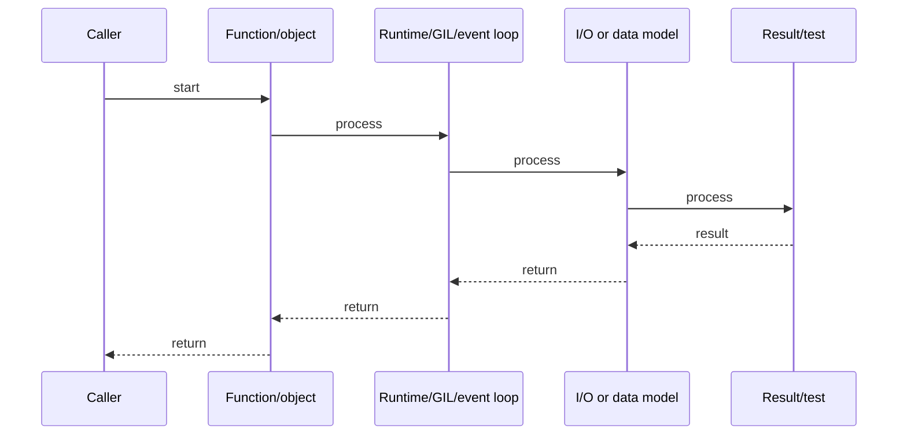

# Pydantic v2, dataclasses & Data Validation

## Quick Facts

- Area: Python
- Tag: Pydantic
- Source: `src/modules/topics/python/python-pydantic-dataclasses.js`
- Tags: `pydantic`, `dataclasses`, `validation`, `serialization`, `schema`
- Visual coverage: generated diagrams only

## Concept

**Pydantic v2** rewrites validation in Rust (`pydantic-core`) - 5-50x faster than v1. Core concepts:

- **`BaseModel`**: auto-validates on construction; `model_validate`, `model_dump`, `model_json_schema`.
- **`Field`**: metadata - constraints, aliases, defaults, `exclude`.
- **`@field_validator`, `@model_validator`**: custom validation at field or model level.
- **`@computed_field`**: derived fields included in serialization.
- **`ConfigDict`**: `strict`, `from_attributes` (ORM mode), `frozen`.
- **`TypeAdapter`**: validate arbitrary types without a model class.

## Why It Matters

Pydantic is used by FastAPI, LangChain, AWS CDK, and hundreds of data pipelines for runtime validation of external data. Incorrect validation of untrusted input (APIs, Kafka messages, CSV files) is a security and reliability risk. Pydantic v2's Rust core makes it viable even in tight loops.

## Architecture / Mental Model


## Runtime / Sequence



## Animation Plan

- Flow lab can use generated mental model steps above.
- UML sequence can use generated sequence diagram above.
- Architecture map can use generated area mental model above.

Flow steps:

1. Caller
2. Function/object
3. Runtime/GIL/event loop
4. I/O or data model
5. Result/test

## Example

```python
from datetime import datetime
from decimal import Decimal
from typing import Annotated
from pydantic import (
    BaseModel, Field, field_validator, model_validator,
    ConfigDict, computed_field, TypeAdapter
)

#  Reusable annotated type
PositiveMoney = Annotated[Decimal, Field(gt=0, decimal_places=2, max_digits=10)]

class OrderLine(BaseModel):
    product_id: str = Field(min_length=3, max_length=50)
    quantity: int = Field(gt=0, le=1000)
    unit_price: PositiveMoney

    @computed_field
    @property
    def total(self) -> Decimal:
        return self.unit_price * self.quantity

class CreateOrder(BaseModel):
    model_config = ConfigDict(frozen=True, str_strip_whitespace=True)

    user_id: int
    lines: list[OrderLine] = Field(min_length=1)
    placed_at: datetime = Field(default_factory=datetime.utcnow)

    @field_validator("user_id")
    @classmethod
    def user_must_be_positive(cls, v: int) -> int:
        if v <= 0:
            raise ValueError("user_id must be positive")
        return v

    @model_validator(mode="after")
    def check_total_limit(self) -> "CreateOrder":
        total = sum(l.total for l in self.lines)
        if total > Decimal("10000"):
            raise ValueError(f"order total {total} exceeds limit")
        return self

#  TypeAdapter: validate without a model
ListOfInts = TypeAdapter(list[int])
data = ListOfInts.validate_python(["1", "2", "3"])  # coerces strings

#  ORM mode: from SQLAlchemy/Django ORM objects
class UserOut(BaseModel):
    model_config = ConfigDict(from_attributes=True)
    id: int
    name: str
```

Notes:
Use `model_config = ConfigDict(strict=True)` when you don't want Pydantic to coerce types (e.g., string -> int). Use `model_dump(mode="json")` to get JSON-serializable dicts for Redis/Kafka.

## Complexity And Performance

- Time/space complexity depends on input size, data volume, and implementation choices.
- Track latency, throughput, memory, saturation, error rate, and correctness invariants.

## Interview Drills

1. What changed between Pydantic v1 and v2?
   Answer: V2 rewrites the validation core in Rust - 5-50x faster. API changes: `@validator` -> `@field_validator` (class method, explicit `mode='before'|'after'`), `orm_mode` -> `from_attributes`, `.dict()` -> `.model_dump()`, `.json()` -> `.model_dump_json()`. Validator order changed. `@root_validator` -> `@model_validator`. Many v1 workarounds (custom `__get_validators__`) have cleaner v2 equivalents via `Annotated`.
   Follow-ups: How do you migrate a large codebase from v1 to v2?; What is a Pydantic TypeAdapter?

2. How do you validate data from a database ORM without duplicating models?
   Answer: Use `ConfigDict(from_attributes=True)` - Pydantic reads attributes from ORM objects as if they were dict keys. Pattern: have one SQLAlchemy model and a `*Out` Pydantic model for serialization. For write paths, a `*In` model validates user input. This keeps ORM models mutable and Pydantic models focused on validation/serialization.
   Follow-ups: How do you handle lazy-loaded relationships?; Pydantic vs marshmallow?

## Trade-offs

Pros:

- Rust core: sub-microsecond validation for hot paths.
- JSON Schema auto-generation - OpenAPI integration.
- Annotated types compose reusable constraints.

Cons:

- v1 -> v2 migration is significant (breaking API changes).
- Frozen models add immutability overhead for large nested objects.
- Complex cross-field validators can be hard to test in isolation.

When to use:
**Pydantic** for validating external data (API, Kafka, CSV). **dataclasses** for internal data structures that don't need validation. **TypedDict** for lightweight dict typing without runtime overhead.

## Gotchas

Watch for edge cases, assumptions, and hidden performance costs that can make this topic fail in production if handled incorrectly.
