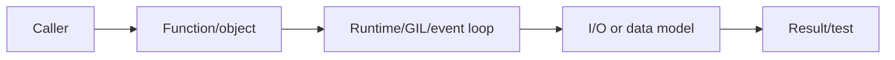
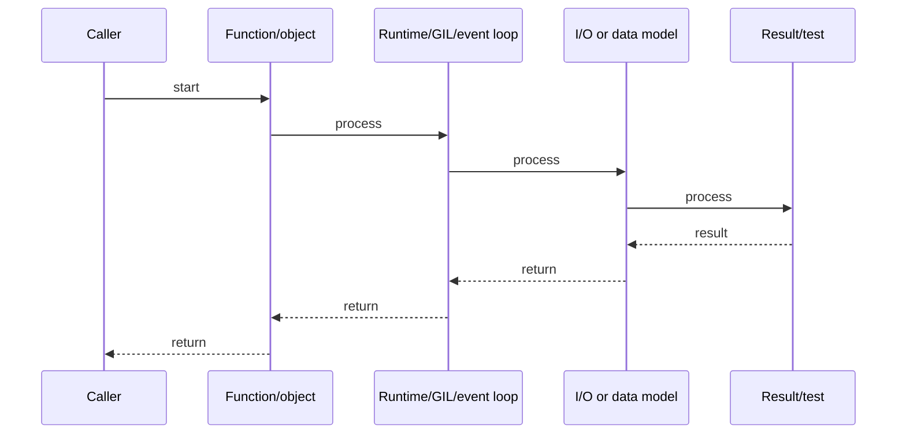

# pytest, Fixtures, Mocking & TDD

## Quick Facts
- Area: Python
- Tag: Testing
- Source: `src/modules/topics/python/python-testing.js`
- Tags: `pytest`, `fixtures`, `mock`, `parametrize`, `coverage`, `hypothesis`
- Visual coverage: generated diagrams only

## Concept
Python's testing ecosystem centers on **pytest**:
- **Fixtures**: `@pytest.fixture` - dependency injection for test setup/teardown with scopes (`function`, `class`, `module`, `session`).
- **`@pytest.mark.parametrize`**: table-driven tests.
- **`unittest.mock`** / **`pytest-mock`**: `MagicMock`, `patch`, `AsyncMock`.
- **`pytest-asyncio`**: async test support.
- **Property-based testing (Hypothesis)**: generates adversarial inputs automatically.
- **Coverage**: `pytest-cov` with branch coverage.

## Why It Matters
Good fixtures replace repetitive setup code and enforce DRY in tests. Parametrize eliminates copy-paste test variants. Property-based tests with Hypothesis find edge cases (empty strings, max int, NaN) that hand-written tests miss. In senior interviews, being able to design a testable architecture (interfaces, DI) matters as much as writing the tests.

## Architecture / Mental Model


## Runtime / Sequence


## Animation Plan
- Flow lab can use generated mental model steps above.
- UML sequence can use generated sequence diagram above.
- Architecture map can use generated area mental model above.

Flow steps:

1. Caller
2. Function/object
3. Runtime/GIL/event loop
4. I/O or data model
5. Result/test

## Example
```python
import pytest
import pytest_asyncio
from unittest.mock import AsyncMock, patch
from hypothesis import given, strategies as st

#  Fixtures with scope 
@pytest.fixture(scope="session")
def db_pool():
    """Real DB pool, created once per test session."""
    import asyncio, asyncpg
    pool = asyncio.get_event_loop().run_until_complete(
        asyncpg.create_pool("postgresql://localhost/test")
    )
    yield pool
    asyncio.get_event_loop().run_until_complete(pool.close())

@pytest.fixture
def mock_email(monkeypatch):
    sent = []
    monkeypatch.setattr("myapp.email.send", lambda to, msg: sent.append((to, msg)))
    return sent

#  Parametrize 
@pytest.mark.parametrize("qty,price,expected_total", [
    (1, "10.00", "10.00"),
    (3, "2.50",  "7.50"),
    (0, "5.00",  None),   # invalid: raises
])
def test_order_total(qty, price, expected_total):
    from decimal import Decimal
    from myapp.models import OrderLine
    if expected_total is None:
        with pytest.raises(ValueError):
            OrderLine(product_id="SKU1", quantity=qty, unit_price=Decimal(price))
    else:
        line = OrderLine(product_id="SKU1", quantity=qty, unit_price=Decimal(price))
        assert line.total == Decimal(expected_total)

#  AsyncMock 
@pytest.mark.asyncio
async def test_create_order_sends_email():
    from myapp.service import OrderService
    fake_db = AsyncMock()
    fake_db.fetchrow.return_value = {"id": 42}
    svc = OrderService(db=fake_db)
    with patch("myapp.service.send_confirmation") as mock_send:
        result = await svc.create(user_id=1, product_id="X", quantity=2)
    mock_send.assert_awaited_once()
    assert result.id == 42

#  Property-based testing 
@given(st.lists(st.integers(min_value=1, max_value=100), min_size=1))
def test_sum_always_positive(xs):
    assert sum(xs) > 0
```

Notes:
Use `monkeypatch` for patching in fixtures - it automatically reverts after the test. Prefer `AsyncMock` over `MagicMock` for coroutines. Run with `pytest --cov=myapp --cov-branch` for branch coverage.

## Complexity And Performance
- Time/space complexity depends on input size, data volume, and implementation choices.
- Track latency, throughput, memory, saturation, error rate, and correctness invariants.

## Interview Drills
1. What is fixture scope and when would you use session scope?
   Answer: Fixture scope controls how often the fixture is created: `function` (default, per test), `class`, `module`, `session` (once for the entire test run). Use **session scope** for expensive setup: database connection pools, test containers, loaded ML models. Use **function scope** for anything with mutable state that must be isolated per test.
   Follow-ups: What is yield in a fixture?; How do you handle teardown errors in a session fixture?

2. How do you test code that uses time.sleep or datetime.now?
   Answer: Three approaches: (1) **`monkeypatch`** to replace `time.sleep` with a no-op. (2) **`freezegun`** library - freezes time across the call stack including `datetime.now()`, `time.time()`. (3) **Inject clock** - pass a `clock` callable/object as a dependency, replace with a fake in tests. Injection is the most testable design; freezegun is the quickest fix.
   Follow-ups: How does freezegun work under the hood?; How do you test scheduled tasks?

## Trade-offs
Pros:
- Fixtures compose and have scope - DRY setup without BaseTestCase boilerplate.
- Parametrize generates test IDs automatically for clear failure reports.
- Hypothesis finds edge cases humans miss - invaluable for parsing and math.

Cons:
- Heavy mocking creates brittle tests that break on refactoring, not bugs.
- Session-scoped fixtures with state cause hard-to-debug test ordering issues.
- Hypothesis can be slow for complex strategies - tune max_examples.

When to use:
**Unit tests**: mock external I/O, test one unit. **Integration tests**: real DB in Docker, no mocks. **Property tests**: parsing, math, data transforms. Aim for fast feedback - keep unit tests < 1ms each.

## Gotchas
_No gotchas configured._

