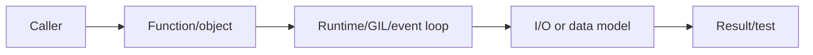
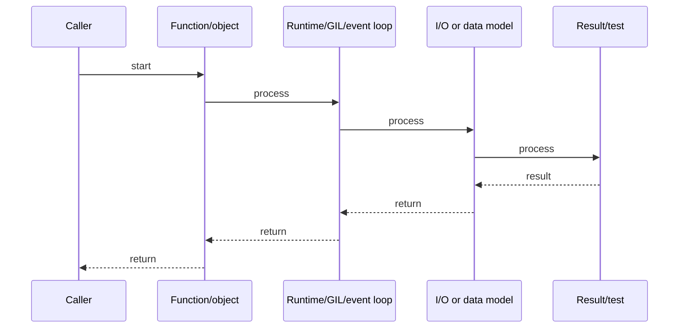

# Type Hints, mypy & Structural Typing

## Quick Facts

- Area: Python
- Tag: Typing
- Source: `src/modules/topics/python/python-type-hints-mypy.js`
- Tags: `type hints`, `mypy`, `Protocol`, `TypeVar`, `Generic`, `PEP 484`
- Visual coverage: generated diagrams only

## Concept

Python's type system (PEP 484+) is **gradual** - typed and untyped code coexist. Key constructs:

- **`TypeVar`** - generic placeholder: `T = TypeVar("T")`.
- **`Generic[T]`** - parameterize classes.
- **`Protocol`** - structural subtyping (duck-typing with type safety).
- **`ParamSpec`, `Concatenate`** - for decorator type correctness.
- **`TypedDict`, `NamedTuple`** - typed dict/tuple shapes.
- **`Literal`, `Final`, `TypeGuard`** - narrow types at specific values.
  Python 3.12: `type` keyword for type aliases. Python 3.10+: `X | Y` union syntax.

## Why It Matters

mypy + type hints catch an estimated 15% of production bugs at commit time with zero runtime cost. `Protocol` enables the same structural typing Go uses - depend on behavior, not class hierarchy. Type hints are also the foundation for FastAPI's automatic validation, Pydantic models, and IDE completion.

## Architecture / Mental Model



## Runtime / Sequence



## Animation Plan

- Flow lab can use generated mental model steps above.
- UML sequence can use generated sequence diagram above.
- Architecture map can use generated area mental model above.

Flow steps:

1. Caller
2. Function/object
3. Runtime/GIL/event loop
4. I/O or data model
5. Result/test

## Example

```python
from __future__ import annotations
from typing import TypeVar, Generic, Protocol, runtime_checkable
from collections.abc import Sequence

T = TypeVar("T")
K = TypeVar("K")
V = TypeVar("V")

#  Protocol: structural subtyping
@runtime_checkable
class Closeable(Protocol):
    def close(self) -> None: ...

def cleanup(resource: Closeable) -> None:
    resource.close()  # works with any object that has close()

#  Generic class
class Result(Generic[T]):
    def __init__(self, value: T | None, error: Exception | None = None) -> None:
        self._value = value
        self._error = error

    @classmethod
    def ok(cls, value: T) -> Result[T]:
        return cls(value)

    @classmethod
    def err(cls, error: Exception) -> Result[T]:
        return cls(None, error)

    def unwrap(self) -> T:
        if self._error:
            raise self._error
        assert self._value is not None
        return self._value

#  TypedDict for structured dicts
from typing import TypedDict, NotRequired

class UserRecord(TypedDict):
    id: int
    name: str
    email: NotRequired[str]   # optional key (PEP 655)

def greet(user: UserRecord) -> str:
    return f"Hello {user['name']}"

#  Overload for multiple signatures
from typing import overload

@overload
def process(x: int) -> str: ...
@overload
def process(x: str) -> int: ...
def process(x):
    return str(x) if isinstance(x, int) else len(x)
```

Notes:
Use `from __future__ import annotations` (deferred evaluation) to allow forward references without quotes. Run mypy in strict mode (`--strict`) in CI for new code; gradually tighten existing code.

## Complexity And Performance

- Time/space complexity depends on input size, data volume, and implementation choices.
- Track latency, throughput, memory, saturation, error rate, and correctness invariants.

## Interview Drills

1. What is the difference between Protocol and ABC?
   Answer: **ABC** (Abstract Base Class) uses nominal subtyping - a class must explicitly `class Foo(ABC)` or register with `ABC.register()`. **`Protocol`** uses structural subtyping - any class with the right methods satisfies the protocol, no inheritance needed. Protocol enables Go-style duck-typing with static type checking. Use Protocol when you don't control the implementing class.
   Follow-ups: What is runtime_checkable?; Can a Protocol extend another Protocol?

2. How do you type a decorator that preserves the wrapped function's signature?
   Answer: Use `ParamSpec` and `TypeVar`: `P = ParamSpec("P"); R = TypeVar("R")`, then `def decorator(fn: Callable[P, R]) -> Callable[P, R]`. Without `ParamSpec`, mypy infers the wrapper as `Callable[..., R]` - losing parameter names and types for callers. `functools.wraps` handles runtime metadata; `ParamSpec` handles static types.
   Follow-ups: What is Concatenate?; How do you type a class decorator?

## Trade-offs

Pros:

- Catches type errors at commit time - zero runtime overhead.
- Protocol enables structural typing without inheritance coupling.
- Types serve as machine-verified documentation.

Cons:

- Gradual typing: untyped third-party code creates Any holes.
- Complex generics (recursive types, HKTs) hit mypy limitations.
- Type stubs (.pyi) must be maintained for C extensions.

When to use:
Enable mypy in CI for all new code. Use strict mode for new modules. Add types incrementally to legacy code - start with function signatures. Always type public APIs and library boundaries.

## Gotchas

Watch for edge cases, assumptions, and hidden performance costs that can make this topic fail in production if handled incorrectly.
