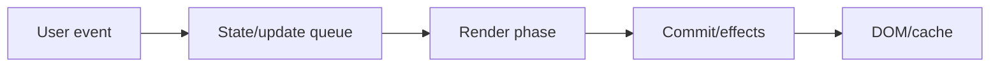
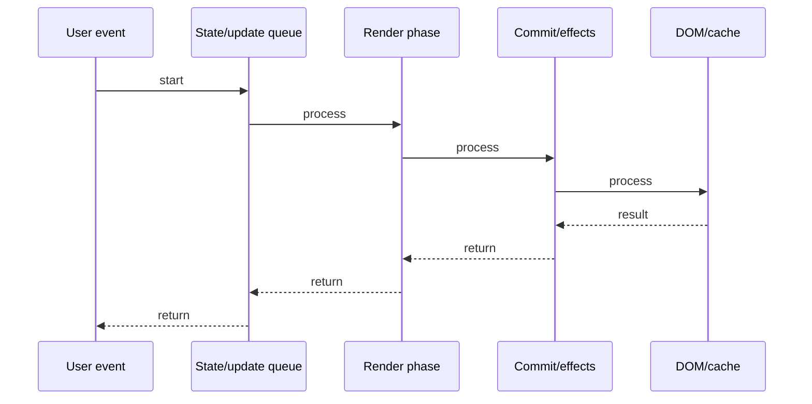

# Concurrent Mode

## Quick Facts
- Area: React
- Tag: Advanced
- Source: `src/modules/topics/react/react-concurrent.js`
- Tags: `react`, `concurrent`, `suspense`, `transitions`, `use-deferred-value`, `time-slicing`, `scheduler`
- Visual coverage: live visual

## Concept
Concurrent Mode lets React pause, resume, and abandon renders to keep the UI responsive.
Without Concurrent: renders block the main thread - long trees = janky scrolling, frozen inputs.
Time slicing: React splits rendering into 5ms chunks, yielding to browser between chunks.
Transitions (startTransition/useTransition): mark state updates as "non-urgent". React renders urgent updates first.
Suspense: let components "wait" for async data. Show fallback until data resolves.
useDeferredValue: delay updating a value until urgent work is done - like a debounce built into React.

## Why It Matters
Without concurrent features, a 1000-item list re-render blocks input for 200ms.
With startTransition, the user can keep typing while React renders the filtered list in the background.
Suspense eliminates loading state management boilerplate - declare "what to show while loading" declaratively.

## Architecture / Mental Model


## Runtime / Sequence


## Animation Plan
- Flow lab can use generated mental model steps above.
- UML sequence can use generated sequence diagram above.
- Architecture map can use generated area mental model above.
- Live visual exists in app: topic-specific canvas/ReactViz animation.

Flow steps:

1. User event
2. State/update queue
3. Render phase
4. Commit/effects
5. DOM/cache

## Example
```javascript
// Enable concurrent mode (React 18+)
const root = createRoot(document.getElementById('root'));
root.render(<App />);

// startTransition: mark update as non-urgent
import { startTransition, useTransition } from 'react';

const [isPending, startTransition] = useTransition();

// Typing in search box (urgent):
setQuery(e.target.value); // <- always urgent (immediate)

// Filtering 10k items (non-urgent):
startTransition(() => {
  setFilteredResults(items.filter(...)); // <- can be interrupted
});

// isPending = true while transition is in progress
{isPending && <Spinner />}

// Suspense: wait for async data
function Profile() {
  const user = use(fetchUser(id)); // throws Promise if not ready
  return <h1>{user.name}</h1>;
}

<Suspense fallback={<Skeleton />}>
  <Profile />      // suspended until fetchUser resolves
</Suspense>

// useDeferredValue: show stale results while computing new
const deferredQuery = useDeferredValue(query);
const results = useMemo(() =>
  filter(items, deferredQuery), [deferredQuery]
);
```

## Complexity And Performance
- Time/space complexity depends on input size, data volume, and implementation choices.
- Track latency, throughput, memory, saturation, error rate, and correctness invariants.

## Interview Drills
1. What is time slicing and how does React implement it?

2. Difference between startTransition and debounce?

3. How does Suspense know when to show the fallback?

4. What is useDeferredValue and when to use it over startTransition?

5. What is the React Scheduler and how does it prioritize work?

6. Can Suspense be used for code-splitting? How?

## Trade-offs
Pros:
- Keeps UI responsive during heavy renders
- Declarative loading states with Suspense
- No manual debouncing needed

Cons:
- React 18+ only
- startTransition cannot wrap async code
- Suspense requires library support (React Query, Relay)

## Gotchas
- startTransition cannot be used with async/await - the function must be synchronous.
- Transitions do NOT delay urgent updates - only the marked update is deferred.
- Suspense boundaries must be placed intentionally - too high = full page flash.
- useDeferredValue shows STALE data while new data loads - indicate staleness to user.
- createRoot() is required for concurrent features - legacy render() opts out.

